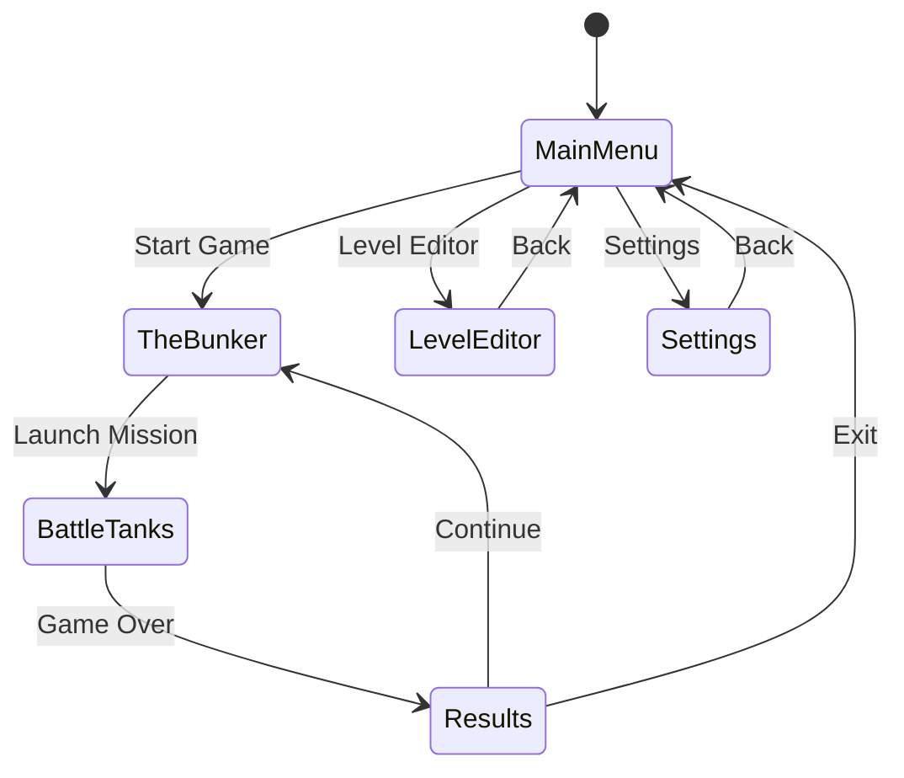

# PANDA-TANKS

A TRON-inspired tank combat game built with Panda3D featuring wireframe aesthetics, strategic grid-based gameplay, and community-driven level editing.

## Description

PANDA-TANKS is a desktop 3D tank combat game that captures the iconic visual style of TRON (1982). Players navigate geometric arenas in wireframe tanks, engaging in strategic battles using energy projectiles and environmental cover. The game features a complete progression loop with customizable loadouts, a powerful level editor, and support for community-created content.

The visual aesthetic is pure wireframe geometry with neon-lit edges—no PNG textures are used. All rendering follows an SVGA shader style with vibrant cyan, magenta, orange, and white color palettes against dark backgrounds.

Built with **Panda3D** (Python), leveraging its built-in physics (Bullet), DirectGUI for UI, and shader-based rendering for the TRON aesthetic.

## Game Architecture

```
┌─────────────────────────────────────────────────────────────┐
│                        main.py                               │
│  (Entry point, ShowBase subclass, screen manager)            │
├─────────────────────────────────────────────────────────────┤
│                                                              │
│  ┌──────────────┐  ┌──────────────┐  ┌──────────────┐       │
│  │  MainMenu    │  │  TheBunker   │  │ BattleTanks  │       │
│  │  Screen.py   │  │  Screen.py   │  │ Screen.py    │       │
│  └──────────────┘  └──────────────┘  └──────────────┘       │
│                                                              │
│  ┌──────────────┐  ┌──────────────┐  ┌──────────────┐       │
│  │   Results    │  │ LevelEditor  │  │  Settings    │       │
│  │  Screen.py   │  │  Screen.py   │  │  Screen.py   │       │
│  └──────────────┘  └──────────────┘  └──────────────┘       │
│                                                              │
├─────────────────────────────────────────────────────────────┤
│                    Shared Components                         │
│  ┌────────────┐ ┌────────────┐ ┌────────────┐               │
│  │ entities/  │ │ ui/        │ │ systems/   │               │
│  │ tank.py    │ │ hud.py     │ │ game_      │               │
│  │ arena.py   │ │ button.py  │ │ state.py   │               │
│  │ skybox.py  │ │ panel.py   │ │ physics.py │               │
│  │ grid.py    │ │ slider.py  │ │ input.py   │               │
│  └────────────┘ └────────────┘ └────────────┘               │
└─────────────────────────────────────────────────────────────┘
```

## Functionality

### Screen Flow



### Screen Specifications

#### 1. Main Menu Screen (`screens/main_menu_screen.py`)

**Visual Layout:**
- Centered vertically and horizontally
- Large "PANDA-TANKS" title with glowing cyan wireframe effect
- Four menu buttons stacked vertically with 20px spacing
- Animated wireframe tank rotating slowly in background

**Menu Options:**
| Button | Action |
|--------|--------|
| START GAME | Navigate to TheBunker screen |
| LEVEL EDITOR | Navigate to LevelEditor screen |
| SETTINGS | Navigate to Settings screen |
| EXIT | Quit application with confirmation dialog |

**Interactions:**
- Buttons glow brighter on hover (opacity 0.7 → 1.0)
- Click triggers screen transition with fade effect (300ms)
- Keyboard navigation: Arrow keys to select, Enter to confirm

**Implementation:**
```python
from direct.gui.DirectGui import DirectButton, DirectFrame, DirectLabel
from direct.interval.IntervalGlobal import Sequence, LerpColorInterval

class MainMenuScreen:
    """Main menu with DirectGUI buttons and 3D background tank."""
    
    def __init__(self, game):
        self.game = game
        self.root = DirectFrame(frameColor=(0, 0, 0, 0))
        self.buttons = []
        self._setup_ui()
        self._setup_background_tank()
    
    def _setup_ui(self):
        # Title label with Orbitron-style font
        self.title = DirectLabel(
            text="PANDA-TANKS",
            scale=0.15,
            pos=(0, 0, 0.5),
            text_fg=TRON_COLORS['cyan'],
            text_font=self.game.loader.loadFont('fonts/orbitron.ttf')
        )
        # Menu buttons created with _create_button helper
```

---

#### 2. The Bunker Screen (`screens/bunker_screen.py`)

**Purpose:** Pre-game setup, loadout selection, and mission briefing.

**Layout Sections:**

```
┌─────────────────────────────────────────────────────────┐
│  [BACK]                    THE BUNKER                   │
├───────────────────┬─────────────────────────────────────┤
│                   │                                     │
│   TANK PREVIEW    │         LOADOUT PANEL               │
│   (3D rotating    │   ┌─────────────────────────────┐   │
│    tank model)    │   │ Primary: [Dropdown]         │   │
│                   │   │ Secondary: [Dropdown]       │   │
│                   │   │ Ability: [Dropdown]         │   │
│                   │   │ Armor: [Slider]             │   │
│                   │   │ Speed: [Slider]             │   │
│                   │   └─────────────────────────────┘   │
├───────────────────┴─────────────────────────────────────┤
│                    LEVEL SELECT                          │
│   [Level 1] [Level 2] [Level 3] [Custom...] [Random]    │
├─────────────────────────────────────────────────────────┤
│  Mission: Destroy all enemy tanks                       │
│                              [LAUNCH MISSION]           │
└─────────────────────────────────────────────────────────┘
```

**Tank Customization Options:**

```python
from dataclasses import dataclass
from typing import Literal

WeaponType = Literal['standard', 'rapid', 'heavy', 'spread']
SecondaryType = Literal['missile', 'mine', 'shield', 'none']
AbilityType = Literal['boost', 'cloak', 'scan', 'repair']

@dataclass
class TankLoadout:
    primary: WeaponType = 'standard'
    secondary: SecondaryType = 'missile'
    ability: AbilityType = 'boost'
    armor: int = 5        # 1-10, affects damage resistance
    speed: int = 5        # 1-10, affects movement speed
    color: str = '#00FFFF'  # Hex color for tank wireframe
```

**Level Selection:**
- Grid of level thumbnail previews (wireframe top-down view)
- Built-in levels numbered 1-10
- "Custom" button opens file picker for community levels
- "Random" generates procedural arena

---

#### 3. Battle Tanks Screen (`screens/battle_screen.py`)

**Primary Gameplay Arena**

**Camera System:**
- Third-person chase camera, 15 units behind tank, 8 units above
- Smooth follow with 0.1 lerp factor
- Camera collision avoidance with arena boundaries
- Optional: First-person view toggle (V key)

```python
class ChaseCamera:
    """Third-person camera that follows the player tank."""
    
    def __init__(self, game, target):
        self.game = game
        self.target = target
        self.distance = 15.0
        self.height = 8.0
        self.lerp_factor = 0.1
        self.first_person = False
    
    def update(self, dt):
        if self.first_person:
            # Position at tank turret, looking forward
            pos = self.target.get_turret_position()
            self.game.camera.setPos(pos)
            self.game.camera.setHpr(self.target.turret_rotation, 0, 0)
        else:
            # Chase camera behind tank
            target_pos = self.target.get_pos()
            angle = self.target.rotation
            
            ideal_pos = Point3(
                target_pos.x - math.sin(angle) * self.distance,
                target_pos.y - math.cos(angle) * self.distance,
                target_pos.z + self.height
            )
            
            current_pos = self.game.camera.getPos()
            new_pos = current_pos + (ideal_pos - current_pos) * self.lerp_factor
            
            self.game.camera.setPos(new_pos)
            self.game.camera.lookAt(target_pos + Vec3(0, 0, 2))
```

**HUD Elements (`ui/game_hud.py`):**

```
┌─────────────────────────────────────────────────────────┐
│ [HEALTH BAR]████████░░  80%          [MINIMAP]         │
│ [ENERGY BAR]██████████  100%              ·            │
│                                         · × ·          │
│                                           ·            │
│                                                        │
│                     (3D GAME VIEW)                     │
│                                                        │
│                                                        │
│                                                        │
│                                                        │
│ [PRIMARY: Ready]  [SECONDARY: 3/3]  [ABILITY: 85%]    │
│                                      [ESC: Pause]      │
└─────────────────────────────────────────────────────────┘
```

**Player Controls:**

| Input | Action |
|-------|--------|
| W / ↑ | Move forward |
| S / ↓ | Move backward |
| A / ← | Rotate left |
| D / → | Rotate right |
| Mouse Move | Aim turret |
| Left Click | Fire primary weapon |
| Right Click | Fire secondary weapon |
| Space | Activate ability |
| V | Toggle camera view |
| ESC | Pause menu |

**Combat Mechanics:**

```python
from dataclasses import dataclass
from panda3d.core import Vec3
import uuid

@dataclass
class Projectile:
    id: str
    projectile_type: str  # 'energy', 'missile', 'mine'
    position: Vec3
    velocity: Vec3
    damage: float
    owner: str           # Tank ID that fired it
    lifetime: float      # Seconds until despawn
    max_lifetime: float

@dataclass
class DamageEvent:
    target: str          # Tank ID
    amount: float
    source: str          # Projectile ID or 'collision'
    position: Vec3
```

**Weapon Specifications:**

| Weapon | Damage | Fire Rate | Projectile Speed | Special |
|--------|--------|-----------|------------------|---------|
| Standard | 15 | 2/sec | 50 units/sec | None |
| Rapid | 8 | 5/sec | 60 units/sec | None |
| Heavy | 40 | 0.5/sec | 30 units/sec | Splash damage (5 unit radius) |
| Spread | 10×3 | 1/sec | 45 units/sec | 3 projectiles, 15° spread |
| Missile | 50 | 0.3/sec | 25 units/sec | Homing, limited supply (3) |
| Mine | 80 | 0.2/sec | 0 | Proximity detonation |

**Enemy AI Behaviors:**

```python
from enum import Enum
from dataclasses import dataclass

class AIState(Enum):
    IDLE = 'idle'
    PATROL = 'patrol'
    CHASE = 'chase'
    ATTACK = 'attack'
    FLEE = 'flee'
    SEEK_COVER = 'seek_cover'

@dataclass
class AIBehavior:
    state: AIState = AIState.IDLE
    target_position: Vec3 = None
    last_known_player_pos: Vec3 = None
    state_timer: float = 0.0
    detection_range: float = 30.0
    attack_range: float = 25.0
    accuracy: float = 0.6        # 0-1, affects aim deviation
    reaction_time: float = 0.8   # Seconds before state change
    prefers_cover: bool = False
```

**Victory/Defeat Conditions:**
- **Victory:** All enemy tanks destroyed
- **Defeat:** Player tank health reaches 0
- **Time Limit (optional):** Configurable per level, defeat if exceeded

---

#### 4. Results Screen (`screens/results_screen.py`)

**Post-Game Statistics Display:**

```
┌─────────────────────────────────────────────────────────┐
│                      MISSION COMPLETE                    │
│                         ★ ★ ★                           │
├─────────────────────────────────────────────────────────┤
│                                                          │
│   Time:           2:34                                   │
│   Enemies Destroyed:  5/5                                │
│   Accuracy:       73%                                    │
│   Damage Taken:   45                                     │
│   Max Combo:      3                                      │
│                                                          │
│   ─────────────────────────────────────                  │
│   SCORE:          12,450                                 │
│   XP EARNED:      +250                                   │
│   NEW RANK:       Corporal ↑                             │
│                                                          │
├─────────────────────────────────────────────────────────┤
│        [CONTINUE]              [MAIN MENU]               │
└─────────────────────────────────────────────────────────┘
```

**Scoring Formula:**

```python
@dataclass
class GameStats:
    enemies_destroyed: int = 0
    total_enemies: int = 0
    shots_fired: int = 0
    shots_hit: int = 0
    damage_taken: float = 0
    damage_dealt: float = 0
    max_combo: int = 0
    current_combo: int = 0
    combo_timer: float = 0
    time_seconds: float = 0

def calculate_score(stats: GameStats) -> int:
    base_score = stats.enemies_destroyed * 1000
    time_bonus = max(0, (300 - stats.time_seconds) * 10)
    accuracy = stats.shots_hit / max(1, stats.shots_fired)
    accuracy_bonus = int(accuracy * 2000)
    damage_deduction = int(stats.damage_taken * 5)
    combo_bonus = stats.max_combo * 500
    
    return int(base_score + time_bonus + accuracy_bonus - damage_deduction + combo_bonus)
```

---

#### 5. Level Editor Screen (`screens/level_editor_screen.py`)

**Full-Featured Arena Builder**

**Layout:**

```
┌─────────────────────────────────────────────────────────┐
│ [FILE ▼] [EDIT ▼] [VIEW ▼]              [TEST] [BACK]  │
├────────────┬────────────────────────────────────────────┤
│            │                                            │
│  TOOLBOX   │           EDITOR VIEWPORT                  │
│            │           (Top-down grid view)             │
│ [Select]   │                                            │
│ [Wall]     │      ┌───┐         ┌─────────┐            │
│ [Barrier]  │      │   │         │         │            │
│ [Spawn]    │      └───┘    P    │         │            │
│ [Enemy]    │               ↓    └─────────┘            │
│ [Pickup]   │         E →                               │
│ [Objective]│                                            │
│            │                                            │
│ ─────────  │────────────────────────────────────────────│
│ PROPERTIES │  Grid: 50×50  |  Objects: 12  |  Valid ✓  │
│ Width: [5] │                                            │
│ Height:[3] │                                            │
│ Rotation:  │                                            │
│   [0°]     │                                            │
└────────────┴────────────────────────────────────────────┘
```

**Editor Tools:**

| Tool | Icon | Function |
|------|------|----------|
| Select | ⬚ | Click to select objects, drag to move |
| Wall | ▬ | Place solid barriers (blocks movement & projectiles) |
| Barrier | ▤ | Place cover (blocks projectiles, not movement) |
| Spawn | P | Set player spawn point (exactly 1 required) |
| Enemy | E | Place enemy tank spawn |
| Pickup | ◈ | Place health/ammo pickups |
| Objective | ⬡ | Place mission objectives |

**Level Data Structure:**

```python
from dataclasses import dataclass, field
from typing import List, Optional, Literal

Difficulty = Literal['easy', 'medium', 'hard', 'brutal']
TerrainType = Literal['wall', 'barrier', 'ramp', 'pit']
AIPreset = Literal['patrol', 'guard', 'aggressive', 'sniper']
PickupType = Literal['health', 'energy', 'ammo', 'shield']
ObjectiveType = Literal['destroy_all', 'destroy_target', 'survive', 'capture', 'reach']

@dataclass
class Vec2:
    x: float
    y: float

@dataclass
class GridSize:
    width: int
    height: int

@dataclass
class LevelMeta:
    id: str
    name: str
    author: str
    version: str
    grid_size: GridSize
    difficulty: Difficulty
    time_limit: Optional[int] = None
    description: Optional[str] = None

@dataclass
class TerrainObject:
    id: str
    terrain_type: TerrainType
    position: Vec2
    width: float
    height: float
    rotation: float = 0.0

@dataclass
class EnemySpawn:
    id: str
    position: Vec2
    ai_type: AIPreset
    delay: float = 0.0
    weapon_type: Optional[str] = None

@dataclass
class LevelPickup:
    id: str
    pickup_type: PickupType
    position: Vec2
    respawn_time: Optional[float] = None

@dataclass
class LevelObjective:
    id: str
    objective_type: ObjectiveType
    description: str
    position: Optional[Vec2] = None
    target: Optional[str] = None
    count: Optional[int] = None
    duration: Optional[float] = None

@dataclass
class SpawnData:
    player: Vec2
    enemies: List[EnemySpawn] = field(default_factory=list)

@dataclass
class LevelData:
    meta: LevelMeta
    terrain: List[TerrainObject] = field(default_factory=list)
    spawns: SpawnData = None
    pickups: List[LevelPickup] = field(default_factory=list)
    objectives: List[LevelObjective] = field(default_factory=list)
```

**File Operations:**
- **New:** Clear editor, prompt for grid size
- **Save:** Export to JSON with `.ptlevel` extension
- **Load:** Import `.ptlevel` files
- **Test:** Launch BattleTanks with current level

**Validation Rules:**
- Exactly 1 player spawn required
- At least 1 enemy spawn required
- No overlapping solid objects
- Spawns not inside walls
- Grid bounds respected (max 100×100)

---

#### 6. Settings Screen (`screens/settings_screen.py`)

**Tabbed Settings Interface:**

```
┌─────────────────────────────────────────────────────────┐
│                       SETTINGS                           │
│  [GRAPHICS] [AUDIO] [CONTROLS] [GAMEPLAY]               │
├─────────────────────────────────────────────────────────┤
│                                                          │
│   Quality Preset:    [Low] [Medium] [●High] [Ultra]     │
│                                                          │
│   Wireframe Glow:    ████████░░  80%                    │
│   Bloom Intensity:   ██████░░░░  60%                    │
│   Grid Lines:        [✓] Enabled                        │
│   Particle Effects:  [✓] Enabled                        │
│                                                          │
│   Skybox Style:      [▼ Sunset Grid        ]            │
│                                                          │
│   Resolution:        [▼ 1920×1080          ]            │
│   Fullscreen:        [✓] Enabled                        │
│                                                          │
├─────────────────────────────────────────────────────────┤
│              [RESET DEFAULTS]        [APPLY]             │
└─────────────────────────────────────────────────────────┘
```

**Settings Categories:**

```python
from dataclasses import dataclass
from typing import Dict

@dataclass
class GraphicsSettings:
    quality_preset: str = 'high'  # 'low', 'medium', 'high', 'ultra'
    wireframe_glow: int = 80      # 0-100
    bloom_intensity: int = 60     # 0-100
    grid_lines_enabled: bool = True
    particle_effects: bool = True
    skybox_style: str = 'sunset'  # 'sunset', 'night', 'dawn', 'storm', 'void'
    resolution: str = '1920x1080'
    fullscreen: bool = False

@dataclass
class AudioSettings:
    master_volume: int = 80       # 0-100
    music_volume: int = 70        # 0-100
    sfx_volume: int = 80          # 0-100
    ui_sounds: bool = True

@dataclass
class ControlSettings:
    mouse_sensitivity: float = 1.0  # 0.1-3.0
    invert_y: bool = False
    key_bindings: Dict[str, str] = None  # Action -> Key mapping

@dataclass
class GameplaySettings:
    difficulty: str = 'normal'    # 'easy', 'normal', 'hard', 'brutal'
    auto_aim: bool = False        # Easy mode only
    show_damage_numbers: bool = True
    camera_shake: bool = True
    tutorial_hints: bool = True
```

---

## Technical Implementation

### File Structure

```
panda_tanks/
├── main.py                      # Entry point, ShowBase subclass
├── config.py                    # Global configuration
├── requirements.txt             # Python dependencies
│
├── screens/
│   ├── __init__.py
│   ├── base_screen.py           # Abstract base screen class
│   ├── main_menu_screen.py      # Main menu
│   ├── bunker_screen.py         # Loadout/setup
│   ├── battle_screen.py         # Main gameplay
│   ├── results_screen.py        # Post-game stats
│   ├── level_editor_screen.py   # Level editor
│   └── settings_screen.py       # Settings
│
├── entities/
│   ├── __init__.py
│   ├── tank.py                  # Tank model & animation
│   ├── enemy_tank.py            # Enemy with AI
│   ├── projectile.py            # Bullets, missiles
│   ├── arena.py                 # Level geometry
│   ├── grid.py                  # Ground grid
│   ├── skybox.py                # Procedural sky
│   ├── barrier.py               # Cover objects
│   ├── pickup.py                # Collectibles
│   └── effects.py               # Explosions, trails
│
├── ui/
│   ├── __init__.py
│   ├── button.py                # Styled DirectButton wrapper
│   ├── panel.py                 # Container panel
│   ├── slider.py                # Range input
│   ├── dropdown.py              # DirectOptionMenu wrapper
│   ├── game_hud.py              # In-game overlay
│   ├── pause_menu.py            # Pause overlay
│   ├── minimap.py               # Radar display
│   └── health_bar.py            # Health/energy bars
│
├── editor/
│   ├── __init__.py
│   ├── editor_viewport.py       # 2D editor canvas
│   ├── toolbox.py               # Tool selection
│   ├── properties_panel.py      # Object properties
│   └── editor_menu_bar.py       # File/Edit menus
│
├── systems/
│   ├── __init__.py
│   ├── game_state.py            # Game state management
│   ├── physics.py               # Bullet physics wrapper
│   ├── collision.py             # Collision detection/response
│   ├── input_manager.py         # Input handling
│   ├── ai.py                    # Enemy AI logic
│   ├── combat.py                # Damage calculation
│   ├── scoring.py               # Score/XP system
│   ├── audio.py                 # Sound management
│   └── progression.py           # Unlocks, ranks
│
├── types/
│   ├── __init__.py
│   ├── game_types.py            # Game dataclasses
│   ├── level_types.py           # Level data types
│   └── settings_types.py        # Settings types
│
├── data/
│   ├── levels/                  # Built-in level JSONs
│   │   ├── level01.json
│   │   ├── level02.json
│   │   └── ...
│   ├── fonts/                   # Orbitron font
│   └── defaults.py              # Default settings/loadouts
│
├── shaders/
│   ├── wireframe.vert           # Wireframe vertex shader
│   ├── wireframe.frag           # Wireframe fragment shader
│   ├── glow.vert                # Glow effect vertex shader
│   ├── glow.frag                # Glow effect fragment shader
│   ├── bloom.vert               # Bloom post-process
│   └── bloom.frag               # Bloom fragment shader
│
└── utils/
    ├── __init__.py
    ├── math_utils.py            # Vector math helpers
    ├── colors.py                # TRON color palette
    └── storage.py               # JSON save/load wrapper
```

### Main Application (`main.py`)

```python
from direct.showbase.ShowBase import ShowBase
from direct.task import Task
from panda3d.core import WindowProperties, loadPrcFileData
from panda3d.bullet import BulletWorld

from screens.main_menu_screen import MainMenuScreen
from screens.bunker_screen import BunkerScreen
from screens.battle_screen import BattleScreen
from screens.results_screen import ResultsScreen
from screens.level_editor_screen import LevelEditorScreen
from screens.settings_screen import SettingsScreen
from systems.game_state import GameState
from systems.input_manager import InputManager
from systems.audio import AudioManager
from utils.colors import TRON_COLORS

# Configure Panda3D before ShowBase init
loadPrcFileData('', '''
    window-title PANDA-TANKS
    show-frame-rate-meter #t
    sync-video #t
    textures-power-2 none
''')


class PandaTanks(ShowBase):
    """Main game application."""
    
    def __init__(self):
        ShowBase.__init__(self)
        
        # Set window properties
        props = WindowProperties()
        props.setTitle("PANDA-TANKS")
        props.setSize(1920, 1080)
        self.win.requestProperties(props)
        
        # Set background color (TRON dark blue)
        self.setBackgroundColor(0, 0.067, 0.133, 1)
        
        # Initialize subsystems
        self.game_state = GameState()
        self.input_manager = InputManager(self)
        self.audio_manager = AudioManager(self)
        
        # Initialize Bullet physics world
        self.physics_world = BulletWorld()
        self.physics_world.setGravity((0, 0, -9.81))
        
        # Screen management
        self.screens = {}
        self.current_screen = None
        self._init_screens()
        
        # Start game loop task
        self.taskMgr.add(self._update, 'game_update')
        
        # Show main menu
        self.switch_screen('main_menu')
    
    def _init_screens(self):
        """Initialize all game screens."""
        self.screens['main_menu'] = MainMenuScreen(self)
        self.screens['bunker'] = BunkerScreen(self)
        self.screens['battle'] = BattleScreen(self)
        self.screens['results'] = ResultsScreen(self)
        self.screens['editor'] = LevelEditorScreen(self)
        self.screens['settings'] = SettingsScreen(self)
    
    def switch_screen(self, screen_name: str, **kwargs):
        """Transition to a new screen with fade effect."""
        if self.current_screen:
            self.current_screen.hide()
        
        self.current_screen = self.screens[screen_name]
        self.current_screen.show(**kwargs)
    
    def _update(self, task):
        """Main game loop update."""
        dt = globalClock.getDt()
        
        # Update input
        self.input_manager.update()
        
        # Update current screen
        if self.current_screen:
            self.current_screen.update(dt)
        
        # Update physics
        self.physics_world.doPhysics(dt)
        
        return Task.cont


if __name__ == '__main__':
    game = PandaTanks()
    game.run()
```

### Core Types (`types/game_types.py`)

```python
from dataclasses import dataclass, field
from typing import List, Optional, Dict
from panda3d.core import Vec3
from enum import Enum
import uuid


class GameScreen(Enum):
    MAIN_MENU = 'main_menu'
    BUNKER = 'bunker'
    BATTLE = 'battle'
    RESULTS = 'results'
    EDITOR = 'editor'
    SETTINGS = 'settings'


class AIState(Enum):
    IDLE = 'idle'
    PATROL = 'patrol'
    CHASE = 'chase'
    ATTACK = 'attack'
    FLEE = 'flee'
    SEEK_COVER = 'seek_cover'


class WeaponType(Enum):
    STANDARD = 'standard'
    RAPID = 'rapid'
    HEAVY = 'heavy'
    SPREAD = 'spread'


class SecondaryType(Enum):
    MISSILE = 'missile'
    MINE = 'mine'
    SHIELD = 'shield'
    NONE = 'none'


class AbilityType(Enum):
    BOOST = 'boost'
    CLOAK = 'cloak'
    SCAN = 'scan'
    REPAIR = 'repair'


class ProjectileType(Enum):
    ENERGY = 'energy'
    HEAVY = 'heavy'
    RAPID = 'rapid'
    SPREAD = 'spread'
    MISSILE = 'missile'
    MINE = 'mine'


class PickupType(Enum):
    HEALTH = 'health'
    ENERGY = 'energy'
    AMMO = 'ammo'
    SHIELD = 'shield'


# ============ PLAYER ============

@dataclass
class TankLoadout:
    primary: WeaponType = WeaponType.STANDARD
    secondary: SecondaryType = SecondaryType.MISSILE
    ability: AbilityType = AbilityType.BOOST
    armor: int = 5        # 1-10
    speed: int = 5        # 1-10
    color: str = '#00FFFF'


@dataclass
class PlayerState:
    id: str = field(default_factory=lambda: str(uuid.uuid4()))
    position: Vec3 = field(default_factory=lambda: Vec3(0, 0, 0))
    rotation: float = 0.0              # Y-axis rotation (radians)
    turret_rotation: float = 0.0       # Turret Y-axis rotation
    health: float = 100.0
    max_health: float = 100.0
    energy: float = 100.0
    max_energy: float = 100.0
    loadout: TankLoadout = field(default_factory=TankLoadout)
    velocity: Vec3 = field(default_factory=lambda: Vec3(0, 0, 0))
    is_alive: bool = True


# ============ ENEMIES ============

@dataclass
class AIBehavior:
    state: AIState = AIState.IDLE
    target_position: Optional[Vec3] = None
    last_known_player_pos: Optional[Vec3] = None
    state_timer: float = 0.0
    detection_range: float = 30.0
    attack_range: float = 25.0
    accuracy: float = 0.6


@dataclass
class EnemyState:
    id: str = field(default_factory=lambda: str(uuid.uuid4()))
    position: Vec3 = field(default_factory=lambda: Vec3(0, 0, 0))
    rotation: float = 0.0
    turret_rotation: float = 0.0
    health: float = 100.0
    max_health: float = 100.0
    ai: AIBehavior = field(default_factory=AIBehavior)
    is_alive: bool = True
    weapon_cooldown: float = 0.0


# ============ COMBAT ============

@dataclass
class Projectile:
    id: str = field(default_factory=lambda: str(uuid.uuid4()))
    projectile_type: ProjectileType = ProjectileType.ENERGY
    position: Vec3 = field(default_factory=lambda: Vec3(0, 0, 0))
    velocity: Vec3 = field(default_factory=lambda: Vec3(0, 0, 0))
    rotation: float = 0.0
    damage: float = 15.0
    owner: str = ''
    lifetime: float = 0.0
    max_lifetime: float = 3.0


@dataclass
class Explosion:
    id: str = field(default_factory=lambda: str(uuid.uuid4()))
    position: Vec3 = field(default_factory=lambda: Vec3(0, 0, 0))
    radius: float = 5.0
    duration: float = 0.5
    elapsed: float = 0.0


# ============ PICKUPS ============

@dataclass
class PickupState:
    id: str = field(default_factory=lambda: str(uuid.uuid4()))
    pickup_type: PickupType = PickupType.HEALTH
    position: Vec3 = field(default_factory=lambda: Vec3(0, 0, 0))
    is_active: bool = True
    respawn_timer: float = 0.0


# ============ STATISTICS ============

@dataclass
class GameStats:
    enemies_destroyed: int = 0
    total_enemies: int = 0
    shots_fired: int = 0
    shots_hit: int = 0
    damage_taken: float = 0.0
    damage_dealt: float = 0.0
    max_combo: int = 0
    current_combo: int = 0
    combo_timer: float = 0.0
    time_seconds: float = 0.0


# ============ PROGRESSION ============

@dataclass
class PlayerProgression:
    xp: int = 0
    rank: int = 1
    rank_name: str = 'Recruit'
    unlocked_weapons: List[WeaponType] = field(default_factory=lambda: [WeaponType.STANDARD])
    unlocked_abilities: List[AbilityType] = field(default_factory=lambda: [AbilityType.BOOST])
    completed_levels: List[str] = field(default_factory=list)
    high_scores: Dict[str, int] = field(default_factory=dict)


# ============ FULL GAME STATE ============

@dataclass
class GameState:
    current_screen: GameScreen = GameScreen.MAIN_MENU
    is_paused: bool = False
    player: PlayerState = field(default_factory=PlayerState)
    enemies: List[EnemyState] = field(default_factory=list)
    projectiles: List[Projectile] = field(default_factory=list)
    pickups: List[PickupState] = field(default_factory=list)
    explosions: List[Explosion] = field(default_factory=list)
    level: Optional['LevelData'] = None
    stats: GameStats = field(default_factory=GameStats)
    time: float = 0.0
    progression: PlayerProgression = field(default_factory=PlayerProgression)
```

### Physics System (`systems/physics.py`)

```python
from panda3d.core import Vec3, Point3, BitMask32
from panda3d.bullet import (
    BulletWorld, BulletRigidBodyNode, BulletBoxShape,
    BulletCylinderShape, BulletGhostNode, BulletSphereShape
)
from typing import List, Optional, Tuple
import math


# Collision masks
MASK_WALL = BitMask32.bit(0)
MASK_TANK = BitMask32.bit(1)
MASK_PROJECTILE = BitMask32.bit(2)
MASK_PICKUP = BitMask32.bit(3)
MASK_BARRIER = BitMask32.bit(4)


class PhysicsManager:
    """Manages Bullet physics world and collision detection."""
    
    def __init__(self, world: BulletWorld):
        self.world = world
        self.bodies = {}  # id -> BulletRigidBodyNode
        self.ghosts = {}  # id -> BulletGhostNode
    
    def create_tank_body(self, entity_id: str, position: Vec3) -> BulletRigidBodyNode:
        """Create a physics body for a tank."""
        shape = BulletBoxShape(Vec3(1.0, 1.5, 0.5))
        body = BulletRigidBodyNode(f'tank_{entity_id}')
        body.addShape(shape)
        body.setMass(10.0)
        body.setLinearFactor(Vec3(1, 1, 0))  # Lock Z movement
        body.setAngularFactor(Vec3(0, 0, 1))  # Only rotate around Z
        
        body.setIntoCollideMask(MASK_TANK)
        body.setFromCollideMask(MASK_WALL | MASK_TANK | MASK_BARRIER)
        
        self.world.attachRigidBody(body)
        self.bodies[entity_id] = body
        return body
    
    def create_wall_body(self, entity_id: str, position: Vec3, 
                         size: Vec3, is_barrier: bool = False) -> BulletRigidBodyNode:
        """Create a static physics body for a wall or barrier."""
        shape = BulletBoxShape(size / 2)
        body = BulletRigidBodyNode(f'wall_{entity_id}')
        body.addShape(shape)
        body.setMass(0.0)  # Static body
        
        mask = MASK_BARRIER if is_barrier else MASK_WALL
        body.setIntoCollideMask(mask)
        
        self.world.attachRigidBody(body)
        self.bodies[entity_id] = body
        return body
    
    def create_projectile_body(self, entity_id: str, position: Vec3,
                               velocity: Vec3) -> BulletRigidBodyNode:
        """Create a physics body for a projectile."""
        shape = BulletSphereShape(0.2)
        body = BulletRigidBodyNode(f'projectile_{entity_id}')
        body.addShape(shape)
        body.setMass(0.1)
        body.setLinearVelocity(velocity)
        body.setGravity(Vec3(0, 0, 0))  # No gravity for projectiles
        
        body.setIntoCollideMask(MASK_PROJECTILE)
        body.setFromCollideMask(MASK_WALL | MASK_TANK | MASK_BARRIER)
        
        self.world.attachRigidBody(body)
        self.bodies[entity_id] = body
        return body
    
    def create_pickup_ghost(self, entity_id: str, position: Vec3) -> BulletGhostNode:
        """Create a ghost node for pickup detection."""
        shape = BulletSphereShape(1.0)
        ghost = BulletGhostNode(f'pickup_{entity_id}')
        ghost.addShape(shape)
        ghost.setIntoCollideMask(MASK_PICKUP)
        
        self.world.attachGhost(ghost)
        self.ghosts[entity_id] = ghost
        return ghost
    
    def raycast(self, origin: Vec3, direction: Vec3, 
                max_distance: float, mask: BitMask32 = MASK_WALL | MASK_TANK
                ) -> Optional[Tuple[Vec3, str, float]]:
        """Cast a ray and return hit info: (point, entity_id, distance)."""
        end = origin + direction.normalized() * max_distance
        result = self.world.rayTestClosest(origin, end, mask)
        
        if result.hasHit():
            hit_point = result.getHitPos()
            hit_node = result.getNode()
            distance = (hit_point - origin).length()
            entity_id = hit_node.getName().split('_', 1)[1] if '_' in hit_node.getName() else ''
            return (hit_point, entity_id, distance)
        
        return None
    
    def check_line_of_sight(self, from_pos: Vec3, to_pos: Vec3) -> bool:
        """Check if there's clear line of sight between two points."""
        direction = to_pos - from_pos
        distance = direction.length()
        result = self.raycast(from_pos, direction, distance, MASK_WALL | MASK_BARRIER)
        return result is None
    
    def remove_body(self, entity_id: str):
        """Remove a physics body from the world."""
        if entity_id in self.bodies:
            self.world.removeRigidBody(self.bodies[entity_id])
            del self.bodies[entity_id]
        if entity_id in self.ghosts:
            self.world.removeGhost(self.ghosts[entity_id])
            del self.ghosts[entity_id]
    
    def get_collisions(self) -> List[Tuple[str, str]]:
        """Get all current collision pairs."""
        collisions = []
        manifold = self.world.getManifold(0)
        
        for i in range(self.world.getNumManifolds()):
            manifold = self.world.getManifold(i)
            if manifold.getNumManifoldPoints() > 0:
                node0 = manifold.getNode0()
                node1 = manifold.getNode1()
                id0 = node0.getName().split('_', 1)[1] if '_' in node0.getName() else ''
                id1 = node1.getName().split('_', 1)[1] if '_' in node1.getName() else ''
                collisions.append((id0, id1))
        
        return collisions
```

### AI System (`systems/ai.py`)

```python
from panda3d.core import Vec3
from typing import Optional, Dict
import math
import random

from types.game_types import EnemyState, PlayerState, AIState, AIBehavior
from systems.physics import PhysicsManager


# AI configuration presets
AI_CONFIG = {
    'patrol': {
        'detection_range': 30.0,
        'attack_range': 25.0,
        'accuracy': 0.6,
        'reaction_time': 0.8,
        'prefers_cover': False,
        'aggression': 0.3,
        'move_speed': 3.0,
    },
    'guard': {
        'detection_range': 25.0,
        'attack_range': 20.0,
        'accuracy': 0.7,
        'reaction_time': 0.5,
        'prefers_cover': True,
        'aggression': 0.5,
        'move_speed': 4.0,
    },
    'aggressive': {
        'detection_range': 40.0,
        'attack_range': 30.0,
        'accuracy': 0.8,
        'reaction_time': 0.3,
        'prefers_cover': False,
        'aggression': 0.9,
        'move_speed': 6.0,
    },
    'sniper': {
        'detection_range': 50.0,
        'attack_range': 45.0,
        'accuracy': 0.95,
        'reaction_time': 1.0,
        'prefers_cover': True,
        'aggression': 0.2,
        'move_speed': 2.0,
    },
}


class AIManager:
    """Manages enemy AI behavior and decision making."""
    
    def __init__(self, physics: PhysicsManager):
        self.physics = physics
    
    def update_enemy(self, enemy: EnemyState, player: PlayerState, 
                     dt: float) -> Dict:
        """Update enemy AI and return state changes."""
        distance_to_player = (enemy.position - player.position).length()
        can_see_player = self.physics.check_line_of_sight(
            enemy.position + Vec3(0, 0, 1),  # Eye level
            player.position + Vec3(0, 0, 1)
        )
        
        # Update state timer
        enemy.ai.state_timer -= dt
        
        # Determine new state
        new_state = self._determine_state(enemy, player, distance_to_player, can_see_player)
        
        # Update last known player position if visible
        if can_see_player:
            enemy.ai.last_known_player_pos = Vec3(player.position)
        
        # Execute state behavior
        updates = {}
        
        if new_state == AIState.IDLE:
            pass  # Do nothing
        
        elif new_state == AIState.PATROL:
            updates['position'] = self._execute_patrol(enemy, dt)
            updates['rotation'] = self._face_movement_direction(enemy, updates['position'])
        
        elif new_state == AIState.CHASE:
            target = enemy.ai.last_known_player_pos or player.position
            updates['position'] = self._move_toward(enemy.position, target, 5.0 * dt)
            updates['rotation'] = self._face_movement_direction(enemy, updates['position'])
        
        elif new_state == AIState.ATTACK:
            updates['turret_rotation'] = self._aim_at_target(
                enemy.position, player.position, enemy.ai.accuracy
            )
        
        elif new_state == AIState.FLEE:
            updates['position'] = self._execute_flee(enemy, player.position, dt)
            updates['rotation'] = self._face_movement_direction(enemy, updates['position'])
        
        elif new_state == AIState.SEEK_COVER:
            cover_pos = self._find_cover(enemy, player.position)
            if cover_pos:
                updates['position'] = self._move_toward(enemy.position, cover_pos, 5.0 * dt)
                updates['rotation'] = self._face_movement_direction(enemy, updates['position'])
        
        # Update state if changed
        if new_state != enemy.ai.state:
            enemy.ai.state = new_state
            enemy.ai.state_timer = 2.0
        
        return updates
    
    def _determine_state(self, enemy: EnemyState, player: PlayerState,
                         distance: float, can_see: bool) -> AIState:
        """Determine the appropriate AI state based on conditions."""
        # Check if should flee (low health)
        if enemy.health < enemy.max_health * 0.25:
            return AIState.FLEE
        
        if can_see:
            if distance <= enemy.ai.attack_range:
                return AIState.ATTACK
            elif distance <= enemy.ai.detection_range:
                return AIState.CHASE
        elif enemy.ai.last_known_player_pos:
            # Lost sight but remember last position
            return AIState.CHASE
        
        return AIState.PATROL
    
    def _execute_patrol(self, enemy: EnemyState, dt: float) -> Vec3:
        """Execute patrol behavior - wander between random points."""
        if (enemy.ai.target_position is None or 
            (enemy.position - enemy.ai.target_position).length() < 1.0):
            # Pick new patrol point
            enemy.ai.target_position = Vec3(
                enemy.position.x + (random.random() - 0.5) * 20,
                enemy.position.y + (random.random() - 0.5) * 20,
                0
            )
        
        return self._move_toward(enemy.position, enemy.ai.target_position, 3.0 * dt)
    
    def _execute_flee(self, enemy: EnemyState, player_pos: Vec3, dt: float) -> Vec3:
        """Execute flee behavior - move away from player."""
        away_direction = (enemy.position - player_pos).normalized()
        flee_target = enemy.position + away_direction * 20
        return self._move_toward(enemy.position, flee_target, 6.0 * dt)
    
    def _find_cover(self, enemy: EnemyState, player_pos: Vec3) -> Optional[Vec3]:
        """Find a position behind cover relative to player."""
        # This would search for barriers and find positions behind them
        # Simplified: just move perpendicular to player direction
        to_player = (player_pos - enemy.position).normalized()
        perpendicular = Vec3(-to_player.y, to_player.x, 0)
        return enemy.position + perpendicular * 10
    
    def _move_toward(self, current: Vec3, target: Vec3, max_delta: float) -> Vec3:
        """Move position toward target by max_delta amount."""
        direction = (target - current).normalized()
        distance = (target - current).length()
        move_distance = min(distance, max_delta)
        return current + direction * move_distance
    
    def _face_movement_direction(self, enemy: EnemyState, new_pos: Vec3) -> float:
        """Calculate rotation to face movement direction."""
        direction = new_pos - enemy.position
        if direction.length() > 0.01:
            return math.atan2(direction.x, direction.y)
        return enemy.rotation
    
    def _aim_at_target(self, from_pos: Vec3, to_pos: Vec3, accuracy: float) -> float:
        """Calculate turret angle to aim at target with accuracy deviation."""
        direction = to_pos - from_pos
        angle = math.atan2(direction.x, direction.y)
        
        # Add inaccuracy
        deviation = (1 - accuracy) * 0.3
        angle += (random.random() - 0.5) * deviation
        
        return angle
    
    def should_fire(self, enemy: EnemyState, player: PlayerState) -> bool:
        """Determine if enemy should fire at player."""
        if enemy.ai.state != AIState.ATTACK:
            return False
        if enemy.weapon_cooldown > 0:
            return False
        
        can_see = self.physics.check_line_of_sight(
            enemy.position + Vec3(0, 0, 1),
            player.position + Vec3(0, 0, 1)
        )
        return can_see
```

### Input System (`systems/input_manager.py`)

```python
from direct.showbase.DirectObject import DirectObject
from panda3d.core import Vec2
from typing import Set, Dict, Callable
from dataclasses import dataclass


@dataclass
class InputState:
    # Movement
    forward: bool = False
    backward: bool = False
    left: bool = False
    right: bool = False
    
    # Combat
    fire_primary: bool = False
    fire_secondary: bool = False
    use_ability: bool = False
    
    # Camera
    mouse_pos: Vec2 = None
    mouse_delta: Vec2 = None
    
    # UI
    pause: bool = False
    toggle_view: bool = False
    
    def __post_init__(self):
        if self.mouse_pos is None:
            self.mouse_pos = Vec2(0, 0)
        if self.mouse_delta is None:
            self.mouse_delta = Vec2(0, 0)


class InputManager(DirectObject):
    """Handles keyboard and mouse input for the game."""
    
    def __init__(self, game):
        DirectObject.__init__(self)
        self.game = game
        self.state = InputState()
        self.enabled = True
        
        self._keys_pressed: Set[str] = set()
        self._last_mouse_pos = Vec2(0, 0)
        self._single_press_actions: Set[str] = set()
        
        # Key bindings (action -> key)
        self.bindings = {
            'forward': ['w', 'arrow_up'],
            'backward': ['s', 'arrow_down'],
            'left': ['a', 'arrow_left'],
            'right': ['d', 'arrow_right'],
            'use_ability': ['space'],
            'pause': ['escape'],
            'toggle_view': ['v'],
        }
        
        self._setup_key_events()
        self._setup_mouse_events()
    
    def _setup_key_events(self):
        """Register key press/release events."""
        for action, keys in self.bindings.items():
            for key in keys:
                self.accept(key, self._on_key_press, [action])
                self.accept(f'{key}-up', self._on_key_release, [action])
    
    def _setup_mouse_events(self):
        """Register mouse events."""
        self.accept('mouse1', self._on_mouse_press, ['primary'])
        self.accept('mouse1-up', self._on_mouse_release, ['primary'])
        self.accept('mouse3', self._on_mouse_press, ['secondary'])
        self.accept('mouse3-up', self._on_mouse_release, ['secondary'])
        
        # Disable right-click menu
        self.game.disableMouse()
    
    def _on_key_press(self, action: str):
        """Handle key press."""
        if not self.enabled:
            return
        self._keys_pressed.add(action)
    
    def _on_key_release(self, action: str):
        """Handle key release."""
        self._keys_pressed.discard(action)
    
    def _on_mouse_press(self, button: str):
        """Handle mouse button press."""
        if not self.enabled:
            return
        if button == 'primary':
            self.state.fire_primary = True
        elif button == 'secondary':
            self.state.fire_secondary = True
    
    def _on_mouse_release(self, button: str):
        """Handle mouse button release."""
        if button == 'primary':
            self.state.fire_primary = False
        elif button == 'secondary':
            self.state.fire_secondary = False
    
    def update(self):
        """Update input state - call each frame."""
        if not self.enabled:
            return
        
        # Update movement state
        self.state.forward = 'forward' in self._keys_pressed
        self.state.backward = 'backward' in self._keys_pressed
        self.state.left = 'left' in self._keys_pressed
        self.state.right = 'right' in self._keys_pressed
        self.state.use_ability = 'use_ability' in self._keys_pressed
        
        # Handle single-press actions (consumed after reading)
        self.state.pause = 'pause' in self._keys_pressed and 'pause' not in self._single_press_actions
        self.state.toggle_view = 'toggle_view' in self._keys_pressed and 'toggle_view' not in self._single_press_actions
        
        if 'pause' in self._keys_pressed:
            self._single_press_actions.add('pause')
        else:
            self._single_press_actions.discard('pause')
        
        if 'toggle_view' in self._keys_pressed:
            self._single_press_actions.add('toggle_view')
        else:
            self._single_press_actions.discard('toggle_view')
        
        # Update mouse position and delta
        if self.game.mouseWatcherNode.hasMouse():
            mouse = self.game.mouseWatcherNode.getMouse()
            current_pos = Vec2(mouse.x, mouse.y)
            self.state.mouse_delta = current_pos - self._last_mouse_pos
            self.state.mouse_pos = current_pos
            self._last_mouse_pos = current_pos
        else:
            self.state.mouse_delta = Vec2(0, 0)
    
    def consume_single_press(self):
        """Reset single-press actions after consuming them."""
        self.state.pause = False
        self.state.toggle_view = False
    
    def set_enabled(self, enabled: bool):
        """Enable or disable input processing."""
        self.enabled = enabled
```

### Color Palette (`utils/colors.py`)

```python
from panda3d.core import Vec4, Vec3
from typing import Tuple


# TRON-inspired color palette
TRON_COLORS = {
    # Primary colors
    'cyan': '#00FFFF',
    'cyan_dark': '#00AAAA',
    'cyan_glow': '#00FFFF88',
    
    # Enemy colors
    'orange': '#FF6600',
    'orange_dark': '#AA4400',
    'orange_glow': '#FF660088',
    
    # Accent colors
    'magenta': '#FF00FF',
    'magenta_dark': '#AA00AA',
    
    'white': '#FFFFFF',
    'white_dim': '#AAAAAA',
    
    # Background
    'black': '#000000',
    'dark_blue': '#000022',
    'grid_blue': '#001144',
    
    # UI
    'panel_bg': '#00111188',
    'panel_border': '#00FFFF44',
    
    # Effects
    'explosion': '#FFAA00',
    'shield': '#00FF00',
    'health': '#00FF00',
    'energy': '#00AAFF',
    'damage': '#FF0000',
}


def hex_to_vec4(hex_color: str, alpha: float = 1.0) -> Vec4:
    """Convert hex color string to Panda3D Vec4 (0-1 range)."""
    hex_color = hex_color.lstrip('#')
    
    if len(hex_color) == 8:  # Has alpha
        r = int(hex_color[0:2], 16) / 255.0
        g = int(hex_color[2:4], 16) / 255.0
        b = int(hex_color[4:6], 16) / 255.0
        a = int(hex_color[6:8], 16) / 255.0
        return Vec4(r, g, b, a)
    elif len(hex_color) == 6:
        r = int(hex_color[0:2], 16) / 255.0
        g = int(hex_color[2:4], 16) / 255.0
        b = int(hex_color[4:6], 16) / 255.0
        return Vec4(r, g, b, alpha)
    
    return Vec4(1, 1, 1, 1)


def hex_to_vec3(hex_color: str) -> Vec3:
    """Convert hex color string to Panda3D Vec3 (0-1 range)."""
    vec4 = hex_to_vec4(hex_color)
    return Vec3(vec4.x, vec4.y, vec4.z)


def get_tron_color(name: str, alpha: float = 1.0) -> Vec4:
    """Get a TRON color by name as Vec4."""
    hex_color = TRON_COLORS.get(name, '#FFFFFF')
    return hex_to_vec4(hex_color, alpha)


def with_opacity(hex_color: str, opacity: float) -> Vec4:
    """Get color with custom opacity."""
    return hex_to_vec4(hex_color, opacity)


def lerp_color(color_a: Vec4, color_b: Vec4, t: float) -> Vec4:
    """Linearly interpolate between two colors."""
    return color_a + (color_b - color_a) * t


def health_color(health_percent: float) -> Vec4:
    """Get color based on health percentage (green -> yellow -> red)."""
    if health_percent > 0.6:
        return get_tron_color('health')
    elif health_percent > 0.3:
        return Vec4(1.0, 1.0, 0.0, 1.0)  # Yellow
    else:
        return get_tron_color('damage')
```

---

## Component Specifications

### Tank Entity (`entities/tank.py`)

```python
from panda3d.core import NodePath, Vec3, Vec4, Point3
from panda3d.core import GeomVertexFormat, GeomVertexData, GeomVertexWriter
from panda3d.core import Geom, GeomTriangles, GeomNode, GeomLines
from panda3d.core import RenderModeAttrib, ColorAttrib
from direct.showbase.DirectObject import DirectObject

from utils.colors import hex_to_vec4, health_color


class Tank(DirectObject):
    """
    Wireframe tank with animated turret.
    
    Visual Structure:
    - Base: Flattened box (2 x 0.5 x 3 units)
    - Treads: Two elongated boxes on sides
    - Turret Base: Cylinder (0.6 radius, 0.3 height)
    - Cannon: Long thin box extending from turret
    
    All meshes rendered in wireframe mode.
    Health indicator: Colored bar floating above tank
    """
    
    def __init__(self, game, color: str = '#00FFFF', is_player: bool = False):
        DirectObject.__init__(self)
        self.game = game
        self.color = hex_to_vec4(color)
        self.is_player = is_player
        
        self.root = NodePath('tank')
        self.root.reparentTo(game.render)
        
        self._health = 100.0
        self._max_health = 100.0
        self._turret_rotation = 0.0
        
        self._build_model()
        self._setup_health_bar()
    
    def _build_model(self):
        """Construct the tank geometry."""
        # Main body
        self.body = self._create_wireframe_box(
            Vec3(2.0, 3.0, 0.5),
            self.color
        )
        self.body.reparentTo(self.root)
        self.body.setPos(0, 0, 0.25)
        
        # Left tread
        self.left_tread = self._create_wireframe_box(
            Vec3(0.3, 3.2, 0.6),
            self.color
        )
        self.left_tread.reparentTo(self.root)
        self.left_tread.setPos(-1.0, 0, 0.3)
        
        # Right tread
        self.right_tread = self._create_wireframe_box(
            Vec3(0.3, 3.2, 0.6),
            self.color
        )
        self.right_tread.reparentTo(self.root)
        self.right_tread.setPos(1.0, 0, 0.3)
        
        # Turret base (simplified cylinder as octagonal prism)
        self.turret_base = self._create_wireframe_cylinder(
            0.6, 0.3, 8,
            self.color
        )
        self.turret_base.reparentTo(self.root)
        self.turret_base.setPos(0, 0, 0.65)
        
        # Turret pivot point
        self.turret_pivot = NodePath('turret_pivot')
        self.turret_pivot.reparentTo(self.root)
        self.turret_pivot.setPos(0, 0, 0.65)
        
        # Cannon
        self.cannon = self._create_wireframe_box(
            Vec3(0.15, 2.0, 0.15),
            self.color
        )
        self.cannon.reparentTo(self.turret_pivot)
        self.cannon.setPos(0, 1.2, 0.15)
    
    def _create_wireframe_box(self, size: Vec3, color: Vec4) -> NodePath:
        """Create a wireframe box geometry."""
        # Create lines for box edges
        format = GeomVertexFormat.getV3()
        vdata = GeomVertexData('box', format, Geom.UHStatic)
        vertex = GeomVertexWriter(vdata, 'vertex')
        
        hx, hy, hz = size.x / 2, size.y / 2, size.z / 2
        
        # 8 corners of box
        corners = [
            (-hx, -hy, -hz), (hx, -hy, -hz), (hx, hy, -hz), (-hx, hy, -hz),
            (-hx, -hy, hz), (hx, -hy, hz), (hx, hy, hz), (-hx, hy, hz)
        ]
        
        for corner in corners:
            vertex.addData3(*corner)
        
        # 12 edges of box
        lines = GeomLines(Geom.UHStatic)
        edges = [
            (0, 1), (1, 2), (2, 3), (3, 0),  # Bottom
            (4, 5), (5, 6), (6, 7), (7, 4),  # Top
            (0, 4), (1, 5), (2, 6), (3, 7)   # Sides
        ]
        
        for a, b in edges:
            lines.addVertices(a, b)
        
        geom = Geom(vdata)
        geom.addPrimitive(lines)
        
        node = GeomNode('wireframe_box')
        node.addGeom(geom)
        
        np = NodePath(node)
        np.setColor(color)
        np.setRenderModeThickness(2)
        
        return np
    
    def _create_wireframe_cylinder(self, radius: float, height: float, 
                                    segments: int, color: Vec4) -> NodePath:
        """Create a wireframe cylinder (approximated as prism)."""
        import math
        
        format = GeomVertexFormat.getV3()
        vdata = GeomVertexData('cylinder', format, Geom.UHStatic)
        vertex = GeomVertexWriter(vdata, 'vertex')
        
        # Generate vertices for top and bottom circles
        for z in [-height/2, height/2]:
            for i in range(segments):
                angle = 2 * math.pi * i / segments
                x = radius * math.cos(angle)
                y = radius * math.sin(angle)
                vertex.addData3(x, y, z)
        
        lines = GeomLines(Geom.UHStatic)
        
        # Bottom circle edges
        for i in range(segments):
            lines.addVertices(i, (i + 1) % segments)
        
        # Top circle edges
        for i in range(segments):
            lines.addVertices(segments + i, segments + (i + 1) % segments)
        
        # Vertical edges
        for i in range(segments):
            lines.addVertices(i, segments + i)
        
        geom = Geom(vdata)
        geom.addPrimitive(lines)
        
        node = GeomNode('wireframe_cylinder')
        node.addGeom(geom)
        
        np = NodePath(node)
        np.setColor(color)
        np.setRenderModeThickness(2)
        
        return np
    
    def _setup_health_bar(self):
        """Create health bar floating above tank."""
        self.health_bar_bg = self._create_wireframe_box(
            Vec3(2.0, 0.1, 0.2),
            Vec4(0.3, 0.3, 0.3, 1)
        )
        self.health_bar_bg.reparentTo(self.root)
        self.health_bar_bg.setPos(0, 0, 2.0)
        self.health_bar_bg.setBillboardPointEye()
        
        self.health_bar_fill = self._create_wireframe_box(
            Vec3(2.0, 0.1, 0.2),
            health_color(1.0)
        )
        self.health_bar_fill.reparentTo(self.health_bar_bg)
        self.health_bar_fill.setPos(0, 0, 0)
        
        # Hide health bar for player unless damaged
        if self.is_player:
            self.health_bar_bg.hide()
    
    @property
    def health(self) -> float:
        return self._health
    
    @health.setter
    def health(self, value: float):
        self._health = max(0, min(value, self._max_health))
        percent = self._health / self._max_health
        
        # Update health bar
        self.health_bar_fill.setScale(percent, 1, 1)
        self.health_bar_fill.setColor(health_color(percent))
        
        # Show health bar if damaged
        if self.is_player and percent < 1.0:
            self.health_bar_bg.show()
    
    @property
    def turret_rotation(self) -> float:
        return self._turret_rotation
    
    @turret_rotation.setter
    def turret_rotation(self, angle: float):
        self._turret_rotation = angle
        self.turret_pivot.setH(math.degrees(angle))
    
    def get_pos(self) -> Vec3:
        return self.root.getPos()
    
    def set_pos(self, pos: Vec3):
        self.root.setPos(pos)
    
    def get_turret_position(self) -> Vec3:
        """Get world position of cannon tip."""
        return self.cannon.getPos(self.game.render) + Vec3(0, 1.5, 0)
    
    def set_rotation(self, angle: float):
        """Set tank body rotation (degrees)."""
        self.root.setH(math.degrees(angle))
    
    def destroy(self):
        """Clean up the tank."""
        self.root.removeNode()
```

### Arena Component (`entities/arena.py`)

```python
from panda3d.core import NodePath, Vec3, Vec4
from panda3d.core import GeomVertexFormat, GeomVertexData, GeomVertexWriter
from panda3d.core import Geom, GeomLines, GeomNode, LineSegs

from types.level_types import LevelData, TerrainObject
from utils.colors import get_tron_color


class Arena:
    """
    Renders level geometry from LevelData.
    Converts 2D level data to 3D wireframe meshes.
    
    Terrain Rendering:
    - Walls: Tall boxes (height: 4 units), solid blue wireframe
    - Barriers: Medium boxes (height: 2 units), semi-transparent
    
    Ground:
    - Grid with level dimensions
    - Subtle glow effect at intersections
    
    Boundaries:
    - Invisible collision walls at grid edges
    - Visual edge glow effect
    """
    
    WALL_HEIGHT = 4.0
    BARRIER_HEIGHT = 2.0
    
    def __init__(self, game, level: LevelData):
        self.game = game
        self.level = level
        
        self.root = NodePath('arena')
        self.root.reparentTo(game.render)
        
        self._build_ground()
        self._build_terrain()
        self._build_boundaries()
    
    def _build_ground(self):
        """Create the ground grid."""
        width = self.level.meta.grid_size.width
        height = self.level.meta.grid_size.height
        
        self.ground = self._create_grid(width, height, 1.0)
        self.ground.reparentTo(self.root)
        self.ground.setPos(-width/2, -height/2, 0)
    
    def _create_grid(self, width: int, height: int, cell_size: float) -> NodePath:
        """Create a wireframe grid on the ground."""
        lines = LineSegs('grid')
        lines.setColor(get_tron_color('grid_blue'))
        lines.setThickness(1)
        
        # Horizontal lines
        for y in range(height + 1):
            lines.moveTo(0, y * cell_size, 0)
            lines.drawTo(width * cell_size, y * cell_size, 0)
        
        # Vertical lines
        for x in range(width + 1):
            lines.moveTo(x * cell_size, 0, 0)
            lines.drawTo(x * cell_size, height * cell_size, 0)
        
        node = lines.create()
        return NodePath(node)
    
    def _build_terrain(self):
        """Build terrain objects (walls, barriers)."""
        self.terrain_nodes = []
        
        for obj in self.level.terrain:
            if obj.terrain_type == 'wall':
                node = self._create_wall(obj)
            elif obj.terrain_type == 'barrier':
                node = self._create_barrier(obj)
            else:
                continue
            
            node.reparentTo(self.root)
            self.terrain_nodes.append(node)
    
    def _create_wall(self, obj: TerrainObject) -> NodePath:
        """Create a wall object."""
        size = Vec3(obj.width, obj.height, self.WALL_HEIGHT)
        node = self._create_wireframe_box(size, get_tron_color('cyan'))
        node.setPos(obj.position.x, obj.position.y, self.WALL_HEIGHT / 2)
        node.setH(obj.rotation)
        return node
    
    def _create_barrier(self, obj: TerrainObject) -> NodePath:
        """Create a barrier object (cover)."""
        size = Vec3(obj.width, obj.height, self.BARRIER_HEIGHT)
        node = self._create_wireframe_box(size, get_tron_color('cyan', 0.5))
        node.setPos(obj.position.x, obj.position.y, self.BARRIER_HEIGHT / 2)
        node.setH(obj.rotation)
        return node
    
    def _create_wireframe_box(self, size: Vec3, color: Vec4) -> NodePath:
        """Create a wireframe box geometry."""
        lines = LineSegs('box')
        lines.setColor(color)
        lines.setThickness(2)
        
        hx, hy, hz = size.x / 2, size.y / 2, size.z / 2
        
        # Bottom rectangle
        lines.moveTo(-hx, -hy, -hz)
        lines.drawTo(hx, -hy, -hz)
        lines.drawTo(hx, hy, -hz)
        lines.drawTo(-hx, hy, -hz)
        lines.drawTo(-hx, -hy, -hz)
        
        # Top rectangle
        lines.moveTo(-hx, -hy, hz)
        lines.drawTo(hx, -hy, hz)
        lines.drawTo(hx, hy, hz)
        lines.drawTo(-hx, hy, hz)
        lines.drawTo(-hx, -hy, hz)
        
        # Vertical edges
        for x, y in [(-hx, -hy), (hx, -hy), (hx, hy), (-hx, hy)]:
            lines.moveTo(x, y, -hz)
            lines.drawTo(x, y, hz)
        
        node = lines.create()
        return NodePath(node)
    
    def _build_boundaries(self):
        """Create arena boundary walls."""
        width = self.level.meta.grid_size.width
        height = self.level.meta.grid_size.height
        
        # Boundary visual glow
        lines = LineSegs('boundary')
        lines.setColor(get_tron_color('cyan_glow'))
        lines.setThickness(4)
        
        hw, hh = width / 2, height / 2
        
        lines.moveTo(-hw, -hh, 0)
        lines.drawTo(hw, -hh, 0)
        lines.drawTo(hw, hh, 0)
        lines.drawTo(-hw, hh, 0)
        lines.drawTo(-hw, -hh, 0)
        
        self.boundary_visual = NodePath(lines.create())
        self.boundary_visual.reparentTo(self.root)
    
    def destroy(self):
        """Clean up the arena."""
        self.root.removeNode()
```

### GameHUD Component (`ui/game_hud.py`)

```python
from direct.gui.DirectGui import (
    DirectFrame, DirectLabel, DirectWaitBar
)
from direct.gui.OnscreenText import OnscreenText
from panda3d.core import TextNode

from types.game_types import PlayerState, GameStats
from types.level_types import LevelData
from utils.colors import get_tron_color, hex_to_vec4


class GameHUD:
    """
    2D overlay during gameplay using DirectGUI.
    
    Layout (fixed positioning):
    - Top-left: Health bar, Energy bar
    - Top-right: Minimap (radar style)
    - Bottom-left: Weapon status, ammo counts
    - Bottom-right: Current objective, timer
    - Center (hidden unless damaged): Damage indicator flash
    """
    
    def __init__(self, game):
        self.game = game
        self.root = DirectFrame(frameColor=(0, 0, 0, 0))
        
        self._setup_health_bar()
        self._setup_energy_bar()
        self._setup_weapon_status()
        self._setup_minimap()
        self._setup_objective()
        self._setup_damage_flash()
    
    def _setup_health_bar(self):
        """Create health bar in top-left."""
        self.health_label = DirectLabel(
            text="HEALTH",
            text_fg=get_tron_color('cyan'),
            text_scale=0.04,
            text_align=TextNode.ALeft,
            pos=(-1.2, 0, 0.9),
            parent=self.root
        )
        
        self.health_bar = DirectWaitBar(
            text="",
            value=100,
            range=100,
            pos=(-1.0, 0, 0.9),
            scale=(0.4, 1, 0.03),
            frameColor=hex_to_vec4('#001122'),
            barColor=get_tron_color('health'),
            parent=self.root
        )
    
    def _setup_energy_bar(self):
        """Create energy bar below health."""
        self.energy_label = DirectLabel(
            text="ENERGY",
            text_fg=get_tron_color('cyan'),
            text_scale=0.04,
            text_align=TextNode.ALeft,
            pos=(-1.2, 0, 0.82),
            parent=self.root
        )
        
        self.energy_bar = DirectWaitBar(
            text="",
            value=100,
            range=100,
            pos=(-1.0, 0, 0.82),
            scale=(0.4, 1, 0.03),
            frameColor=hex_to_vec4('#001122'),
            barColor=get_tron_color('energy'),
            parent=self.root
        )
    
    def _setup_weapon_status(self):
        """Create weapon status in bottom-left."""
        self.weapon_frame = DirectFrame(
            frameColor=hex_to_vec4('#00111188'),
            frameSize=(-0.3, 0.3, -0.1, 0.1),
            pos=(-1.0, 0, -0.85),
            parent=self.root
        )
        
        self.primary_label = DirectLabel(
            text="PRIMARY: Ready",
            text_fg=get_tron_color('cyan'),
            text_scale=0.035,
            pos=(0, 0, 0.03),
            parent=self.weapon_frame
        )
        
        self.secondary_label = DirectLabel(
            text="SECONDARY: 3/3",
            text_fg=get_tron_color('cyan'),
            text_scale=0.035,
            pos=(0, 0, -0.03),
            parent=self.weapon_frame
        )
    
    def _setup_minimap(self):
        """Create minimap in top-right."""
        self.minimap_frame = DirectFrame(
            frameColor=hex_to_vec4('#00111188'),
            frameSize=(-0.15, 0.15, -0.15, 0.15),
            pos=(1.1, 0, 0.8),
            parent=self.root
        )
        
        # Minimap would render tank positions here
        # Using simple markers for now
        self.minimap_player = DirectFrame(
            frameColor=get_tron_color('cyan'),
            frameSize=(-0.01, 0.01, -0.01, 0.01),
            pos=(0, 0, 0),
            parent=self.minimap_frame
        )
    
    def _setup_objective(self):
        """Create objective display in bottom-right."""
        self.objective_label = DirectLabel(
            text="Destroy all enemy tanks",
            text_fg=get_tron_color('cyan'),
            text_scale=0.04,
            text_align=TextNode.ARight,
            pos=(1.2, 0, -0.85),
            parent=self.root
        )
        
        self.timer_label = DirectLabel(
            text="0:00",
            text_fg=get_tron_color('white'),
            text_scale=0.05,
            text_align=TextNode.ARight,
            pos=(1.2, 0, -0.75),
            parent=self.root
        )
    
    def _setup_damage_flash(self):
        """Create damage flash overlay."""
        self.damage_flash = DirectFrame(
            frameColor=(1, 0, 0, 0),
            frameSize=(-2, 2, -2, 2),
            parent=self.root
        )
        self.damage_flash.hide()
    
    def update(self, player: PlayerState, stats: GameStats, level: LevelData):
        """Update HUD with current game state."""
        # Update health bar
        health_percent = player.health / player.max_health * 100
        self.health_bar['value'] = health_percent
        
        if health_percent > 60:
            self.health_bar['barColor'] = get_tron_color('health')
        elif health_percent > 30:
            self.health_bar['barColor'] = (1, 1, 0, 1)  # Yellow
        else:
            self.health_bar['barColor'] = get_tron_color('damage')
        
        # Update energy bar
        energy_percent = player.energy / player.max_energy * 100
        self.energy_bar['value'] = energy_percent
        
        # Update timer
        minutes = int(stats.time_seconds) // 60
        seconds = int(stats.time_seconds) % 60
        self.timer_label['text'] = f"{minutes}:{seconds:02d}"
        
        # Update objective
        remaining = stats.total_enemies - stats.enemies_destroyed
        self.objective_label['text'] = f"Enemies: {remaining}/{stats.total_enemies}"
    
    def show_damage_flash(self, intensity: float = 0.5):
        """Show damage indicator flash."""
        self.damage_flash['frameColor'] = (1, 0, 0, intensity)
        self.damage_flash.show()
        
        # Fade out over 0.3 seconds
        from direct.interval.IntervalGlobal import LerpFunc
        LerpFunc(
            lambda t: self.damage_flash.setColorScale(1, 1, 1, 1 - t),
            duration=0.3,
            fromData=0,
            toData=1
        ).start()
    
    def show(self):
        self.root.show()
    
    def hide(self):
        self.root.hide()
    
    def destroy(self):
        self.root.destroy()
```

---

## Style Guide

### Typography

```python
# Font configuration
FONTS = {
    'primary': 'fonts/orbitron.ttf',  # Orbitron or similar futuristic font
    'fallback': 'Courier New',
}

FONT_SIZES = {
    'title': 0.15,      # DirectGUI scale
    'heading': 0.08,
    'body': 0.05,
    'small': 0.035,
}
```

### UI Components

```python
# Panel styling
PANEL_STYLE = {
    'frameColor': (0, 0.067, 0.133, 0.85),  # Dark blue with transparency
    'borderWidth': (0.01, 0.01),
}

# Button styling
BUTTON_STYLE = {
    'frameColor': (0, 0, 0, 0),
    'text_fg': (0, 1, 1, 1),  # Cyan
    'text_scale': 0.06,
    'relief': None,
}

# Button hover effect handled via DirectButton's state
```

### 3D Wireframe Materials

```python
# Wireframe rendering setup
def setup_wireframe_render(node: NodePath, color: Vec4, thickness: float = 2):
    """Configure a node for wireframe rendering."""
    node.setColor(color)
    node.setRenderModeThickness(thickness)
    node.setLightOff()  # No lighting for pure wireframe
    node.setTransparency(True)
```

### Shader-Based Glow Effect

**Vertex Shader (`shaders/glow.vert`):**
```glsl
#version 130

in vec4 p3d_Vertex;
in vec3 p3d_Normal;

uniform mat4 p3d_ModelViewProjectionMatrix;
uniform mat4 p3d_ModelViewMatrix;

out vec3 vNormal;
out vec3 vPosition;

void main() {
    vNormal = normalize(mat3(p3d_ModelViewMatrix) * p3d_Normal);
    vPosition = vec3(p3d_ModelViewMatrix * p3d_Vertex);
    gl_Position = p3d_ModelViewProjectionMatrix * p3d_Vertex;
}
```

**Fragment Shader (`shaders/glow.frag`):**
```glsl
#version 130

uniform vec3 glowColor;
uniform float glowIntensity;

in vec3 vNormal;
in vec3 vPosition;

out vec4 fragColor;

void main() {
    vec3 viewDir = normalize(-vPosition);
    float fresnel = pow(1.0 - max(dot(vNormal, viewDir), 0.0), 2.0);
    vec3 color = glowColor * glowIntensity * (0.5 + fresnel * 0.5);
    fragColor = vec4(color, fresnel * 0.8);
}
```

---

## Audio Specifications

### Sound Effects (Placeholder Descriptions)

| Sound | Trigger | Description |
|-------|---------|-------------|
| `fire_standard` | Primary fire | Short electronic "pew" |
| `fire_heavy` | Heavy weapon | Deep bass thump |
| `fire_rapid` | Rapid fire | Quick repeated chirps |
| `explosion` | Tank destroyed | Low rumble + high pitch shatter |
| `hit_tank` | Projectile hits tank | Metallic ping |
| `hit_wall` | Projectile hits wall | Dull thud |
| `pickup` | Collect item | Ascending chime |
| `ability_boost` | Speed boost | Engine rev whoosh |
| `ability_cloak` | Cloak activate | Shimmer fade |
| `ui_hover` | Button hover | Soft click |
| `ui_select` | Button click | Confirmation beep |
| `victory` | Level complete | Triumphant fanfare |
| `defeat` | Player destroyed | Descending tone |

### Audio Manager

```python
from panda3d.core import AudioManager as PandaAudioManager

class AudioManager:
    """Manages game audio playback."""
    
    def __init__(self, game):
        self.game = game
        self.sounds = {}
        self.music = None
        
        self.master_volume = 0.8
        self.music_volume = 0.7
        self.sfx_volume = 0.8
    
    def load_sound(self, name: str, path: str):
        """Load a sound effect."""
        self.sounds[name] = self.game.loader.loadSfx(path)
    
    def play_sound(self, name: str):
        """Play a sound effect."""
        if name in self.sounds:
            sound = self.sounds[name]
            sound.setVolume(self.master_volume * self.sfx_volume)
            sound.play()
    
    def play_music(self, path: str, loop: bool = True):
        """Play background music."""
        if self.music:
            self.music.stop()
        
        self.music = self.game.loader.loadMusic(path)
        self.music.setVolume(self.master_volume * self.music_volume)
        self.music.setLoop(loop)
        self.music.play()
```

---

## Performance Goals

| Metric | Target |
|--------|--------|
| Frame Rate | 60 FPS (minimum 30 on low-end) |
| Load Time | < 3 seconds initial load |
| Memory | < 512MB GPU memory |
| Max Enemies | 20 simultaneous |
| Max Projectiles | 100 simultaneous |
| Level Size | Up to 100×100 grid |

### Optimization Strategies

1. **Object Pooling:** Pre-allocate projectiles and effects
2. **LOD:** Reduce wireframe detail at distance (fewer edge segments)
3. **Frustum Culling:** Built into Panda3D
4. **Batch Rendering:** Use GeomNode for static geometry batching
5. **Throttled Updates:** AI updates at 10Hz, physics at 60Hz

---

## Testing Scenarios

### Gameplay Tests

1. **Movement:** Tank moves smoothly in all directions, collides with walls
2. **Combat:** All weapons fire correctly, damage applies, enemies react
3. **AI:** Enemies patrol, detect player, attack, and flee appropriately
4. **Pickups:** Items collected, effects applied, respawn works
5. **Victory:** Level completes when all enemies destroyed
6. **Defeat:** Game over when player health reaches 0

### Editor Tests

1. **Place Objects:** All tools place correct object types
2. **Move Objects:** Drag and drop works with grid snapping
3. **Delete Objects:** Selection and deletion works
4. **Save/Load:** Level exports to JSON, imports correctly
5. **Validation:** Invalid levels show clear error messages
6. **Test Play:** Launch button starts game with current level

### UI Tests

1. **Navigation:** All screens reachable, back buttons work
2. **Settings:** Changes persist, apply correctly to game
3. **Responsiveness:** UI scales for different window sizes
4. **Keyboard:** Full keyboard navigation support

---

## Accessibility Requirements

1. **Keyboard-Only Play:** All gameplay possible without mouse (arrow keys + space + enter)
2. **Color Blind Mode:** Alternative color schemes (settings option)
3. **High Contrast:** Ensure wireframes visible against backgrounds
4. **Pause Anytime:** ESC always pauses, no timed menus
5. **Adjustable Speed:** Game speed slider in settings

---

## Extended Features (Future)

1. **Multiplayer:** Split-screen or network co-op/versus
2. **Campaign:** Story mode with progression between levels
3. **Achievements:** Track accomplishments and unlock rewards
4. **Leaderboards:** Global high scores per level
5. **Workshop:** Share community levels via cloud
6. **Replay System:** Record and playback matches

---

## Dependencies

```
# requirements.txt
panda3d>=1.10.13
numpy>=1.24.0
```

### Installation

```bash
# Create virtual environment
python -m venv venv
source venv/bin/activate  # or `venv\Scripts\activate` on Windows

# Install dependencies
pip install -r requirements.txt

# Run the game
python main.py
```

---

## Implementation Notes

1. **State Management:** Use dataclasses for game state, avoid global mutable state
2. **Frame Loop:** Use `taskMgr.add()` for game loop, `globalClock.getDt()` for delta time
3. **Separation of Concerns:** Keep rendering separate from game logic
4. **No PNG Textures:** All visuals are procedural wireframe geometry or shaders
5. **Module Boundaries:** Each file should be < 300 lines; split as needed
6. **Type Hints:** Full type annotations on all functions and classes

---

*This TINS README provides complete specifications for generating a functional PANDA-TANKS game using Panda3D. All features, data structures, and behaviors are explicitly defined to enable accurate implementation.*
