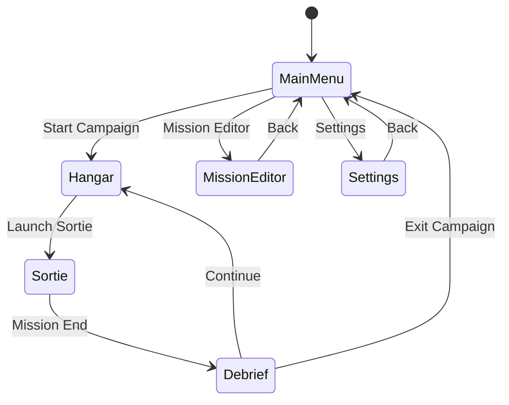
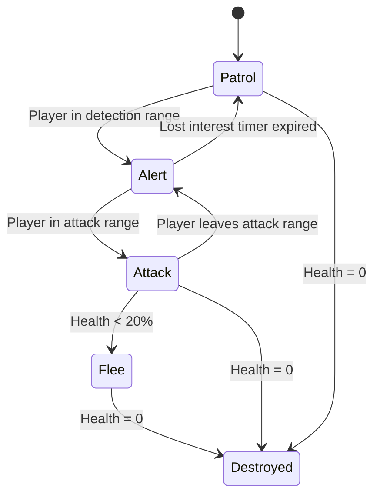

# R-STRIKER

A Desert Strike-inspired helicopter combat game built with React Three Fiber featuring TRON-style wireframe aesthetics, horizontal-plane-locked flight, air-to-ground combat, resource management, and a comprehensive level editor.

## Description

R-STRIKER is a browser-based isometric helicopter combat game that merges the iconic visual style of TRON (1982) with the gameplay mechanics of Desert Strike (1992). Players pilot a wireframe attack helicopter across geometric arenas, engaging stationary and slow-moving ground targets while managing three critical resources: armor, fuel, and ammunition.

The helicopter is locked to a horizontal plane—there is no altitude variation—creating a "flying tank" feel where the player glides across the battlefield with momentum-based physics. Combat focuses on air-to-ground engagements against SAM sites, AA guns, tanks, infantry, and fortified structures using a three-weapon arsenal: infinite machine gun, limited rockets, and precious guided missiles.

The visual aesthetic is pure wireframe geometry with neon-lit edges—no PNG textures are used. All rendering follows an SVGA shader style with vibrant cyan, magenta, orange, and white color palettes against dark backgrounds. The isometric perspective provides tactical awareness while maintaining the abstract digital aesthetic.

## Game Architecture

```
┌─────────────────────────────────────────────────────────────┐
│                        App.tsx                               │
│  (Root component, state management, screen routing)          │
├─────────────────────────────────────────────────────────────┤
│                                                              │
│  ┌──────────────┐  ┌──────────────┐  ┌──────────────┐       │
│  │  MainMenu    │  │   Hangar     │  │  Sortie      │       │
│  │  Screen.tsx  │  │  Screen.tsx  │  │  Screen.tsx  │       │
│  └──────────────┘  └──────────────┘  └──────────────┘       │
│                                                              │
│  ┌──────────────┐  ┌──────────────┐  ┌──────────────┐       │
│  │   Debrief    │  │ MissionEditor│  │  Settings    │       │
│  │  Screen.tsx  │  │  Screen.tsx  │  │  Screen.tsx  │       │
│  └──────────────┘  └──────────────┘  └──────────────┘       │
│                                                              │
├─────────────────────────────────────────────────────────────┤
│                    Shared Components                         │
│  ┌────────────┐ ┌────────────┐ ┌────────────┐               │
│  │ 3D/        │ │ UI/        │ │ Game/      │               │
│  │ Chopper.tsx│ │ HUD.tsx    │ │ GameState  │               │
│  │ Arena.tsx  │ │ Button.tsx │ │ .ts        │               │
│  │ Targets.tsx│ │ Panel.tsx  │ │ Resources  │               │
│  │ Pickups.tsx│ │ Gauges.tsx │ │ .ts        │               │
│  │ Terrain.tsx│ │ Minimap.tsx│ │ Input.ts   │               │
│  └────────────┘ └────────────┘ └────────────┘               │
└─────────────────────────────────────────────────────────────┘
```

## Functionality

### Screen Flow



### Screen Specifications

---

#### 1. Main Menu Screen (`screens/MainMenuScreen.tsx`)

**Visual Layout:**
- Centered vertically and horizontally
- Large "R-STRIKER" title with glowing cyan wireframe effect
- Subtitle: "DIGITAL STRIKE FORCE" in smaller orange text
- Four menu buttons stacked vertically with 20px spacing
- Animated wireframe helicopter rotating slowly in background with rotor spin

**Menu Options:**

| Button | Action |
|--------|--------|
| START CAMPAIGN | Navigate to Hangar screen |
| MISSION EDITOR | Navigate to MissionEditor screen |
| SETTINGS | Navigate to Settings screen |
| EXIT | Close application / show exit confirmation |

**Interactions:**
- Buttons glow brighter on hover (opacity 0.7 → 1.0)
- Click triggers screen transition with fade effect (300ms)
- Keyboard navigation: Arrow keys to select, Enter to confirm

---

#### 2. Hangar Screen (`screens/HangarScreen.tsx`)

**Purpose:** Pre-mission setup, loadout configuration, and mission briefing hub.

**Layout Sections:**

```
┌─────────────────────────────────────────────────────────────┐
│  [BACK]                      THE HANGAR                      │
├───────────────────┬─────────────────────────────────────────┤
│                   │                                          │
│  CHOPPER PREVIEW  │          LOADOUT PANEL                   │
│  (3D rotating     │   ┌──────────────────────────────────┐   │
│   helicopter)     │   │ Primary: [Machine Gun Config]    │   │
│                   │   │ Rockets: [Hydra/FFAR/Custom]     │   │
│   STATS READOUT   │   │ Missiles: [Hellfire/TOW]         │   │
│   ─────────────   │   │ Starting Rockets: [Slider 20-50] │   │
│   Armor: ████░░   │   │ Starting Missiles: [Slider 4-12] │   │
│   Speed: ███░░░   │   │ Fuel Capacity: [Slider]          │   │
│   Agility: ████░  │   └──────────────────────────────────┘   │
│                   │                                          │
├───────────────────┴─────────────────────────────────────────┤
│                    MISSION SELECT                            │
│   [Mission 1] [Mission 2] [Mission 3] [Custom...] [Random]  │
├─────────────────────────────────────────────────────────────┤
│  MISSION BRIEFING:                                           │
│  "Destroy SAM installations in sectors A-3 and B-7.         │
│   Rescue downed pilot at coordinates 45,72.                  │
│   RTB to friendly base for resupply."                        │
│                                                              │
│  Objectives: [✓] Destroy SAMs  [✓] Rescue Pilot  [ ] Bonus  │
│                                         [LAUNCH SORTIE]      │
└─────────────────────────────────────────────────────────────┘
```

**Helicopter Loadout Configuration:**

```typescript
interface ChopperLoadout {
  // Weapon systems
  primaryType: 'standard_mg' | 'gatling' | 'autocannon';
  rocketType: 'hydra' | 'ffar' | 'zuni';
  missileType: 'hellfire' | 'tow' | 'maverick';
  
  // Starting resources
  startingRockets: number;    // 20-50, default 38
  startingMissiles: number;   // 4-12, default 8
  fuelCapacity: number;       // 80-120%, affects max fuel
  
  // Performance stats (affected by loadout weight)
  armorRating: number;        // 1-10, base durability
  maxSpeed: number;           // 1-10, movement speed
  agility: number;            // 1-10, turn rate and drift
  
  // Cosmetic
  primaryColor: string;       // Hex color for wireframe
  accentColor: string;        // Secondary glow color
}
```

**Weapon Type Details:**

| Primary | Damage/Hit | Fire Rate | Notes |
|---------|------------|-----------|-------|
| Standard MG | 5 | 10/sec | Balanced |
| Gatling | 3 | 20/sec | High volume, lower accuracy |
| Autocannon | 12 | 4/sec | Slow, high damage per hit |

| Rockets | Damage | Capacity Modifier | Notes |
|---------|--------|-------------------|-------|
| Hydra | 25 | 1.0x | Standard |
| FFAR | 20 | 1.3x | More rockets, less damage |
| Zuni | 40 | 0.6x | Fewer rockets, high damage |

| Missiles | Damage | Tracking | Notes |
|----------|--------|----------|-------|
| Hellfire | 100 | Strong | Best tracking |
| TOW | 80 | Medium | Wire-guided feel |
| Maverick | 150 | Weak | Highest damage, must aim well |

**Mission Selection:**
- Grid of mission thumbnail previews (wireframe top-down tactical map)
- Built-in missions numbered 1-10 with increasing difficulty
- "Custom" button opens file picker for community missions
- "Random" generates procedural mission with random objectives

---

#### 3. Sortie Screen (`screens/SortieScreen.tsx`)

**Primary Gameplay Arena - Isometric Air-to-Ground Combat**

**Camera System:**
- Fixed isometric angle: 45° rotation, 60° pitch
- Camera follows helicopter with smooth lerp (0.08 factor)
- Zoom level adjustable: 15-40 units above ground plane
- No camera collision—always maintains clear view
- Optional: Rotate camera 90° increments (Q/E keys)

**HUD Elements (`components/ui/GameHUD.tsx`):**

```
┌─────────────────────────────────────────────────────────────┐
│  ┌─────────────────────┐              ┌─────────────────┐   │
│  │ ARMOR  ████████░░░  │              │    TACTICAL     │   │
│  │        [156/200]    │              │      MAP        │   │
│  │ FUEL   ██████░░░░░  │              │   ┌─────────┐   │   │
│  │        [63%]        │              │   │  · ▲ ·  │   │   │
│  │ ROCKETS [24/38]     │              │   │ × · · × │   │   │
│  │ MISSILES [5/8]      │              │   │  · ○ ·  │   │   │
│  └─────────────────────┘              │   └─────────┘   │   │
│                                        │ ▲=You ×=Enemy  │   │
│                                        │ ○=Objective    │   │
│                  (ISOMETRIC 3D VIEW)   └─────────────────┘   │
│                                                              │
│                      ┌───┐                                   │
│                      │ ▲ │  ← Player Helicopter              │
│                      └───┘                                   │
│                                                              │
│            [×] SAM        [×] Tank       ○ POW               │
│                                                              │
│  ┌─────────────────────────────────────────────────────────┐│
│  │[MG: ∞ RDY] [ROCKETS: 24] [MISSILES: 5]    [ESC: Pause] ││
│  └─────────────────────────────────────────────────────────┘│
│  OBJECTIVE: Destroy SAM Site Alpha  [2/3 Complete]          │
└─────────────────────────────────────────────────────────────┘
```

**Player Controls - Horizontal Plane Movement:**

| Input | Action |
|-------|--------|
| W / ↑ | Move forward (helicopter facing direction) |
| S / ↓ | Move backward |
| A / ← | Strafe left |
| D / → | Strafe right |
| Mouse Move | Rotate helicopter to face cursor |
| Left Click | Fire machine gun (hold for continuous) |
| Right Click | Fire rockets (tap for single, hold for burst) |
| Middle Click / F | Fire guided missile |
| Space | Emergency boost (uses extra fuel) |
| Q / E | Rotate camera 90° |
| Tab | Toggle tactical map fullscreen |
| ESC | Pause menu |

**Movement Physics - Horizontal Plane Lock System:**

```typescript
interface ChopperPhysics {
  // Position (Z is always ground_level + hover_height)
  position: { x: number; y: number; z: number };
  
  // Velocity with momentum
  velocity: { x: number; y: number };  // No Z velocity
  
  // Movement parameters
  maxSpeed: number;           // Units per second (12-18 based on loadout)
  acceleration: number;       // How fast we reach max speed (0.3s ramp)
  deceleration: number;       // Drag when no input (drift factor)
  turnSpeed: number;          // Rotation degrees per second
  
  // Constants
  hoverHeight: 3;             // Fixed height above terrain
  driftFactor: 0.92;          // Velocity multiplier per frame when idle
  boostMultiplier: 1.8;       // Speed boost when using emergency boost
  
  // Collision
  collisionRadius: 1.5;       // For terrain/structure collision
  bounceForce: 0.4;           // Velocity reflection on collision
  collisionDamage: 5;         // Armor damage per collision
}
```

**Movement Behavior Specification:**
1. Helicopter hovers at fixed height (3 units) above terrain - NO altitude control
2. WASD provides 8-directional movement relative to current facing
3. Mouse cursor determines helicopter rotation (smooth lerp to face cursor)
4. Momentum-based physics: helicopter drifts when input released
5. Acceleration takes ~0.3 seconds to reach full speed
6. Deceleration uses drift factor (0.92 per frame) for gradual slowdown
7. Collision with terrain/structures causes bounce-back and minor damage
8. Emergency boost (Space) increases speed 1.8x but drains fuel faster

---

### Resource Management System

**Three-Resource Economy:**

```typescript
interface ResourceState {
  // Health/Armor
  armor: number;              // Current armor points
  maxArmor: number;           // Maximum armor (150-250 based on loadout)
  
  // Fuel
  fuel: number;               // Current fuel percentage (0-100)
  fuelDrainRate: number;      // Percent per second while flying (0.5%)
  fuelBoostDrain: number;     // Additional drain when boosting (1.5%)
  
  // Ammunition
  rockets: number;            // Current rocket count
  maxRockets: number;         // Capacity (20-50)
  missiles: number;           // Current missile count
  maxMissiles: number;        // Capacity (4-12)
  // Machine gun is infinite
}
```

**Resource Drain Rates:**

| Resource | Passive Drain | Active Drain | Recovery |
|----------|---------------|--------------|----------|
| Armor | None | Enemy fire, collisions | Base landing (full), Repair pickup (+50) |
| Fuel | 0.5%/sec | +1.5%/sec when boosting | Fuel drum (+25%), Base landing (full) |
| Rockets | None | 1 per shot | Ammo crate (+10), Base landing (full) |
| Missiles | None | 1 per shot | Ammo crate (+2), Base landing (full) |

**Fuel Depletion Consequence:**
- At 10% fuel: Warning alarm, HUD flashes
- At 0% fuel: Helicopter forced landing, mission failure

**Pickup Entities:**

```typescript
interface Pickup {
  id: string;
  type: 'fuel' | 'ammo' | 'repair' | 'bonus';
  position: Vector3;
  collected: boolean;
  respawnTime: number | null;  // Seconds until respawn, null = no respawn
  
  // Type-specific values
  fuelAmount?: number;         // Percentage restored (default 25)
  rocketAmount?: number;       // Rockets restored (default 10)
  missileAmount?: number;      // Missiles restored (default 2)
  armorAmount?: number;        // Armor restored (default 50)
  bonusPoints?: number;        // Score bonus (default 500)
}
```

**Pickup Visual Design:**
- Fuel Drums: Yellow wireframe cylinder, pulsing glow
- Ammo Crates: Green wireframe cube, rotating slowly
- Repair Kits: White wireframe cross/plus shape
- Bonus Items: Magenta wireframe star, spinning

---

### Combat Systems

**Weapon Arsenal - Three-Tier System:**

#### 1. Machine Gun (Primary - Infinite Ammo)

```typescript
interface MachineGunSpec {
  damage: number;             // 3-12 based on type
  fireRate: number;           // Shots per second (4-20)
  projectileSpeed: 80;        // Units per second
  spread: number;             // Degrees of random deviation (2-8)
  range: 60;                  // Units before despawn
  
  // Visual
  projectileColor: '#FFFF00'; // Yellow tracer
  muzzleFlash: true;
}
```

**Machine Gun Behavior:**
- Hold left-click for continuous fire
- Projectiles travel in straight line with slight spread
- Low damage per hit, effective against infantry and light targets
- No tracking or guidance

#### 2. Rockets (Secondary - Limited Ammo)

```typescript
interface RocketSpec {
  damage: number;             // 20-40 based on type
  fireRate: 3;                // Shots per second (burst)
  projectileSpeed: 50;        // Units per second
  splashRadius: 4;            // Damage falloff radius
  splashDamage: 0.5;          // Multiplier for splash (50% at edge)
  range: 80;                  // Units before despawn
  
  // Visual
  projectileColor: '#FF6600'; // Orange
  trailEffect: true;          // Smoke trail
  explosionSize: 6;           // Visual explosion radius
}
```

**Rocket Behavior:**
- Right-click tap fires single rocket
- Right-click hold fires burst (3 rockets, 0.15s apart)
- Unguided, travels in straight line
- Splash damage affects nearby enemies
- Effective against vehicles and structures

#### 3. Guided Missiles (Heavy - Precious Limited Ammo)

```typescript
interface MissileSpec {
  damage: number;             // 80-150 based on type
  fireRate: 0.5;              // Slow fire rate
  projectileSpeed: 35;        // Initial speed
  maxSpeed: 55;               // Accelerates to this
  trackingStrength: number;   // Turn rate toward target (0.5-0.9)
  lockOnRange: 50;            // Range for auto-lock
  range: 120;                 // Max travel distance
  
  // Visual
  projectileColor: '#FF0000'; // Red
  trailEffect: true;          // Smoke trail
  explosionSize: 10;          // Large explosion
}
```

**Missile Behavior:**
- Middle-click or F to fire
- Automatically locks onto nearest valid target in range
- Tracking strength varies by missile type
- Best used against high-value hardened targets
- Limited supply—use wisely

**Targeting System:**

```typescript
interface TargetingSystem {
  // Auto-target acquisition
  lockOnRange: number;        // Range to acquire targets
  lockOnArc: 90;              // Degrees (cone in facing direction)
  priorityOrder: ['sam', 'aa_gun', 'tank', 'apc', 'structure', 'infantry'];
  
  // Current state
  lockedTarget: string | null;  // Entity ID
  lockProgress: number;         // 0-1, missiles need 0.5s lock
  
  // Visual feedback
  targetReticle: boolean;       // Show reticle on locked target
  lockWarning: boolean;         // Show when enemy locks onto player
}
```

---

### Enemy Types & Behaviors

**Stationary Targets:**

```typescript
interface StationaryEnemy {
  id: string;
  type: 'sam_site' | 'aa_gun' | 'bunker' | 'radar' | 'fuel_depot' | 'structure';
  position: Vector3;
  rotation: number;           // Facing direction
  health: number;
  maxHealth: number;
  
  // Combat
  attackRange: number;
  attackDamage: number;
  attackRate: number;         // Attacks per second
  attackType: 'missile' | 'flak' | 'bullet' | 'none';
  
  // Behavior
  trackingSpeed: number;      // How fast turret rotates to track player
  alertRange: number;         // Range to detect player
  
  // Rewards
  scoreValue: number;
  isObjective: boolean;       // Required for mission completion
}
```

**Stationary Enemy Specifications:**

| Type | Health | Attack Type | Damage | Range | Threat | Score |
|------|--------|-------------|--------|-------|--------|-------|
| SAM Site | 150 | Homing Missile | 60 | 80 | CRITICAL | 1000 |
| AA Gun | 80 | Flak Burst | 15 | 50 | HIGH | 500 |
| Bunker | 200 | Bullet Stream | 8 | 40 | MEDIUM | 750 |
| Radar | 50 | None | 0 | 0 | LOW | 300 |
| Fuel Depot | 100 | None (explodes) | 0 | 0 | LOW | 400 |
| Structure | 120 | None | 0 | 0 | LOW | 200 |

**Mobile Targets:**

```typescript
interface MobileEnemy {
  id: string;
  type: 'tank' | 'apc' | 'jeep' | 'infantry' | 'mobile_sam' | 'boat';
  position: Vector3;
  rotation: number;
  velocity: Vector3;
  
  health: number;
  maxHealth: number;
  
  // Movement
  moveSpeed: number;          // Units per second
  patrolPath: Vector3[];      // Waypoints
  currentWaypoint: number;
  
  // Combat
  attackRange: number;
  attackDamage: number;
  attackRate: number;
  attackType: 'shell' | 'missile' | 'bullet' | 'none';
  turretTrackSpeed: number;
  
  // AI
  aiState: 'patrol' | 'alert' | 'attack' | 'flee';
  detectionRange: number;
  loseInterestTime: number;   // Seconds before returning to patrol
  
  // Rewards
  scoreValue: number;
  isObjective: boolean;
}
```

**Mobile Enemy Specifications:**

| Type | Health | Speed | Attack | Damage | Range | Score |
|------|--------|-------|--------|--------|-------|-------|
| Tank | 120 | 3 | Shell | 35 | 45 | 800 |
| APC | 60 | 5 | Bullet | 10 | 35 | 400 |
| Jeep | 25 | 8 | Bullet | 5 | 30 | 200 |
| Infantry | 10 | 2 | Bullet | 3 | 25 | 100 |
| Mobile SAM | 100 | 4 | Missile | 50 | 70 | 1200 |
| Boat | 80 | 6 | Shell | 25 | 40 | 600 |

**Enemy AI State Machine:**



**Enemy Attack Patterns:**

| Attack Type | Behavior |
|-------------|----------|
| Missile (SAM) | Lock-on warning (1s) → Launch → Tracks player for 5s |
| Flak (AA) | Burst of 5 projectiles with spread, leading player position |
| Shell (Tank) | Single high-damage projectile, slow turret tracking |
| Bullet | Rapid stream, low accuracy, suppressive |

**Lock-On Warning System:**
- When SAM/Mobile SAM locks onto player, HUD shows "MISSILE LOCK" warning
- Audio alarm plays during lock-on
- Player has 1 second to break line of sight or destroy launcher

---

### Friendly Units & Rescue System

**Rescue Objectives:**

```typescript
interface RescueTarget {
  id: string;
  type: 'pow' | 'pilot' | 'vip' | 'soldier';
  position: Vector3;
  rescued: boolean;
  
  // Rescue mechanics
  pickupRadius: 3;            // Must be within this range
  pickupTime: 2;              // Seconds to complete pickup (must hover)
  
  // Rewards
  scoreValue: number;
  isObjective: boolean;       // Required for mission success
  
  // Visual
  signalFlare: boolean;       // Shows flare particle effect
  waveAnimation: boolean;     // Character waves for attention
}
```

**Rescue Mechanic:**
1. Approach rescue target within pickup radius (3 units)
2. Helicopter must remain stationary for 2 seconds
3. Progress bar shows pickup progress
4. Moving cancels pickup (must restart)
5. Once rescued, target boards helicopter
6. Return to friendly base to complete rescue

**Passenger Capacity:**
- Maximum 6 passengers
- Each passenger type has different point value
- POWs and Pilots are often mission objectives
- Co-pilot rescues grant extra life

**Friendly Base:**

```typescript
interface FriendlyBase {
  id: string;
  position: Vector3;
  landingZoneRadius: 8;
  
  // Services when landed
  repairsArmor: true;         // Full armor restore
  refuelsFuel: true;          // Full fuel restore
  restocksAmmo: true;         // Full ammo restore
  acceptsPassengers: true;    // Drops off rescued personnel
  
  // Visual
  landingPadMarker: true;     // Glowing 'H' pad
  radarDish: true;            // Rotating dish decoration
}
```

**Base Landing Mechanic:**
1. Enter landing zone radius (8 units)
2. HUD shows "HOLD TO LAND" prompt
3. Press and hold Space for 1.5 seconds
4. Helicopter descends to pad (visual only—still on horizontal plane)
5. All resources restored, passengers offloaded
6. Press Space to take off

---

### Mission Structure

**Objective Types:**

```typescript
type ObjectiveType = 
  | 'destroy'       // Eliminate specific target(s)
  | 'destroy_all'   // Eliminate all enemies of type
  | 'rescue'        // Extract personnel
  | 'protect'       // Keep target alive for duration
  | 'survive'       // Stay alive for time limit
  | 'collect'       // Gather pickup items
  | 'reach'         // Arrive at location
  | 'rtb';          // Return to base

interface MissionObjective {
  id: string;
  type: ObjectiveType;
  description: string;
  
  // Target specification
  targetIds?: string[];       // Specific entity IDs
  targetType?: string;        // Enemy type for 'destroy_all'
  targetPosition?: Vector3;   // Location for 'reach'
  targetCount?: number;       // Number required
  
  // Progress
  currentProgress: number;
  requiredProgress: number;
  isComplete: boolean;
  
  // Classification
  isPrimary: boolean;         // Required for mission success
  isBonus: boolean;           // Optional extra objectives
  bonusScore: number;
}
```

**Mission Data Structure:**

```typescript
interface Mission {
  id: string;
  name: string;
  description: string;
  briefing: string;           // Shown in Hangar
  
  // Map data
  mapSize: { width: number; height: number };
  terrain: TerrainTile[][];
  
  // Entities
  enemies: (StationaryEnemy | MobileEnemy)[];
  pickups: Pickup[];
  rescueTargets: RescueTarget[];
  friendlyBases: FriendlyBase[];
  
  // Objectives
  objectives: MissionObjective[];
  
  // Player start
  playerStart: { position: Vector3; rotation: number };
  
  // Difficulty
  difficulty: 'easy' | 'normal' | 'hard' | 'nightmare';
  timeLimit: number | null;   // Seconds, null = no limit
  
  // Metadata
  author: string;
  version: string;
  thumbnail?: string;         // Base64 preview image
}
```

**Victory/Defeat Conditions:**

| Condition | Result | Trigger |
|-----------|--------|---------|
| All primary objectives complete | VICTORY | Check after each objective |
| Player armor reaches 0 | DEFEAT | On damage event |
| Fuel reaches 0 | DEFEAT | On fuel drain |
| Time limit exceeded | DEFEAT | Timer expiry |
| Player lands at base after all objectives | MISSION COMPLETE | Landing check |

---

#### 4. Debrief Screen (`screens/DebriefScreen.tsx`)

**Post-Mission Statistics Display:**

```
┌─────────────────────────────────────────────────────────────┐
│                     MISSION COMPLETE                         │
│                        ★ ★ ★ ☆ ☆                            │
│                    RATING: EXCELLENT                         │
├─────────────────────────────────────────────────────────────┤
│                                                              │
│   Time:              04:32                                   │
│   Enemies Destroyed: 12/15                                   │
│   Accuracy:          68%                                     │
│   Personnel Rescued: 3/3                                     │
│   Damage Taken:      87                                      │
│   Fuel Used:         73%                                     │
│                                                              │
│   ─────────────────────────────────────────────             │
│                                                              │
│   SCORE BREAKDOWN:                                           │
│   Enemies:           +8,400                                  │
│   Rescues:           +3,000                                  │
│   Objectives:        +5,000                                  │
│   Time Bonus:        +1,200                                  │
│   Accuracy Bonus:    +680                                    │
│   No Damage Bonus:   +0                                      │
│   ─────────────────────────────────────────────             │
│   TOTAL:             18,280                                  │
│                                                              │
├─────────────────────────────────────────────────────────────┤
│          [CONTINUE]              [EXIT TO MENU]              │
└─────────────────────────────────────────────────────────────┘
```

**Statistics Tracked:**

```typescript
interface MissionStats {
  // Time
  missionDuration: number;    // Seconds
  timeLimit: number | null;
  
  // Combat
  enemiesDestroyed: number;
  totalEnemies: number;
  shotsFired: number;
  shotsHit: number;
  accuracy: number;           // Calculated percentage
  
  // Resources
  damageTaken: number;
  fuelUsed: number;           // Percentage of starting fuel
  rocketsUsed: number;
  missilesUsed: number;
  
  // Objectives
  objectivesCompleted: number;
  totalObjectives: number;
  bonusObjectives: number;
  
  // Rescue
  personnelRescued: number;
  totalPersonnel: number;
  
  // Score
  enemyScore: number;
  rescueScore: number;
  objectiveScore: number;
  timeBonus: number;
  accuracyBonus: number;
  noDamageBonus: number;
  totalScore: number;
}
```

**Star Rating Calculation:**
- ★★★★★: All objectives, all rescues, >80% accuracy, no damage
- ★★★★☆: All objectives, all rescues, >60% accuracy
- ★★★☆☆: All primary objectives complete
- ★★☆☆☆: Mission complete with some objectives failed
- ★☆☆☆☆: Barely survived

---

#### 5. Mission Editor Screen (`screens/MissionEditorScreen.tsx`)

**Purpose:** Create and edit custom missions with full control over terrain, enemies, objectives, and gameplay parameters.

**Layout:**

```
┌─────────────────────────────────────────────────────────────┐
│  [BACK] [NEW] [LOAD] [SAVE] [EXPORT]    MISSION EDITOR      │
├────────────┬────────────────────────────────────────────────┤
│            │                                                 │
│  TOOLBOX   │              EDITOR CANVAS                      │
│  ────────  │         (Isometric Grid View)                   │
│            │                                                 │
│  [Terrain] │    ┌─────────────────────────────────┐         │
│   Sand     │    │  · · · · · · · · · · · · · · ·  │         │
│   Water    │    │  · · · × · · · · · ○ · · · · ·  │         │
│   Rock     │    │  · · · · · · █ █ · · · · · · ·  │         │
│   Road     │    │  · · · · · · █ █ · · · · · · ·  │         │
│            │    │  · · ▲ · · · · · · · · · · · ·  │         │
│  [Enemies] │    │  · · · · · · · · · · · △ · · ·  │         │
│   SAM      │    │  · · · · · · · · · · · · · · ·  │         │
│   AA Gun   │    │  · · · · · · · · · · · · · · ·  │         │
│   Tank     │    └─────────────────────────────────┘         │
│   APC      │                                                 │
│   Infantry │    [ZOOM: ─●────] [GRID: ON] [SNAP: ON]        │
│   Boat     │                                                 │
│            │                                                 │
│  [Pickups] ├────────────────────────────────────────────────┤
│   Fuel     │  PROPERTIES PANEL                               │
│   Ammo     │  ─────────────────                              │
│   Repair   │  Selected: SAM Site                             │
│            │  Position: (12, 8)                              │
│  [Friendly]│  Rotation: [Slider 0-360]                       │
│   Base     │  Health: [Slider 50-300]                        │
│   POW      │  Is Objective: [✓]                              │
│   Pilot    │  Patrol Path: [Edit...]                         │
│            │                                                 │
│  [Special] │                                                 │
│   Player   │                                                 │
│   Start    │                                                 │
│            │                                                 │
├────────────┴────────────────────────────────────────────────┤
│  MISSION SETTINGS  │  OBJECTIVES                             │
│  Name: [________]  │  [+] Add Objective                      │
│  Size: [64]x[64]   │  [1] Destroy all SAM sites              │
│  Time Limit: [___] │  [2] Rescue downed pilot                │
│  Difficulty: [▼]   │  [3] (Bonus) Destroy fuel depot         │
│                    │                                          │
│               [VALIDATE]              [TEST PLAY]            │
└─────────────────────────────────────────────────────────────┘
```

**Editor Tools:**

```typescript
type EditorTool = 
  | 'select'        // Click to select entities
  | 'move'          // Drag entities
  | 'rotate'        // Rotate selected entity
  | 'delete'        // Remove entities
  | 'terrain_paint' // Paint terrain tiles
  | 'place_enemy'   // Place enemy entities
  | 'place_pickup'  // Place pickup items
  | 'place_friendly'// Place bases and rescue targets
  | 'place_player'  // Set player start position
  | 'patrol_path'   // Define patrol waypoints
  | 'objective'     // Configure objectives
  | 'pan'           // Pan camera view
  | 'zoom';         // Zoom in/out
```

**Terrain System:**

```typescript
interface TerrainTile {
  type: 'sand' | 'water' | 'rock' | 'road' | 'structure_floor';
  elevation: number;          // 0-3 levels
  passable: boolean;          // Can ground units cross
  slowdown: number;           // Movement speed multiplier (0.5-1.0)
  
  // Visual
  color: string;              // Wireframe color
  pattern: 'solid' | 'grid' | 'dashed';
}
```

**Terrain Types:**

| Type | Passable | Slowdown | Color | Notes |
|------|----------|----------|-------|-------|
| Sand | Yes | 1.0 | Tan | Default terrain |
| Water | Boats only | 0.7 | Blue | Infantry/vehicles cannot cross |
| Rock | No | N/A | Gray | Impassable obstacle |
| Road | Yes | 1.0 | Dark Gray | Visual only |
| Structure Floor | Yes | 1.0 | Cyan | Inside buildings |

**Entity Placement:**
- Click tool in toolbox to select
- Click on canvas to place at grid position
- Entities snap to grid (1 unit increments)
- Hold Shift for free placement (no snap)
- Right-click to cancel placement

**Patrol Path Editor:**
1. Select mobile enemy
2. Click "Edit Patrol" in properties
3. Click canvas to add waypoints
4. Drag waypoints to adjust
5. Press Enter to confirm path
6. Enemy will loop through waypoints

**Objective Configuration:**

```typescript
interface ObjectiveConfig {
  type: ObjectiveType;
  description: string;        // Shown in briefing
  targets: string[];          // Entity IDs
  isPrimary: boolean;
  bonusScore: number;
}
```

**Objective Types Available:**
- Destroy: Select specific enemies as targets
- Destroy All: Choose enemy type to eliminate
- Rescue: Select rescue targets
- Reach: Place destination marker
- RTB: Auto-configured when base exists

**Validation Rules:**
- Must have exactly one player start
- Must have at least one primary objective
- Must have at least one friendly base (for RTB)
- Enemies must have valid positions (not in water/rock)
- Patrol paths must have 2+ waypoints
- Map size minimum 16x16, maximum 128x128

**File Operations:**

| Action | Behavior |
|--------|----------|
| New | Clear canvas, reset to defaults |
| Load | Open file picker, load .rsmission JSON |
| Save | Save to browser localStorage |
| Export | Download as .rsmission file |
| Test Play | Launch Sortie with current mission |

**Mission File Format:**

```typescript
interface MissionFile {
  format: 'r-striker-mission';
  version: '1.0';
  mission: Mission;           // Full mission data
  editorState?: {             // Optional editor metadata
    lastModified: string;
    author: string;
    notes: string;
  };
}
```

---

#### 6. Settings Screen (`screens/SettingsScreen.tsx`)

**Categories and Options:**

```
┌─────────────────────────────────────────────────────────────┐
│  [BACK]                    SETTINGS                          │
├─────────────────────────────────────────────────────────────┤
│                                                              │
│  AUDIO                                                       │
│  ─────                                                       │
│  Master Volume:     [────●────] 80%                         │
│  Music Volume:      [──────●──] 60%                         │
│  SFX Volume:        [────────●] 100%                        │
│                                                              │
│  GRAPHICS                                                    │
│  ────────                                                    │
│  Quality:           [Low] [Medium] [●High]                  │
│  Wireframe Glow:    [───●──────] 50%                        │
│  Screen Shake:      [ON] [●OFF]                             │
│  Particle Density:  [Low] [●Med] [High]                     │
│                                                              │
│  CONTROLS                                                    │
│  ────────                                                    │
│  Mouse Sensitivity: [────●────] 1.0                         │
│  Invert Y:          [ON] [●OFF]                             │
│  [REBIND KEYS...]                                            │
│                                                              │
│  GAMEPLAY                                                    │
│  ────────                                                    │
│  Difficulty:        [Easy] [●Normal] [Hard]                 │
│  Auto-Target:       [●ON] [OFF]                             │
│  HUD Opacity:       [──────●──] 90%                         │
│  Minimap Size:      [Small] [●Medium] [Large]               │
│                                                              │
│  ACCESSIBILITY                                               │
│  ─────────────                                               │
│  Color Blind Mode:  [●Off] [Deuteranopia] [Protanopia]      │
│  High Contrast:     [ON] [●OFF]                             │
│  Reduced Motion:    [ON] [●OFF]                             │
│                                                              │
│                         [RESET TO DEFAULTS]                  │
└─────────────────────────────────────────────────────────────┘
```

**Settings Data Structure:**

```typescript
interface GameSettings {
  audio: {
    masterVolume: number;     // 0-100
    musicVolume: number;      // 0-100
    sfxVolume: number;        // 0-100
  };
  
  graphics: {
    quality: 'low' | 'medium' | 'high';
    wireframeGlow: number;    // 0-100
    screenShake: boolean;
    particleDensity: 'low' | 'medium' | 'high';
  };
  
  controls: {
    mouseSensitivity: number; // 0.1-3.0
    invertY: boolean;
    keyBindings: Record<string, string>;
  };
  
  gameplay: {
    difficulty: 'easy' | 'normal' | 'hard';
    autoTarget: boolean;
    hudOpacity: number;       // 0-100
    minimapSize: 'small' | 'medium' | 'large';
  };
  
  accessibility: {
    colorBlindMode: 'off' | 'deuteranopia' | 'protanopia' | 'tritanopia';
    highContrast: boolean;
    reducedMotion: boolean;
  };
}
```

**Default Key Bindings:**

| Action | Default Key | Rebindable |
|--------|-------------|------------|
| Move Forward | W | Yes |
| Move Backward | S | Yes |
| Strafe Left | A | Yes |
| Strafe Right | D | Yes |
| Fire MG | Left Click | No |
| Fire Rockets | Right Click | No |
| Fire Missile | F | Yes |
| Boost | Space | Yes |
| Rotate Camera Left | Q | Yes |
| Rotate Camera Right | E | Yes |
| Toggle Map | Tab | Yes |
| Pause | Escape | No |
| Land/Takeoff | Space (at base) | No |

---

## Technical Implementation

### State Management with Zustand

```typescript
// stores/gameStore.ts
interface GameStore {
  // Screen state
  currentScreen: ScreenType;
  setScreen: (screen: ScreenType) => void;
  
  // Player state
  playerLoadout: ChopperLoadout;
  setLoadout: (loadout: Partial<ChopperLoadout>) => void;
  
  // Mission state
  currentMission: Mission | null;
  missionStats: MissionStats | null;
  
  // Runtime game state
  gameState: 'playing' | 'paused' | 'victory' | 'defeat';
  resources: ResourceState;
  updateResources: (delta: Partial<ResourceState>) => void;
  
  // Entities (during gameplay)
  enemies: Map<string, Enemy>;
  projectiles: Map<string, Projectile>;
  pickups: Map<string, Pickup>;
  
  // Settings
  settings: GameSettings;
  updateSettings: (settings: Partial<GameSettings>) => void;
}
```

### Game Loop Architecture

```typescript
// hooks/useGameLoop.ts
function useGameLoop() {
  useFrame((state, delta) => {
    if (gameState !== 'playing') return;
    
    // 1. Process input
    const input = processInput();
    
    // 2. Update player physics
    updatePlayerPhysics(input, delta);
    
    // 3. Drain fuel
    drainFuel(delta);
    
    // 4. Update enemies (10Hz throttled)
    if (shouldUpdateAI(state.clock)) {
      updateEnemyAI();
    }
    
    // 5. Update projectiles
    updateProjectiles(delta);
    
    // 6. Check collisions
    checkCollisions();
    
    // 7. Check objectives
    checkObjectiveProgress();
    
    // 8. Check win/lose conditions
    checkGameEndConditions();
  });
}
```

### 3D Entity Components

**Helicopter Component:**

```typescript
// components/3d/Chopper.tsx
interface ChopperProps {
  position: [number, number, number];
  rotation: number;
  loadout: ChopperLoadout;
  isPlayer: boolean;
}

function Chopper({ position, rotation, loadout, isPlayer }: ChopperProps) {
  const meshRef = useRef<THREE.Group>(null);
  
  return (
    <group ref={meshRef} position={position} rotation={[0, rotation, 0]}>
      {/* Fuselage */}
      <mesh>
        <boxGeometry args={[2, 0.8, 4]} />
        <meshBasicMaterial 
          color={loadout.primaryColor} 
          wireframe 
          transparent 
          opacity={0.9} 
        />
      </mesh>
      
      {/* Cockpit */}
      <mesh position={[0, 0.4, 1.2]}>
        <sphereGeometry args={[0.6, 8, 6]} />
        <meshBasicMaterial color="#00FFFF" wireframe transparent opacity={0.7} />
      </mesh>
      
      {/* Main Rotor */}
      <RotorBlade position={[0, 0.8, 0]} speed={isPlayer ? 15 : 10} />
      
      {/* Tail Boom */}
      <mesh position={[0, 0.2, -2.5]}>
        <cylinderGeometry args={[0.2, 0.15, 3]} />
        <meshBasicMaterial color={loadout.primaryColor} wireframe />
      </mesh>
      
      {/* Tail Rotor */}
      <RotorBlade position={[0.3, 0.2, -3.8]} speed={20} scale={0.3} axis="x" />
      
      {/* Weapons */}
      <WeaponPods loadout={loadout} />
    </group>
  );
}
```

**Enemy Structure Components:**

```typescript
// components/3d/SAMSite.tsx
function SAMSite({ position, rotation, health, maxHealth }: SAMSiteProps) {
  const healthPercent = health / maxHealth;
  
  return (
    <group position={position}>
      {/* Base platform */}
      <mesh rotation={[-Math.PI / 2, 0, 0]}>
        <circleGeometry args={[3, 8]} />
        <meshBasicMaterial color="#FF6600" wireframe />
      </mesh>
      
      {/* Rotating launcher */}
      <group rotation={[0, rotation, 0]}>
        {/* Turret base */}
        <mesh position={[0, 1, 0]}>
          <cylinderGeometry args={[1, 1.2, 2, 8]} />
          <meshBasicMaterial color="#FF6600" wireframe />
        </mesh>
        
        {/* Missile tubes */}
        <mesh position={[0, 2, 0]} rotation={[0.3, 0, 0]}>
          <boxGeometry args={[1.5, 0.8, 2]} />
          <meshBasicMaterial color="#FF0000" wireframe />
        </mesh>
      </group>
      
      {/* Health indicator */}
      <HealthBar position={[0, 4, 0]} percent={healthPercent} />
    </group>
  );
}
```

### Projectile System

```typescript
// systems/ProjectileSystem.ts
interface ProjectileState {
  id: string;
  type: 'mg' | 'rocket' | 'missile' | 'enemy_missile' | 'flak' | 'shell';
  position: Vector3;
  velocity: Vector3;
  damage: number;
  owner: 'player' | string;  // 'player' or enemy ID
  lifetime: number;
  
  // Missile-specific
  target?: string;
  trackingStrength?: number;
}

function updateProjectiles(projectiles: Map<string, ProjectileState>, delta: number) {
  projectiles.forEach((proj, id) => {
    // Update lifetime
    proj.lifetime -= delta;
    if (proj.lifetime <= 0) {
      projectiles.delete(id);
      return;
    }
    
    // Tracking for missiles
    if (proj.target && proj.trackingStrength) {
      const target = getEntityPosition(proj.target);
      if (target) {
        const toTarget = target.clone().sub(proj.position).normalize();
        const currentDir = proj.velocity.clone().normalize();
        const newDir = currentDir.lerp(toTarget, proj.trackingStrength * delta);
        proj.velocity = newDir.multiplyScalar(proj.velocity.length());
      }
    }
    
    // Update position
    proj.position.add(proj.velocity.clone().multiplyScalar(delta));
  });
}
```

### Collision Detection

```typescript
// systems/CollisionSystem.ts
function checkCollisions() {
  const playerPos = getPlayerPosition();
  const playerRadius = 1.5;
  
  // Player vs Enemy projectiles
  projectiles.forEach((proj, id) => {
    if (proj.owner !== 'player') {
      if (playerPos.distanceTo(proj.position) < playerRadius + 0.5) {
        damagePlayer(proj.damage);
        projectiles.delete(id);
        spawnHitEffect(proj.position);
      }
    }
  });
  
  // Player projectiles vs Enemies
  projectiles.forEach((proj, id) => {
    if (proj.owner === 'player') {
      enemies.forEach((enemy, enemyId) => {
        const enemyRadius = getEnemyRadius(enemy.type);
        if (enemy.position.distanceTo(proj.position) < enemyRadius + 0.5) {
          damageEnemy(enemyId, proj.damage);
          projectiles.delete(id);
          spawnHitEffect(proj.position);
          
          // Splash damage for rockets
          if (proj.type === 'rocket') {
            applySplashDamage(proj.position, 4, proj.damage * 0.5);
          }
        }
      });
    }
  });
  
  // Player vs Pickups
  pickups.forEach((pickup, id) => {
    if (!pickup.collected && playerPos.distanceTo(pickup.position) < 3) {
      collectPickup(pickup);
      pickup.collected = true;
    }
  });
  
  // Player vs Terrain/Structures
  checkTerrainCollision(playerPos, playerRadius);
}
```

---

## Visual Style Guide

### Color Palette

```typescript
const RSTRIKE_COLORS = {
  // Primary
  cyan: '#00FFFF',           // Player, friendly, UI primary
  orange: '#FF6600',         // Enemies, warnings
  magenta: '#FF00FF',        // Special items, bonuses
  
  // Secondary
  yellow: '#FFFF00',         // Machine gun tracers, fuel
  green: '#00FF00',          // Health, ammo, positive
  red: '#FF0000',            // Damage, missiles, critical
  white: '#FFFFFF',          // Neutral, text
  
  // Backgrounds
  darkBlue: '#001122',       // Primary background
  deepBlack: '#000008',      // Vignette edges
  
  // Terrain
  sand: '#CC9966',           // Desert terrain
  water: '#0066AA',          // Water bodies
  rock: '#666666',           // Impassable terrain
  road: '#333333',           // Roads and paths
};
```

### Typography

```css
/* Primary font for UI */
font-family: 'Orbitron', 'Courier New', monospace;

/* Sizes */
--font-title: 48px;
--font-heading: 24px;
--font-body: 16px;
--font-small: 12px;
--font-hud: 14px;

/* Weights */
--font-normal: 400;
--font-bold: 700;
```

### UI Components

```css
/* Panel styling */
.panel {
  background: rgba(0, 17, 34, 0.85);
  border: 1px solid rgba(0, 255, 255, 0.3);
  box-shadow: 
    0 0 10px rgba(0, 255, 255, 0.2),
    inset 0 0 20px rgba(0, 255, 255, 0.1);
  backdrop-filter: blur(4px);
}

/* Button styling */
.button {
  background: transparent;
  border: 2px solid #00FFFF;
  color: #00FFFF;
  padding: 12px 32px;
  font-family: 'Orbitron', monospace;
  text-transform: uppercase;
  letter-spacing: 2px;
  transition: all 0.2s;
}

.button:hover {
  background: rgba(0, 255, 255, 0.2);
  box-shadow: 0 0 20px rgba(0, 255, 255, 0.4);
}

/* Resource gauges */
.gauge {
  height: 20px;
  background: rgba(0, 0, 0, 0.5);
  border: 1px solid #00FFFF;
}

.gauge-fill {
  height: 100%;
  transition: width 0.3s;
}

.gauge-armor .gauge-fill {
  background: linear-gradient(90deg, #00FF00, #88FF88);
  box-shadow: 0 0 10px #00FF00;
}

.gauge-fuel .gauge-fill {
  background: linear-gradient(90deg, #FFFF00, #FFAA00);
  box-shadow: 0 0 10px #FFFF00;
}

.gauge-fuel.low .gauge-fill {
  background: linear-gradient(90deg, #FF0000, #FF6600);
  animation: pulse 0.5s infinite;
}
```

### 3D Wireframe Materials

```typescript
// Standard wireframe material
const wireframeMaterial = new THREE.MeshBasicMaterial({
  color: RSTRIKE_COLORS.cyan,
  wireframe: true,
  transparent: true,
  opacity: 0.9,
});

// Enemy wireframe material
const enemyMaterial = new THREE.MeshBasicMaterial({
  color: RSTRIKE_COLORS.orange,
  wireframe: true,
  transparent: true,
  opacity: 0.85,
});

// Glowing wireframe shader (for player helicopter)
const glowMaterial = new THREE.ShaderMaterial({
  uniforms: {
    color: { value: new THREE.Color(RSTRIKE_COLORS.cyan) },
    glowIntensity: { value: 1.5 },
    time: { value: 0 },
  },
  vertexShader: /* glsl */`
    varying vec3 vNormal;
    varying vec3 vPosition;
    void main() {
      vNormal = normal;
      vPosition = position;
      gl_Position = projectionMatrix * modelViewMatrix * vec4(position, 1.0);
    }
  `,
  fragmentShader: /* glsl */`
    uniform vec3 color;
    uniform float glowIntensity;
    uniform float time;
    varying vec3 vNormal;
    varying vec3 vPosition;
    void main() {
      float intensity = pow(0.7 - dot(vNormal, vec3(0, 0, 1.0)), 2.0);
      float pulse = 0.8 + 0.2 * sin(time * 3.0);
      gl_FragColor = vec4(color * glowIntensity * pulse, intensity);
    }
  `,
  transparent: true,
  wireframe: true,
});

// Terrain grid shader
const terrainGridMaterial = new THREE.ShaderMaterial({
  uniforms: {
    gridColor: { value: new THREE.Color(RSTRIKE_COLORS.sand) },
    gridSpacing: { value: 4.0 },
    gridThickness: { value: 0.05 },
  },
  vertexShader: /* glsl */`
    varying vec2 vUv;
    void main() {
      vUv = uv;
      gl_Position = projectionMatrix * modelViewMatrix * vec4(position, 1.0);
    }
  `,
  fragmentShader: /* glsl */`
    uniform vec3 gridColor;
    uniform float gridSpacing;
    uniform float gridThickness;
    varying vec2 vUv;
    void main() {
      vec2 grid = abs(fract(vUv * gridSpacing - 0.5) - 0.5) / fwidth(vUv * gridSpacing);
      float line = min(grid.x, grid.y);
      float alpha = 1.0 - min(line, 1.0);
      if (alpha < 0.1) discard;
      gl_FragColor = vec4(gridColor, alpha * 0.6);
    }
  `,
  transparent: true,
});
```

---

## Audio Specifications

### Sound Effects

| Sound | Trigger | Description |
|-------|---------|-------------|
| `mg_fire` | Machine gun fire | Rapid electronic pops |
| `rocket_fire` | Rocket launch | Whoosh with ignition |
| `rocket_explode` | Rocket impact | Medium explosion |
| `missile_fire` | Missile launch | Deep ignition, doppler |
| `missile_explode` | Missile impact | Large explosion, rumble |
| `missile_lock` | Enemy locks on | Warning beep, escalating |
| `hit_player` | Player takes damage | Metallic impact, alarm |
| `hit_enemy` | Enemy takes damage | Satisfying ping |
| `enemy_destroyed` | Enemy eliminated | Explosion + score chime |
| `pickup_fuel` | Collect fuel | Liquid pour + chime |
| `pickup_ammo` | Collect ammo | Mechanical load + chime |
| `pickup_repair` | Collect repair | Tool sounds + chime |
| `low_fuel_alarm` | Fuel below 10% | Urgent beeping |
| `rescue_complete` | Personnel rescued | Triumphant tone |
| `landing` | Land at base | Touchdown thud |
| `takeoff` | Leave base | Engine spool up |
| `rotor_loop` | Continuous | Helicopter rotor ambience |
| `ui_hover` | Button hover | Soft click |
| `ui_select` | Button click | Confirmation beep |
| `victory` | Mission complete | Triumphant fanfare |
| `defeat` | Mission failed | Descending tone |

### Music

| Context | Style | Notes |
|---------|-------|-------|
| Menu | Ambient synth | Slow, mysterious, pulsing bass |
| Hangar | Military electronics | Tension building, preparation feel |
| Gameplay (calm) | Driving electronic | Steady tempo, background tension |
| Gameplay (combat) | Intense electronic | Faster tempo, triggered when engaged |
| Editor | Minimal ambient | Non-distracting, creative focus |
| Victory | Triumphant synth | Short celebratory theme |
| Defeat | Somber electronics | Brief, melancholic |

---

## Performance Goals

| Metric | Target |
|--------|--------|
| Frame Rate | 60 FPS (minimum 30 on low-end) |
| Load Time | < 3 seconds initial load |
| Memory | < 512MB GPU memory |
| Max Enemies | 30 simultaneous |
| Max Projectiles | 150 simultaneous |
| Max Pickups | 50 simultaneous |
| Map Size | Up to 128×128 grid |

### Optimization Strategies

1. **Object Pooling:** Pre-allocate projectiles, explosions, and particle effects
2. **LOD (Level of Detail):** Reduce wireframe complexity at distance
3. **Frustum Culling:** Built into Three.js, ensure proper bounding boxes
4. **Batch Rendering:** Group static terrain geometry
5. **Throttled Updates:** AI updates at 10Hz, physics at 60Hz
6. **Spatial Partitioning:** Grid-based collision detection
7. **Texture-free:** All visuals are procedural wireframe (no texture memory)

---

## Testing Scenarios

### Gameplay Tests

1. **Movement:** Helicopter moves smoothly in all 8 directions with proper drift
2. **Rotation:** Helicopter faces mouse cursor with smooth interpolation
3. **Weapons:** All three weapon types fire correctly with proper effects
4. **Resources:** Fuel drains, ammo depletes, armor takes damage correctly
5. **Pickups:** All pickup types collected, resources restored properly
6. **Enemies:** All enemy types spawn, attack, and can be destroyed
7. **AI Behavior:** Enemies patrol, detect, attack, and flee appropriately
8. **Rescue:** Personnel can be picked up and delivered to base
9. **Base Landing:** Landing restores all resources, passengers offload
10. **Objectives:** All objective types track progress correctly
11. **Victory:** Mission completes when all primary objectives done + RTB
12. **Defeat:** Game over on armor=0 or fuel=0

### Editor Tests

1. **Terrain Painting:** All terrain types paint correctly with flood fill
2. **Entity Placement:** All entity types place at grid positions
3. **Entity Selection:** Click to select, properties panel updates
4. **Entity Movement:** Drag and drop with grid snapping
5. **Entity Deletion:** Selection and deletion works
6. **Patrol Paths:** Waypoint editing for mobile enemies
7. **Objectives:** Create, edit, delete objectives
8. **Validation:** Invalid missions show clear error messages
9. **Save/Load:** Mission exports to JSON, imports correctly
10. **Test Play:** Launch button starts game with current mission

### UI Tests

1. **Navigation:** All screens reachable, back buttons work
2. **Settings:** Changes persist, apply correctly to game
3. **Loadout:** All options selectable, affect gameplay
4. **Responsiveness:** UI scales for different screen sizes
5. **Keyboard Navigation:** Full keyboard navigation support

---

## Accessibility Requirements

1. **Keyboard-Only Play:** All gameplay possible without mouse (arrow keys + ZXCV for weapons)
2. **Color Blind Mode:** Alternative color schemes in settings
3. **High Contrast:** Option to increase wireframe brightness
4. **Screen Reader:** Menu items have proper aria labels
5. **Pause Anytime:** ESC always pauses, no timed menus
6. **Adjustable Difficulty:** Easy mode with more resources, slower enemies
7. **Reduced Motion:** Option to disable screen shake and particle effects
8. **Subtitles:** Audio cues have visual indicators on HUD

---

## Extended Features (Future)

1. **Co-op Multiplayer:** Two helicopters, shared objectives
2. **Campaign Mode:** Story progression with unlockable missions
3. **Achievements:** Track accomplishments and unlock cosmetics
4. **Leaderboards:** Global high scores per mission
5. **Workshop Integration:** Share community missions online
6. **Replay System:** Record and playback missions
7. **Boss Battles:** Large multi-phase enemy encounters
8. **Weather System:** Sandstorms, night missions affecting visibility

---

## Dependencies

```json
{
  "dependencies": {
    "react": "^18.2.0",
    "react-dom": "^18.2.0",
    "@react-three/fiber": "^8.15.0",
    "@react-three/drei": "^9.88.0",
    "three": "^0.158.0",
    "zustand": "^4.4.0",
    "uuid": "^9.0.0"
  },
  "devDependencies": {
    "typescript": "^5.2.0",
    "vite": "^5.0.0",
    "@types/react": "^18.2.0",
    "@types/three": "^0.158.0"
  }
}
```

---

## Implementation Notes

1. **State Management:** Use Zustand for global game state, React state for UI
2. **Frame Loop:** Use `useFrame` from R3F for game loop logic
3. **Separation of Concerns:** Keep 3D rendering separate from game logic
4. **No PNG Textures:** All visuals are procedural wireframe geometry
5. **Module Boundaries:** Each file should be < 300 lines; split as needed
6. **Type Safety:** Full TypeScript coverage, no `any` types
7. **Horizontal Plane Lock:** Player Z position is always `hoverHeight` (3 units)
8. **Isometric Camera:** Fixed 45° rotation, 60° pitch, follows player with lerp

---

## Summary

R-STRIKER combines the accessible yet deep gameplay of Desert Strike with the striking visual aesthetic of TRON. The horizontal-plane-locked helicopter creates an intuitive "flying tank" control scheme while the three-resource economy (armor, fuel, ammo) provides constant tension and decision-making.

**Key Design Pillars:**
1. **Simple Movement, Complex Decisions:** 8-directional movement with resource management depth
2. **Three-Weapon Arsenal:** Each weapon has clear use cases and tactical value
3. **Resource Tension:** Fuel drain and limited ammo create meaningful choices
4. **Multi-Objective Missions:** Non-linear gameplay with player-chosen approach
5. **Community Content:** Full-featured level editor for endless replayability
6. **Striking Aesthetics:** TRON wireframe visuals with zero texture dependencies

---

*This TINS README provides complete specifications for generating a functional R-STRIKER game. All features, data structures, and behaviors are explicitly defined to enable accurate implementation.*
