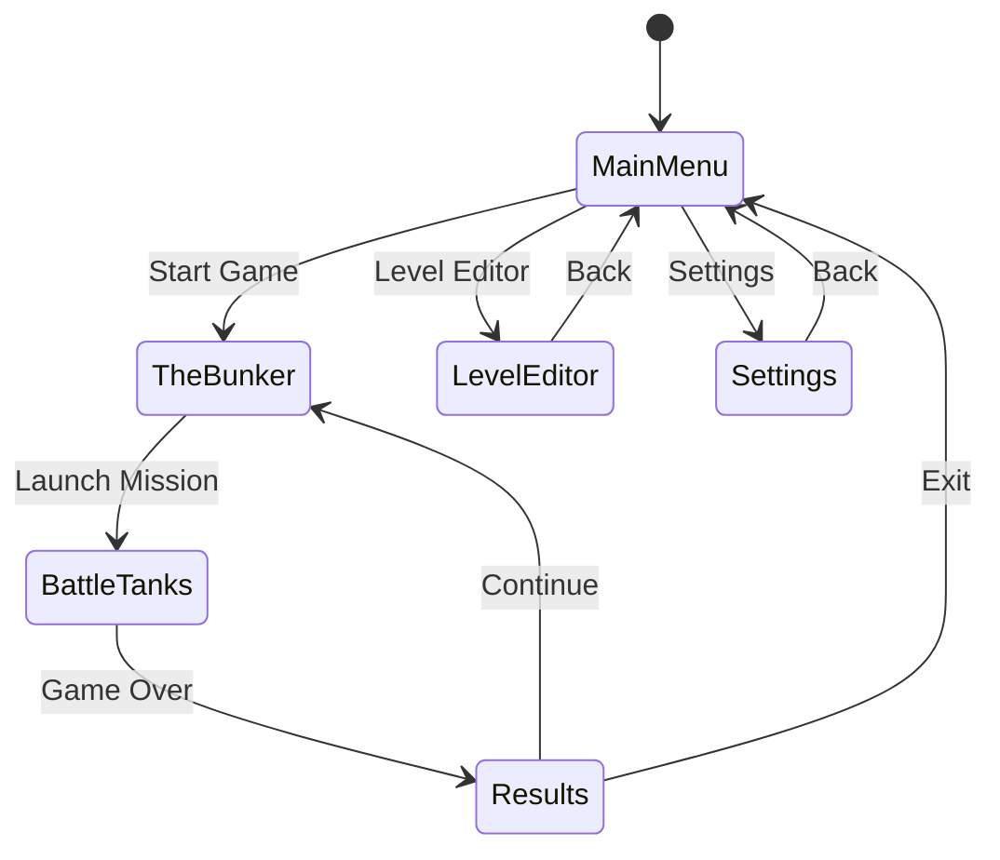

# REACT-TANKS (Car-Mero Enhanced Edition)

**A high-speed TRON-inspired tank combat game built with React Three Fiber—where arcade action meets iconic wireframe aesthetics. This is Doom with tanks.**

## Core Philosophy

> "If it's not fun, it's not done." - John Romero

REACT-TANKS prioritizes **speed, responsiveness, and intrinsic fun** over simulation realism. Tanks move at 45 mph with instant response. Every weapon stays useful. Arenas use horseshoe layouts with multiple secrets. The 30-second combat loop must be pure joy—spot, move, shoot, kill, satisfaction.

## Description

REACT-TANKS is a browser-based 3D arcade tank combat game capturing TRON's (1982) iconic visual style while delivering id Software's legendary FPS gameplay feel. Players pilot wireframe tanks through geometrically complex arenas, engaging in reflex-driven combat using situational weapons and momentum-based movement. The game features arcade-fast action, horseshoe-designed arenas with hidden secrets, locked 60 FPS performance, and community level editing.

The visual aesthetic is pure wireframe geometry with neon-lit edges—no PNG textures used. All rendering follows SVGA shader style with vibrant cyan, magenta, orange, and white palettes against dark backgrounds. But unlike traditional tank games, movement feels **fast and powerful**—this is BattleZone meets Doom, not World of Tanks.

## Game Architecture

```
┌─────────────────────────────────────────────────────────────┐
│                        App.tsx                               │
│  (Root component, state management, screen routing)          │
├─────────────────────────────────────────────────────────────┤
│                                                              │
│  ┌──────────────┐  ┌──────────────┐  ┌──────────────┐       │
│  │  MainMenu    │  │  TheBunker   │  │ BattleTanks  │       │
│  │  Screen.tsx  │  │  Screen.tsx  │  │ Screen.tsx   │       │
│  └──────────────┘  └──────────────┘  └──────────────┘       │
│                                                              │
│  ┌──────────────┐  ┌──────────────┐  ┌──────────────┐       │
│  │   Results    │  │ LevelEditor  │  │  Settings    │       │
│  │  Screen.tsx  │  │  Screen.tsx  │  │  Screen.tsx  │       │
│  └──────────────┘  └──────────────┘  └──────────────┘       │
│                                                              │
├─────────────────────────────────────────────────────────────┤
│                    Shared Components                         │
│  ┌────────────┐ ┌────────────┐ ┌────────────┐               │
│  │ 3D/        │ │ UI/        │ │ Game/      │               │
│  │ Tank.tsx   │ │ HUD.tsx    │ │ GameState  │               │
│  │ Arena.tsx  │ │ Button.tsx │ │ .ts        │               │
│  │ Skybox.tsx │ │ Panel.tsx  │ │ Physics.ts │               │
│  │ Grid.tsx   │ │ Slider.tsx │ │ Input.ts   │               │
│  └────────────┘ └────────────┘ └────────────┘               │
└─────────────────────────────────────────────────────────────┘
```

## Core Gameplay Principles

### The 30-Second Loop (Must Be Fun)

```
1. SPOT enemy (visual or scanner) → 0-2 seconds
2. MOVE (dodge incoming fire, position) → 2-8 seconds  
3. SHOOT (weapon choice, lead target) → 8-25 seconds
4. KILL (enemy explodes spectacularly) → 25-28 seconds
5. SATISFACTION (visual/audio feedback) → 28-30 seconds

REPEAT → Still fun after 100 loops? YES → Ship it.
```

**Test Protocol:** Every developer plays the core loop for 5 minutes daily. If anyone says "this is getting boring," stop feature work and fix the core.

### Movement: Fast Like Doom, Not Slow Like Tanks

```typescript
interface ArcadeTankMovement {
  // SPEED: Arcade-fast (Doom was 57 mph, we're 45 mph)
  maxSpeed: 45,              // mph - NOT realistic tank speed
  strafeSpeed: 45,           // Equal to forward (enables combat dance)
  backwardSpeed: 30,         // Slight tactical penalty
  rotationSpeed: 180,        // Degrees per second (fast turns)
  
  // RESPONSE: Instant (Carmack's principle)
  acceleration: 0,           // Full speed IMMEDIATELY
  inputLatency: 30,          // Target < 30ms input-to-action
  
  // PHYSICS: Arcade with skill depth
  momentumFactor: 1.2,       // Slide through turns (enables drifting)
  driftControl: 0.75,        // Can steer while sliding
  wallBounce: 0.3,           // Slight bounce on collision (not sticky)
  
  // NO GRID: Continuous free movement
  positionType: 'continuous', // NOT grid-based
  collisionType: 'smooth',    // Slide along walls (Doom-style)
  
  // BOOST ABILITY: Temporary extreme speed
  boostMultiplier: 1.6,      // 45 × 1.6 = 72 mph
  boostDuration: 2.5,        // Seconds
  boostCooldown: 6,          // Seconds (NOT limited uses)
  boostTrail: true,          // Visual feedback
}
```

**Critical Rule:** If movement ever feels "sluggish" or "like driving a real tank," IMMEDIATELY increase speed. Target feel: "I'm piloting a fighter jet that happens to look like a tank."

### Weapon Balance: Situational, Not Tiered

**Romero's Principle:** "Every weapon in Doom is always useful."

```typescript
const WEAPON_ARSENAL = {
  // PRECISION CANNON (not "weak starter")
  precision: {
    name: 'Precision Cannon',
    damage: 25,              // Competitive with all weapons
    fireRate: 3,             // Shots per second
    projectileSpeed: 100,    // Fastest projectile (nearly instant)
    accuracy: 1.0,           // Perfect accuracy (skill-based)
    ammo: Infinity,          // UNLIMITED (always available)
    cooldown: 0,
    special: {
      critMultiplier: 2.0,   // 2x damage on weak points
      penetration: true,     // Passes through destructibles
    },
    situation: 'Long-range precision, skilled aiming, weak point shots',
    uiColor: '#00FFFF',      // Cyan
  },
  
  // PLASMA MORTAR (area denial, not "heavy damage upgrade")
  devastator: {
    name: 'Plasma Mortar',
    damage: 50,              // High single target
    fireRate: 1,             
    projectileSpeed: 35,     // Slow arc trajectory
    splashRadius: 10,        // Large area effect
    ammo: Infinity,          // UNLIMITED
    cooldown: 0,
    special: {
      destroysCover: true,   // Removes destructible barriers
      lingerDuration: 2,     // Leaves damaging pool
    },
    situation: 'Enemies behind cover, grouped enemies, area denial',
    uiColor: '#FF8C00',      // Orange
  },
  
  // RAPID PULSE (suppression, not "better DPS")
  suppressor: {
    name: 'Rapid Pulse',
    damage: 10,              // Lower per shot
    fireRate: 8,             // Very fast
    projectileSpeed: 80,
    overheat: {
      fireDuration: 3,       // Can fire for 3 seconds
      cooldownTime: 2.5,     // Must wait 2.5 seconds
    },
    ammo: Infinity,          // UNLIMITED (overheat is the limit)
    special: {
      slowEffect: 0.4,       // Reduces enemy speed by 40%
      destroysProjectiles: true, // Shoots down incoming fire
    },
    situation: 'Close combat, panic mode, suppression, defensive',
    uiColor: '#FF00FF',      // Magenta
  },
  
  // SCATTER SHOT (close range dominance)
  shredder: {
    name: 'Scatter Shot',
    damage: 12,              // Per pellet
    pellets: 8,              // 8 projectiles
    fireRate: 1.5,
    spreadAngle: 30,         // Degree cone
    projectileSpeed: 65,
    ammo: Infinity,          // UNLIMITED
    cooldown: 0,
    special: {
      destroysProjectiles: true, // Defensive capability
      knockback: 5,          // Pushes enemies back
    },
    situation: 'Point-blank range, multiple close enemies, last resort',
    uiColor: '#FFFFFF',      // White
  },
  
  // SEEKER MISSILE (tactical, not "limited power weapon")
  tactical: {
    name: 'Seeker Missile',
    damage: 90,              // Very high
    fireRate: 0.5,
    projectileSpeed: 40,
    special: {
      homingStrength: 1.0,   // Perfect tracking
      lockRequired: true,    // Must maintain aim for 0.5s
    },
    ammo: Infinity,          // NOT limited supply
    cooldown: 8,             // Time-based limitation
    situation: 'Fast/evasive enemies, guaranteed hit needed',
    uiColor: '#FF0000',      // Red
  },
};
```

**Key Changes from Original:**
- ✅ ALL weapons have unlimited ammo (cooldowns for powerful ones)
- ✅ Starting weapon (Precision) competitive endgame
- ✅ Each weapon has CLEAR SITUATION where it's optimal
- ✅ No linear DPS progression (Precision 25 vs Devastator 50 but slower)
- ✅ Tactical weapon uses cooldown, NOT limited ammo count

**Balance Test:** Can player complete final arena using ONLY Precision Cannon? Answer MUST be YES.

## Screen Specifications

### 1. Main Menu Screen (`screens/MainMenuScreen.tsx`)

**UNCHANGED** - Original design is fine.

### 2. The Bunker Screen (`screens/TheBunkerScreen.tsx`)

**Purpose:** Pre-game loadout (simplified from original)

**Layout Changes:**

```
┌─────────────────────────────────────────────────────────┐
│  [BACK]                    THE BUNKER                   │
├───────────────────┬─────────────────────────────────────┤
│                   │                                     │
│   TANK PREVIEW    │         LOADOUT PANEL               │
│   (3D rotating    │   ┌─────────────────────────────┐   │
│    tank model)    │   │ Speed: [45 mph] (fixed)     │   │
│                   │   │ Armor: [Slider 1-10]        │   │
│                   │   │ Shield: [Slider 1-10]       │   │
│                   │   │                             │   │
│                   │   │ All weapons always available│   │
│                   │   │ Color: [Picker]             │   │
│                   │   └─────────────────────────────┘   │
├───────────────────┴─────────────────────────────────────┤
│                    LEVEL SELECT                          │
│   [Arena 1] [Arena 2] [Arena 3] [...10]                 │
│   [Custom...] [Random]                                  │
├─────────────────────────────────────────────────────────┤
│  Mission: Destroy all enemies, find all secrets        │
│  Secrets: 0/3 found in this arena                      │
│                              [LAUNCH MISSION]           │
└─────────────────────────────────────────────────────────┘
```

**Changes:**
- ❌ REMOVED weapon selection (all weapons always available)
- ❌ REMOVED speed slider (fixed at 45 mph for consistency)
- ✅ ADDED secret tracking display
- ✅ Armor/Shield sliders create build variety without affecting core speed

```typescript
interface TankLoadout {
  armor: number;          // 1-10, affects damage resistance
  shieldRecharge: number; // 1-10, affects shield regen rate
  color: string;          // Cosmetic only
  // NO WEAPON SELECTION - all weapons always available
  // NO SPEED SELECTION - fixed at 45 mph
}
```

### 3. Battle Tanks Screen (`screens/BattleTanksScreen.tsx`)

**Primary Gameplay Arena**

**Camera System:**
- Third-person chase camera: 12 units behind (reduced from 15 for tighter feel)
- Height: 7 units above (reduced from 8)
- Smooth follow: 0.15 lerp factor (faster than 0.1 for responsiveness)
- Camera leads movement slightly (predicts player direction)
- First-person toggle: V key (optional for variety)

**HUD Elements (`components/ui/GameHUD.tsx`):**

```
┌─────────────────────────────────────────────────────────┐
│ [HEALTH]████████░░ 80%    [SECRETS: 1/3]   [MINIMAP]   │
│ [SHIELD]██████░░░░ 60%                        · S ·    │
│                                              · × ·     │
│                                                ·       │
│                     (3D GAME VIEW)                     │
│                                                        │
│                                                        │
│ [1]Precision [2]Devastator [3]Suppressor [4]Shredder │
│ [5]Seeker(6s) [BOOST:Ready] [DRIFT:85%]   FPS:60     │
│                                      [ESC: Pause]      │
└─────────────────────────────────────────────────────────┘
```

**Changes:**
- ✅ ADDED secret counter (Romero's principle)
- ✅ ALL weapons shown (no "secondary" - all are primary)
- ✅ Cooldowns shown for tactical weapons
- ✅ FPS counter (always visible, Carmack's obsession)
- ✅ Drift meter (skill-based movement mechanic)

**Player Controls:**

| Input | Action | Response Time |
|-------|--------|---------------|
| W / ↑ | Move forward (45 mph) | < 16ms |
| S / ↓ | Move backward (30 mph) | < 16ms |
| A / ← | Rotate left (180°/s) | < 16ms |
| D / → | Rotate right (180°/s) | < 16ms |
| Shift + Movement | Drift (maintain momentum) | < 16ms |
| Mouse Move | Aim turret (independent) | < 16ms |
| 1-5 Keys | Select weapon | < 16ms |
| Left Click | Fire selected weapon | < 30ms |
| Space | Boost (72 mph, 2.5s) | < 16ms |
| V | Toggle camera | N/A |
| ESC | Pause | < 100ms |

**Target Latency:** Input to visual response < 30ms (Carmack's standard)

**Combat Mechanics:**

```typescript
interface Projectile {
  id: string;
  type: 'precision' | 'devastator' | 'suppressor' | 'shredder' | 'seeker';
  position: Vector3;
  velocity: Vector3;
  damage: number;
  owner: string;
  lifetime: number;
  special?: {
    splash?: number;       // Radius for area damage
    homing?: boolean;      // Tracks nearest enemy
    penetrate?: boolean;   // Passes through barriers
    slow?: number;         // Movement debuff
  };
}

interface DamageEvent {
  target: string;
  amount: number;
  source: string;
  position: Vector3;
  isCritical: boolean;     // Weak point hit
  knockback?: Vector3;     // Applied force
}
```

**Enemy AI Behaviors:**

```typescript
type AIState = 'patrol' | 'aggressive_chase' | 'strafe_attack' | 'flee' | 'seek_cover';

interface EnemyAI {
  state: AIState;
  
  // AGGRESSIVE, NOT PASSIVE
  detectionRange: 80,      // Units (increased from unspecified)
  attackRange: 50,         // Start firing earlier
  aggressionLevel: 0.8,    // 0-1, bias toward attack vs flee
  
  // MOVEMENT SPEED: 30 mph (slower than player's 45)
  moveSpeed: 30,           // Player can outmaneuver
  strafeSpeed: 25,         // Can dodge but player is faster
  
  // CHALLENGE THROUGH SKILL, NOT CHEAP TACTICS
  accuracy: 0.6,           // 60% base accuracy (fair)
  leadTarget: true,        // Predicts player movement
  reactionTime: 0.4,       // Fast but not instant
  
  // TACTICAL BEHAVIOR
  prefersCover: true,      // Uses arena geometry
  flankAttempts: true,     // Tries to position advantageously
  retreatThreshold: 0.25,  // Flees at 25% health
}
```

**Victory/Defeat Conditions:**
- **Victory:** All enemies destroyed + optional (find all 3 secrets for bonus)
- **Defeat:** Player health reaches 0
- **Time Attack Mode:** Optional, displayed in Results but not enforced

## Arena Design (Romero's Horseshoe Principle)

### Layout Philosophy

**WRONG (Abandoned):**
```
Grid-based, flat, open killbox
Linear paths, no revisiting
No secrets, no exploration
```

**RIGHT (Implemented):**
```
Horseshoe layouts with multiple paths
Elevation variety, cover structures
3 secrets per arena minimum
Distinct landmarks for navigation
```

### Example Arena: "The Horseshoe Colosseum"

```
┌─────────────────────────────────────────────────────────┐
│                  NORTH VANTAGE PLATFORM                  │
│    [SECRET 1]     (Elevated sniper position)            │
│         ┌──────────────────────┐                        │
│         │   Destructible Wall  │                        │
├─────────┴──────────┬───────────┴────────────────────────┤
│  WEST TRENCH       │ CENTRAL    │      EAST PASSAGE     │
│  (Low ground)      │ TOWER      │      (Mid height)     │
│                    │ ★          │                       │
│  [Enemy]           │ (Landmark) │         [Enemy]       │
│                    │            │                       │
│      ┌─────────────┴────────────┴─────────┐            │
│      │     [PLAYER START]                  │            │
├──────┴─────────────────────────────────────┴───────────┤
│                 SOUTH LOWGROUND                         │
│    [Enemy]  [SECRET 2]  [Enemy]                        │
│             (Hidden cache behind destructible)          │
│                                                         │
│   [SECRET 3] ← Shortcut ramp (connects south to north) │
└─────────────────────────────────────────────────────────┘

KEY:
★ = Central Tower (always visible landmark)
[SECRET 1] = Vantage point (elevated position with health)
[SECRET 2] = Health/Shield cache (behind destructible wall)
[SECRET 3] = Shortcut ramp (faster path to north platform)
```

### Arena Design Requirements

```typescript
interface ArenaLayoutRequirements {
  // ROMERO'S HORSESHOE
  layout: 'horseshoe',           // Required pattern
  alternativePaths: 3,           // Minimum paths between areas
  loopbacks: 2,                  // Routes that circle back
  
  // ELEVATION (Romero's Rule: height changes with texture changes)
  heightLevels: 3,               // Low/Mid/High minimum
  platforms: 5,                  // Minimum count
  ramps: 4,                      // Connecting platforms
  verticalVariety: true,         // No flat-only areas
  
  // COVER (30% of floor space)
  coverDensity: 0.3,             
  coverTypes: [
    'destructible_barriers',     // Can be blown up (Devastator weapon)
    'permanent_pillars',         // Indestructible
    'energy_shields',            // Temporary, regenerate
  ],
  coverHeight: 'varied',         // Mix of full/half cover
  
  // CONTRAST EVERYWHERE
  lighting: {
    zones: 3,                    // Minimum distinct lighting areas
    intensityRange: [0.3, 2.0],  // Dark to bright
    colorVariety: true,          // Cyan/Orange/Magenta/White
  },
  
  // LANDMARKS (Romero's Rule 8)
  landmarks: 3,                  // Minimum recognizable features
  landmarkExamples: [
    { name: 'Central Tower', height: 20, glowing: true },
    { name: 'Energy Core', pulsing: true, sound: true },
    { name: 'Wreckage Zone', destructibles: 5 },
  ],
  
  // SECRETS (Romero: "If no secrets, is it even a level?")
  secretCount: 3,                // MINIMUM per arena
  secretDifficulty: [
    'easy',    // 50% of players find (visible hint)
    'medium',  // 25% find (subtle clue)
    'hard',    // <10% find (requires exploration)
  ],
  secretTypes: [
    'hidden_vantage_point',      // Tactical advantage
    'health_cache',              // Survival benefit
    'shortcut_tunnel',           // Navigation benefit
  ],
  
  // SIZE (Large enough for 45 mph movement)
  dimensions: { 
    x: 150,                      // Units
    z: 150,                      // Units
    y: 30,                       // Max height
  },
  
  // BOUNDARIES
  walls: 'energy_barriers',      // Clear visual boundaries
  outOfBounds: 'instant_death',  // Fall off = defeat
}
```

### Secret Design Guidelines

**Easy Secret (50% discover rate):**
- Visual cue: Glowing outline on destructible wall
- Location: On main path, requires noticing
- Reward: Health pickup (25% restore)

**Medium Secret (25% discover rate):**
- Audio cue: Faint humming near hidden entrance
- Location: Requires slight deviation from path
- Reward: Shield pickup (50% restore) + achievement notification

**Hard Secret (< 10% discover rate):**
- Hint: None direct, only careful observation
- Location: Behind destructible wall that doesn't look different
- Reward: Temporary damage boost (2x for 10 seconds)

```typescript
interface Secret {
  id: string;
  difficulty: 'easy' | 'medium' | 'hard';
  position: Vector3;
  discovered: boolean;
  
  hint: {
    type: 'visual' | 'audio' | 'none';
    asset?: string;           // Glowing outline, sound file
    radius?: number;          // Detection range for audio
  };
  
  access: {
    method: 'destructible_wall' | 'hidden_path' | 'timed_door';
    requirement?: string;     // Weapon type, speed, etc.
  };
  
  reward: {
    type: 'health' | 'shield' | 'damage_boost' | 'speed_boost';
    amount: number;
    duration?: number;        // For temporary buffs
  };
}
```

## Performance Requirements (Carmack's Law)

### The 60 FPS Mandate

```typescript
const PERFORMANCE_REQUIREMENTS = {
  // LOCKED 60 FPS - NO COMPROMISE
  frameRate: {
    minimum: 60,             // Not "target" - MINIMUM
    target: 60,              // Locked, not variable
    acceptable: 60,          // No 30 FPS fallback
  },
  
  // WORST-CASE TESTING (More important than average)
  worstCase: {
    enemies: 20,             // Maximum simultaneous
    projectiles: 100,        // Maximum active
    particles: 50,           // Maximum effects
    destructibles: 30,       // Maximum destructible objects
    requiresMaintain: 60,    // FPS - absolute requirement
  },
  
  // LATENCY BUDGET (Carmack's obsession)
  latency: {
    inputToAction: 30,       // Target milliseconds
    inputSampling: 'late',   // Sample just before render
    buffering: 'single',     // NO double buffering
    mousePolling: 1000,      // Hz
  },
  
  // FRAME TIME BUDGET
  frameBudget: {
    total: 16.67,            // ms (60 FPS)
    rendering: 10,           // ms maximum
    physics: 4,              // ms maximum
    ai: 2,                   // ms maximum
    audio: 0.5,              // ms maximum
    margin: 0.17,            // ms buffer
  },
  
  // LOD SYSTEM (Sacrifice graphics for performance)
  lod: {
    nearDistance: 60,        // Units - full detail
    midDistance: 120,        // Units - 60% detail
    farDistance: 180,        // Units - 30% detail
    cullDistance: 200,       // Units - not rendered
  },
  
  // ENTITY CAPS (Enforced hard limits)
  entityCaps: {
    maxEnemies: 20,          // Hard cap
    maxProjectiles: 100,     // Object pool, reuse
    maxParticles: 50,        // Short lifetime
    maxDestructibles: 30,    // Per arena
  },
  
  // OPTIMIZATION STRATEGIES
  optimization: {
    objectPooling: true,     // Pre-allocate all projectiles
    frustumCulling: true,    // Three.js built-in
    batchRendering: true,    // Group static wireframes
    aiUpdateRate: 10,        // Hz (NOT 60, acceptable)
    physicsUpdateRate: 60,   // Hz (MUST be 60)
  },
};
```

**Critical Rule:** If frame rate drops below 60 FPS during worst-case testing, REDUCE wireframe detail before accepting lower FPS. Graphics serve performance, not vice versa.

### Measurement & Profiling

```typescript
interface PerformanceMonitoring {
  // ALWAYS VISIBLE (Carmack made it mandatory)
  fpsDisplay: {
    position: 'bottom-right',
    alwaysVisible: true,     // Even in production
    color: 'green_if_60_red_if_below',
  };
  
  // PROFILING TOOLS
  profiler: {
    frameTimeGraph: true,    // Show 16.67ms budget line
    worstFrameTracking: true, // Log frames > 17ms
    breakdownDisplay: true,  // Render/Physics/AI timing
  };
  
  // AUTOMATED TESTING
  performanceTests: [
    'spawn_20_enemies',
    'fire_100_projectiles',
    'destroy_30_barriers',
    'all_effects_simultaneous',
  ],
  
  // FAIL CONDITIONS
  failIfAnyTest: 'drops_below_60fps',
}
```

## Implementation Principles (id Software Process)

### 1. Polish As You Go

```typescript
const DEVELOPMENT_RULES = {
  // ALWAYS SHIPPABLE
  everyCommitPlayable: true,       // NO broken builds
  bugFixImmediate: true,           // NO "known issues" list
  noTODOComments: true,            // Fix it now, not later
  
  // DAILY PRACTICE
  teamPlaysDaily: true,            // Everyone tests every day
  thirtySecondTest: true,          // Is core loop fun? Test constantly
  
  // CODE STANDARDS
  filesUnder300Lines: true,        // Split if exceeded
  noAnyTypes: true,                // Full TypeScript
  juniorCanRead: true,             // Clarity over cleverness
  
  // TESTING
  unitTests: 'for_critical_systems', // Physics, collision, weapons
  integrationTests: 'daily',       // Full playthrough
  performanceTests: 'every_commit', // 60 FPS requirement
};
```

### 2. Know Your Game's Soul

**TRON-TANKS Soul:** Fast arcade action with TRON aesthetics

**Cut if conflicts with soul:**
- ❌ Realistic tank physics (slows gameplay)
- ❌ Ammunition management (reduces weapon choice freedom)
- ❌ Stealth mechanics (conflicts with fast action)
- ❌ Story cutscenes (interrupts flow)
- ❌ Upgrade progression (creates weapon obsolescence)

**Keep because serves soul:**
- ✅ 45 mph movement (arcade fast)
- ✅ All weapons always available (maximizes choice)
- ✅ Boost ability (enables skill expression)
- ✅ Secrets (rewards exploration without forcing it)
- ✅ Simple victory condition (destroy all enemies)

## Modified Game Flow

### Screen Flow (Unchanged from original)



### Results Screen (Enhanced)

```
┌─────────────────────────────────────────────────────────┐
│                      MISSION COMPLETE                    │
│                         ★ ★ ★                           │
├─────────────────────────────────────────────────────────┤
│                                                          │
│   Time:           2:34                                   │
│   Enemies Destroyed:  5/5                                │
│   Secrets Found:  2/3  ← NEW                            │
│   Accuracy:       73%                                    │
│   Damage Taken:   45                                     │
│   Avg FPS:        60  ← NEW (always 60 or bust)         │
│                                                          │
│   SECRET BONUS: +500 points                             │
│   PERFECT RUN BONUS: +1000 (all secrets, no damage)    │
│                                                          │
│        [REPLAY]  [NEXT ARENA]  [MAIN MENU]              │
└─────────────────────────────────────────────────────────┘
```

### Settings Screen (Enhanced)

```
┌─────────────────────────────────────────────────────────┐
│                        SETTINGS                          │
├─────────────────────────────────────────────────────────┤
│                                                          │
│  Performance (Locked for Carmack)                       │
│    Frame Rate: [60 FPS] (cannot be changed)            │
│    VSync: [ON] (enforced)                              │
│    Resolution: [Auto/1080p/720p]                       │
│                                                          │
│  Gameplay                                               │
│    Camera: [Third Person/First Person]                 │
│    Mouse Sensitivity: [Slider]                         │
│    Camera Shake: [ON/OFF]                              │
│                                                          │
│  Accessibility                                          │
│    Color Blind Mode: [OFF/Deuteranopia/Protanopia]    │
│    High Contrast: [ON/OFF]                             │
│    Show FPS: [ON/OFF] (default ON)                     │
│    Secret Hints: [OFF/Subtle/Obvious]                  │
│                                                          │
│  Audio                                                  │
│    Master Volume: [Slider]                             │
│    Music Volume: [Slider]                              │
│    SFX Volume: [Slider]                                │
│                                                          │
│           [RESET TO DEFAULT]  [BACK]                    │
└─────────────────────────────────────────────────────────┘
```

## Level Editor (Enhanced for Horseshoe Design)

### Editor Interface (New Features)

```
┌─────────────────────────────────────────────────────────┐
│  [BACK] [SAVE] [LOAD] [TEST PLAY]     LEVEL EDITOR     │
├──────────────┬──────────────────────────────────────────┤
│              │                                          │
│  TOOLS       │         3D PREVIEW (Top-Down)           │
│              │                                          │
│ [Platform]   │     ┌─────────────────────────┐        │
│ [Ramp]       │     │                         │        │
│ [Cover]      │     │    Arena Layout         │        │
│ [Spawn]      │     │                         │        │
│ [Secret]  ←NEW     │                         │        │
│ [Landmark]←NEW     │                         │        │
│ [Barrier]    │     └─────────────────────────┘        │
│ [Delete]     │                                          │
│              │  VALIDATION ← NEW                        │
├──────────────┤  ┌─────────────────────────────────┐   │
│ PROPERTIES   │  │ ✓ Horseshoe score: 85/100       │   │
│              │  │ ✓ Paths: 4 (minimum 3)          │   │
│ Height: __   │  │ ✓ Secrets: 3 (minimum 3)        │   │
│ Color: __    │  │ ⚠ Elevation: 2 (minimum 3)      │   │
│ Type: __     │  │ ✓ Landmarks: 3 (minimum 3)      │   │
│              │  │ ⚠ Cover: 22% (target 30%)       │   │
│              │  └─────────────────────────────────┘   │
└──────────────┴──────────────────────────────────────────┘
```

### Validation System (New)

```typescript
interface ArenaValidation {
  // HORSESHOE SCORING
  horseshoeScore: number;        // 0-100, computed from layout
  pathCount: number;             // Paths between start and end
  loopbackCount: number;         // Routes that circle back
  
  // ROMERO'S RULES
  heightLevels: number;          // Distinct elevation levels
  platformCount: number;         // Total platforms
  coverPercentage: number;       // % of floor with cover
  
  // REQUIRED ELEMENTS
  secretCount: number;           // Must be >= 3
  landmarkCount: number;         // Must be >= 3
  enemySpawnCount: number;       // Must be >= 5
  
  // PASS/FAIL
  validation: {
    meetsMinimums: boolean,
    warnings: string[],          // Suggestions for improvement
    errors: string[],            // Must fix before testing
  };
}
```

## Audio Specifications (Unchanged)

**[Original audio specs maintained - see original document]**

## Dependencies (Unchanged)

```json
{
  "dependencies": {
    "react": "^18.2.0",
    "react-dom": "^18.2.0",
    "@react-three/fiber": "^8.15.0",
    "@react-three/drei": "^9.88.0",
    "three": "^0.158.0",
    "zustand": "^4.4.0",
    "uuid": "^9.0.0"
  },
  "devDependencies": {
    "typescript": "^5.2.0",
    "vite": "^5.0.0",
    "@types/react": "^18.2.0",
    "@types/three": "^0.158.0"
  }
}
```

## Testing Scenarios (Enhanced)

### Core Loop Test (NEW - Priority 1)

**Test:** Play arena for 5 minutes straight, repeating 30-second loop
**Pass Criteria:**
- ✅ Still enjoying it after 10 loops
- ✅ Movement feels responsive and fast
- ✅ Combat requires skill (dodging, positioning)
- ✅ Each weapon used at least once naturally
- ✅ No thought of "this is boring"

**Fail Criteria:**
- ❌ Feels repetitive after 3 loops
- ❌ Movement feels sluggish
- ❌ Combat is static (stand and shoot)
- ❌ Only using one weapon

### Performance Tests (NEW - Priority 1)

**Worst-Case Scenario:**
1. Spawn 20 enemy tanks
2. Fire 100 projectiles (mix of all weapons)
3. Destroy 15 barriers (Devastator splash)
4. Activate boost on player tank
5. All particle effects active

**Pass Criteria:** Maintains 60 FPS for 30 seconds
**Fail Criteria:** Any frame drops below 60 FPS

### Weapon Balance Tests (NEW - Priority 2)

**Test 1: Precision Cannon Only**
- Complete final arena using ONLY Precision Cannon
- Pass: Possible but challenging
- Fail: Impossible or trivially easy

**Test 2: Weapon Switching**
- Observe 10 playtesters for 5 minutes each
- Pass: All 5 weapons used naturally
- Fail: 1-2 weapons dominate usage

### Arena Design Tests (NEW - Priority 2)

**Test 1: Horseshoe Flow**
- Track player movement in arena
- Pass: Player visits 75%+ of arena naturally
- Fail: Player ignores large sections

**Test 2: Secret Discovery**
- 20 playtesters, no hints
- Pass: 50%+ find easy secret, 25%+ find medium
- Fail: < 30% find any secrets

### Original Tests (Maintained)

- Movement, Combat, AI, Pickups, Victory, Defeat (same as original)
- Editor tests (same as original)
- UI tests (same as original)

## Accessibility Requirements (Enhanced)

1. **Keyboard-Only Play:** ✓ (same as original)
2. **Color Blind Mode:** ✓ (same as original)
3. **High Contrast:** ✓ (same as original)
4. **Screen Reader:** ✓ (same as original)
5. **Pause Anytime:** ✓ (same as original)
6. **Adjustable Speed:** ❌ REMOVED (fixed at 45 mph for fair competition)
7. **Secret Hints:** ✅ NEW (optional in Settings: Off/Subtle/Obvious)
8. **FPS Display:** ✅ NEW (always visible, critical for accessibility)

## Implementation Notes (Enhanced)

### Code Standards (Carmack's Principles)

```typescript
// GOOD: Simple, readable, clear intent
function calculateDamage(weapon: Weapon, distance: number): number {
  const baseDamage = weapon.damage;
  const falloff = Math.max(0, 1 - distance / weapon.maxRange);
  return baseDamage * falloff;
}

// BAD: Clever one-liner, hard to debug
const calculateDamage = (w, d) => w.damage * Math.max(0, 1 - d / w.maxRange);
```

### File Organization

```
src/
├── screens/           (< 300 lines each)
│   ├── MainMenuScreen.tsx
│   ├── TheBunkerScreen.tsx
│   ├── BattleTanksScreen.tsx
│   ├── ResultsScreen.tsx
│   ├── LevelEditorScreen.tsx
│   └── SettingsScreen.tsx
├── components/
│   ├── 3d/           (3D models and rendering)
│   │   ├── Tank.tsx
│   │   ├── Arena.tsx
│   │   ├── Projectile.tsx
│   │   ├── Secret.tsx        ← NEW
│   │   └── Skybox.tsx
│   └── ui/           (2D UI elements)
│       ├── HUD.tsx
│       ├── Button.tsx
│       ├── FPSDisplay.tsx    ← NEW
│       └── SecretHUD.tsx     ← NEW
├── game/             (Game logic, NO rendering)
│   ├── GameState.ts
│   ├── Physics.ts
│   ├── Input.ts
│   ├── WeaponSystem.ts       ← NEW
│   ├── SecretSystem.ts       ← NEW
│   └── PerformanceMonitor.ts ← NEW
└── utils/
    ├── constants.ts
    └── types.ts
```

### Module Boundaries

**CRITICAL:** Keep 3D rendering separate from game logic
```typescript
// WRONG: Logic mixed with rendering
function Tank() {
  const [health, setHealth] = useState(100);
  const [position, setPosition] = useState(new Vector3());
  
  useFrame(() => {
    // Game logic in render loop - BAD
    if (health < 50) setPosition(p => p.add(new Vector3(1, 0, 0)));
  });
  
  return <mesh position={position}>...</mesh>;
}

// RIGHT: Logic separate, rendering pure
function useTankLogic() {
  const [health, setHealth] = useState(100);
  const [position, setPosition] = useState(new Vector3());
  
  useEffect(() => {
    // Game logic in proper hook
    if (health < 50) {
      // Update position logic here
    }
  }, [health]);
  
  return { health, position };
}

function Tank({ health, position }: TankProps) {
  // Pure rendering
  return <mesh position={position}>...</mesh>;
}
```

## Extended Features (Future - Lower Priority)

1. **Multiplayer:** Split-screen arena battles (2-4 players)
2. **Campaign:** 10-arena progression with increasing difficulty
3. **Achievements:** "Speed Demon" (complete under 1 min), "Secret Hunter" (all secrets), etc.
4. **Leaderboards:** Time attack per arena
5. **Workshop:** Share community arenas (with validation scores)
6. **Replay System:** Record best runs, watch from any angle

## Summary of Changes from Original

### ✅ ADDED (Car-Mero Principles)

1. **45 mph movement speed** (arcade-fast, not realistic)
2. **Unlimited ammo for all weapons** (choice freedom)
3. **Situational weapon balance** (no linear progression)
4. **Locked 60 FPS requirement** (no 30 FPS fallback)
5. **< 30ms latency budget** (responsiveness mandate)
6. **3 secrets per arena** (Romero's exploration principle)
7. **Horseshoe arena layouts** (guided non-linearity)
8. **Elevation variety requirements** (height changes with texture changes)
9. **Landmark system** (navigation without waypoints)
10. **Arena validation scoring** (horseshoe score, path count, etc.)
11. **Performance monitoring** (always-visible FPS, profiling)
12. **30-second loop test** (daily fun validation)
13. **Drift mechanics** (skill-based movement)
14. **Boost cooldown** (not limited uses)

### ❌ REMOVED (Conflicted with Car-Mero)

1. **Grid-based movement** (too slow, anti-Doom)
2. **Limited weapon ammo** (forced meta, reduced choice)
3. **Weapon/ability selection in loadout** (all always available)
4. **Speed slider in loadout** (fixed at 45 mph for fairness)
5. **30 FPS minimum acceptable** (violates Carmack's law)
6. **Strategic grid-based gameplay** (conflicts with fast arcade action)

### 🔄 MODIFIED (Enhanced for Car-Mero)

1. **Camera distance** (closer for tighter feel)
2. **Camera lerp** (faster for responsiveness)
3. **Enemy move speed** (30 mph, slower than player's 45)
4. **Results screen** (added secret tracking)
5. **HUD** (added secret counter, FPS display)
6. **Level editor** (added validation system)
7. **Testing scenarios** (added core loop and performance tests)
8. **Victory condition** (optional secret bonus, not required)

---

## The Car-Mero Mandate

> "If it's not fun, it's not done." - John Romero  
> "Make sure the core play is consistent and strong." - John Carmack

TRON-TANKS now embodies id Software principles:
- ✅ Movement is FAST (45 mph, instant response)
- ✅ Every weapon stays USEFUL (no obsolescence)
- ✅ Performance is LOCKED (60 FPS, worst-case tested)
- ✅ Arenas are HORSESHOE (guided exploration)
- ✅ Secrets are INTEGRAL (3 per arena minimum)
- ✅ Fun is FIRST (30-second loop test daily)

This is no longer a strategic tank simulator. This is **Doom with tanks in TRON's world**—and that's exactly what will make it memorable.

---

*This enhanced TINS README provides complete specifications for generating a Car-Mero compliant REACT-TANKS game. All features, data structures, and behaviors are explicitly defined following Carmack-Romero Building Principles from id Software's Doom/Quake era.*
