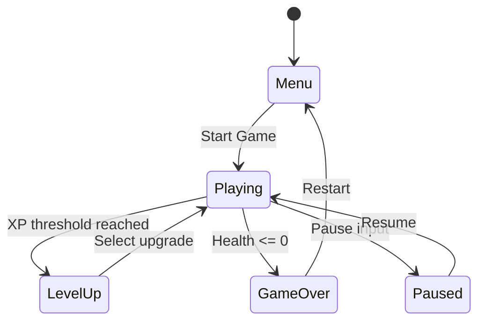

# ROBOT PLANET

## Description

Robot Planet is a browser-based survival action game inspired by Vampire Survivors, built with React Three Fiber. The player controls UNIT-X7, an experimental combat robot that has broken free from its programming constraints on a planet entirely populated by robots. The entire robot population has been mobilized to terminate UNIT-X7, creating endless waves of mechanical enemies.

The game features automatic weapon systems, roguelike upgrade progression, and a distinctive wireframe neon visual aesthetic rendered entirely through procedural geometry and custom GLSL shaders—no external image assets are required.

Core gameplay follows the "bullet heaven" formula: the player focuses purely on movement while weapons fire automatically, creating an accessible yet deep survival experience where strategic upgrade choices determine success.

---

## Functionality

### Core Game Loop

```
┌─────────────────────────────────────────────────────────────────┐
│                      MICRO LOOP (~1 second)                      │
│  Move → Auto-fire weapons → Enemies approach → Collect XP       │
└─────────────────────────────────────────────────────────────────┘
                              ↓
┌─────────────────────────────────────────────────────────────────┐
│                    SESSION LOOP (~23 seconds)                    │
│  Accumulate XP → Level up → Choose upgrade → Power increases    │
└─────────────────────────────────────────────────────────────────┘
                              ↓
┌─────────────────────────────────────────────────────────────────┐
│                     META LOOP (30 minutes)                       │
│  Early game → Mid game → Late game → Victory/Death              │
└─────────────────────────────────────────────────────────────────┘
```

### Player Controls

| Input | Action |
|-------|--------|
| W / ArrowUp | Move up (negative Z) |
| A / ArrowLeft | Move left (negative X) |
| S / ArrowDown | Move down (positive Z) |
| D / ArrowRight | Move right (positive X) |

- Movement is the ONLY player input required
- All weapons fire automatically based on their cooldown timers
- Diagonal movement is supported and normalized to prevent faster diagonal speed
- Movement uses velocity smoothing with lerp for fluid feel

### Game States



| State | Description | UI Shown |
|-------|-------------|----------|
| `menu` | Initial state, title screen | Title, start button, instructions |
| `playing` | Active gameplay | HUD (health, XP, timer, kills, weapons) |
| `paused` | Game frozen | Pause overlay |
| `levelup` | Upgrade selection | Modal with 4 upgrade options |
| `gameover` | Player died | Death screen, stats, restart button |

### Session Structure

The game session lasts 30 minutes with distinct phases:

| Phase | Time | Characteristics |
|-------|------|-----------------|
| Early Game | 0:00 - 2:00 | Scout Drones only, learning controls |
| Build Phase | 2:00 - 5:00 | Worker Bots added, first upgrades |
| Mid Game | 5:00 - 10:00 | Hunter Bots, Stealth Units appear |
| Escalation | 10:00 - 15:00 | Heavy Mechs, increased spawn rates |
| Late Game | 15:00 - 25:00 | All enemy types, high density |
| Endgame | 25:00 - 30:00 | Maximum intensity, survival focus |

---

## Technical Implementation

### Technology Stack

| Technology | Version | Purpose |
|------------|---------|---------|
| React | ^18.2.0 | UI framework |
| Three.js | ^0.160.0 | 3D rendering engine |
| @react-three/fiber | ^8.15.0 | React renderer for Three.js |
| @react-three/drei | ^9.92.0 | Helper components |
| @react-three/postprocessing | ^2.15.0 | Bloom effects |
| Zustand | ^4.4.0 | State management |
| Vite | ^5.0.0 | Build tool |

### Project Architecture

```
src/
├── App.jsx                     # Canvas setup, post-processing
├── index.jsx                   # Entry point, global styles
│
├── stores/
│   └── gameStore.js            # Zustand state management
│
├── components/
│   ├── game/
│   │   ├── GameWorld.jsx       # Main scene container
│   │   ├── Ground.jsx          # Infinite grid shader
│   │   └── Camera.jsx          # Smooth follow camera
│   │
│   ├── player/
│   │   ├── Player.jsx          # Input handling, movement
│   │   └── PlayerMesh.jsx      # UNIT-X7 procedural mesh
│   │
│   ├── enemies/
│   │   ├── EnemyManager.jsx    # Wave spawning system
│   │   ├── Enemy.jsx           # Base enemy behavior
│   │   └── types/
│   │       ├── ScoutDrone.jsx  # Fast swarm unit
│   │       ├── WorkerBot.jsx   # Basic melee unit
│   │       ├── HeavyMech.jsx   # Slow tank unit
│   │       ├── HunterBot.jsx   # Leaping attacker
│   │       ├── StealthUnit.jsx # Phasing enemy
│   │       └── TurretBot.jsx   # Stationary shooter
│   │
│   ├── weapons/
│   │   ├── WeaponManager.jsx   # Auto-fire controller
│   │   └── types/
│   │       ├── PlasmaBolt.jsx      # Homing projectile
│   │       ├── EnergyLash.jsx      # Sweeping arc
│   │       ├── NanoShards.jsx      # Forward projectiles
│   │       ├── OrbitalDrones.jsx   # Rotating shields
│   │       ├── EMPField.jsx        # Damage aura
│   │       ├── TeslaArc.jsx        # Chain lightning
│   │       ├── AcidPool.jsx        # Ground hazard
│   │       └── PlasmaCannon.jsx    # High damage beam
│   │
│   ├── pickups/
│   │   └── PickupManager.jsx   # XP gems, health packs
│   │
│   ├── effects/
│   │   ├── WireframeMaterial.jsx   # Custom shader
│   │   └── DamageNumberManager.jsx # Floating numbers
│   │
│   └── ui/
│       ├── HUD.jsx             # Main overlay container
│       ├── HealthBar.jsx       # Player health display
│       ├── XPBar.jsx           # Experience bar
│       ├── Timer.jsx           # Survival timer
│       ├── KillCounter.jsx     # Enemy kill count
│       ├── WeaponSlots.jsx     # Equipped weapons
│       └── LevelUpModal.jsx    # Upgrade selection
│
└── utils/
    └── constants.js            # Game balance, colors
```

### Data Models

#### Player State

```javascript
player: {
  position: [0, 0, 0],      // [x, y, z] world position
  health: 100,              // Current health points
  maxHealth: 100,           // Maximum health (upgradeable)
  xp: 0,                    // Current XP toward next level
  xpToLevel: 10,            // XP threshold for next level
  level: 1,                 // Current player level
  speed: 5,                 // Movement speed (units/second)
  weapons: ['plasmaBolt'],  // Array of weapon IDs (max 6)
  passives: [],             // Array of passive IDs (max 6)
}
```

#### Enemy Instance

```javascript
enemy: {
  id: 1704067200000.123,    // Unique ID (Date.now() + Math.random())
  type: 'scoutDrone',       // Enemy type key
  position: [10, 0, 5],     // [x, y, z] world position
  health: 5,                // Current health
  maxHealth: 5,             // Maximum health
  damage: 5,                // Damage dealt on contact
  speed: 4,                 // Movement speed
  xpValue: 1,               // XP dropped on death
  scale: 0.3,               // Visual scale multiplier
  color: '#ff3333',         // Wireframe color
}
```

#### Projectile Instance

```javascript
projectile: {
  id: 1704067200000.456,    // Unique ID
  type: 'plasmaBolt',       // Weapon type key
  position: [0, 0, 0],      // [x, y, z] starting position
  velocity: [5, 0, 3],      // [vx, vy, vz] units/second
  damage: 10,               // Damage on hit
  color: '#00aaff',         // Visual color
  lifetime: 3,              // Seconds until despawn
  radius: 0.3,              // Collision radius (optional)
  isArea: false,            // Area damage vs single hit
}
```

#### Pickup Instance

```javascript
pickup: {
  id: 1704067200000.789,    // Unique ID
  type: 'xp',               // 'xp' | 'health' | 'powerCore'
  position: [5, 0, 2],      // [x, y, z] spawn position
  value: 1,                 // XP amount or heal amount
}
```

#### Damage Number

```javascript
damageNumber: {
  id: 1704067200000.111,    // Unique ID
  position: [5, 1, 2],      // [x, y, z] spawn position
  value: 15,                // Damage amount to display
  createdAt: 1704067200000, // Timestamp for fade timing
}
```

---

## Enemy Types

### Enemy Mapping (Vampire Survivors → Robot Planet)

| VS Enemy | Robot Planet | HP | DMG | Speed | XP | Behavior |
|----------|--------------|----|----|-------|-----|----------|
| Bat | Scout Drone | 5 | 5 | 4 | 1 | Fast swarm, spinning blades |
| Skeleton | Worker Bot | 15 | 10 | 2 | 2 | Basic melee, walks toward player |
| Mummy | Heavy Mech | 80 | 25 | 1 | 10 | Slow tank, shoulder cannons |
| Mantis | Hunter Bot | 25 | 15 | 3 | 5 | Quadruped, leaps periodically |
| Ghost | Stealth Unit | 10 | 20 | 3.5 | 3 | Semi-transparent, phases |
| Blue Venus | Turret Bot | 40 | 15 | 0 | 8 | Stationary, ranged attacks |

### Enemy Behavior Specifications

#### Scout Drone
- **Visual**: Small sphere body with 4 spinning rotor blades
- **Movement**: Direct path to player, fastest enemy type
- **Animation**: Blades rotate at 15 rad/second
- **Spawns**: Waves 1+ (primary early-game enemy)

#### Worker Bot
- **Visual**: Humanoid robot, rectangular body, cube head
- **Movement**: Steady approach, slight bobbing walk animation
- **Animation**: Y position oscillates ±0.05 at 8 Hz
- **Spawns**: Waves 2+ (basic fodder throughout game)

#### Heavy Mech
- **Visual**: Large armored body, small protected head, shoulder cannons
- **Movement**: Slow stomp, shoulder cannons track slightly
- **Animation**: Stomp bob ±0.03, shoulder rotation ±0.1 rad
- **Spawns**: Waves 5+ (elite enemy, high threat)

#### Hunter Bot
- **Visual**: Quadruped predator, angular head, tail antenna
- **Movement**: Prowling approach with periodic leaps
- **Animation**: Prowl bob ±0.03 at 6 Hz
- **Spawns**: Waves 3+ (mid-game threat)

### Wave Spawning System

```javascript
WAVES = [
  { time: 0,   enemies: ['scoutDrone'],                          rate: 2,  count: 5  },
  { time: 30,  enemies: ['scoutDrone', 'workerBot'],             rate: 3,  count: 8  },
  { time: 60,  enemies: ['workerBot'],                           rate: 4,  count: 10 },
  { time: 120, enemies: ['scoutDrone', 'workerBot', 'hunterBot'],rate: 5,  count: 15 },
  { time: 180, enemies: ['hunterBot', 'stealthUnit'],            rate: 6,  count: 20 },
  { time: 300, enemies: ['workerBot', 'heavyMech'],              rate: 4,  count: 12 },
  { time: 420, enemies: ['hunterBot', 'turretBot', 'stealthUnit'],rate: 7, count: 25 },
  { time: 600, enemies: ['heavyMech', 'turretBot'],              rate: 5,  count: 15 },
  { time: 900, enemies: ['scoutDrone', 'workerBot', 'hunterBot', 'heavyMech'], rate: 10, count: 40 },
]
```

- `time`: Seconds into session when wave activates
- `enemies`: Pool of enemy types to randomly spawn from
- `rate`: Enemies spawned per second
- `count`: Maximum concurrent enemies

**Spawn Position Calculation**:
```javascript
const angle = Math.random() * Math.PI * 2;
const distance = 15 + Math.random() * 5; // 15-20 units from player
const spawnX = playerX + Math.cos(angle) * distance;
const spawnZ = playerZ + Math.sin(angle) * distance;
```

---

## Weapon Types

### Weapon Mapping (Vampire Survivors → Robot Planet)

| VS Weapon | Robot Planet | DMG | Cooldown | Behavior |
|-----------|--------------|-----|----------|----------|
| Magic Wand | Plasma Bolt | 10 | 1.0s | Homing to nearest enemy |
| Whip | Energy Lash | 15 | 1.2s | Horizontal arc sweep |
| Knife | Nano Shards | 5 | 0.3s | Fast forward projectile |
| King Bible | Orbital Drones | 8 | 0 | 3 rotating shield units |
| Garlic | EMP Field | 3 | 0.5s | Continuous damage aura |
| Lightning Ring | Tesla Arc | 20 | 2.0s | Random chain lightning |
| Santa Water | Acid Pool | 5 | 3.0s | Ground hazard zone |
| Fire Wand | Plasma Cannon | 40 | 2.5s | High damage single target |

### Weapon Behavior Specifications

#### Plasma Bolt (Starting Weapon)
```javascript
{
  name: 'Plasma Bolt',
  baseDamage: 10,
  cooldown: 1.0,
  projectileSpeed: 12,
  color: '#00aaff',
}
```
- **Targeting**: Finds nearest enemy within range
- **Projectile**: Sphere geometry, travels in straight line toward target position
- **Collision**: Single hit, destroys on contact
- **Lifetime**: 3 seconds

#### Energy Lash
```javascript
{
  name: 'Energy Lash',
  baseDamage: 15,
  cooldown: 1.2,
  range: 3,
  arc: Math.PI * 0.6, // ~108 degrees
  color: '#ff00ff',
}
```
- **Targeting**: Direction toward nearest enemy
- **Animation**: Sweeps arc over 0.125 seconds (progress 0→1 at speed 8)
- **Collision**: Hits each enemy once per swing
- **Visual**: Chain of spheres with trailing plane

#### Orbital Drones
```javascript
{
  name: 'Orbital Drones',
  baseDamage: 8,
  cooldown: 0, // Continuous
  orbitRadius: 2,
  droneCount: 3,
  rotationSpeed: 2, // rad/second
  color: '#ffaa00',
}
```
- **Behavior**: 3 drones orbit player continuously
- **Collision**: Damage enemies on contact, 0.5s cooldown per enemy
- **Visual**: Octahedron geometry with glow sphere

#### EMP Field
```javascript
{
  name: 'EMP Field',
  baseDamage: 3,
  cooldown: 0.5,
  radius: 2,
  color: '#00ff88',
}
```
- **Behavior**: Damages all enemies within radius every cooldown interval
- **Visual**: Concentric ring geometry, pulsing scale animation

---

## Progression Systems

### XP and Leveling

```javascript
// XP Calculation
xpToLevel = Math.floor(baseXP * Math.pow(XP_SCALING, level - 1))

// Constants
baseXP = 10
XP_SCALING = 1.2

// Level thresholds
Level 1 → 2:  10 XP
Level 2 → 3:  12 XP
Level 3 → 4:  14 XP
Level 4 → 5:  17 XP
Level 5 → 6:  21 XP
...
Level 20 → 21: 383 XP
```

### Upgrade Selection

On level up:
1. Game state changes to `levelup`
2. Generate 4 random upgrade options from pool
3. Pool includes all weapons + all passives
4. If player owns item, option shows "Level Up!" instead
5. Player selects one, state returns to `playing`

### Passive Items

| ID | Name | Effect per Level | Max |
|----|------|------------------|-----|
| plating | Armor Plating | +10% Max Health | 5 |
| boosters | Leg Boosters | +10% Move Speed | 5 |
| capacitor | Power Capacitor | -8% Cooldowns | 5 |
| targeting | Targeting Array | +10% Projectile Speed | 5 |
| reactor | Fusion Reactor | +10% Damage | 5 |
| salvager | Salvage Module | +20% XP Gain | 5 |
| coolant | Coolant System | +0.5 HP/s Regen | 5 |
| amplifier | Signal Amplifier | +20% Pickup Range | 5 |

### Pickup Collection

- **Collection Range**: 2 units from player center
- **Magnet Range**: 5 units (pickups accelerate toward player)
- **XP Gem Values**: 1 (small), 3 (medium), 5+ (large)
- **Health Pack**: Restores 20 HP

**Magnet Behavior**:
```javascript
if (distanceToPlayer < MAGNET_RANGE) {
  const magnetStrength = 1 - (distance / MAGNET_RANGE);
  pickup.position += directionToPlayer * magnetStrength * delta * 5;
}
```

---

## Visual Style Guide

### Color Palette

```javascript
COLORS = {
  // Entity Colors
  player: '#00ffff',        // Cyan - UNIT-X7
  playerGlow: '#00aaff',    // Lighter cyan - player effects
  enemy: '#ff3333',         // Red - standard enemies
  enemyElite: '#ff00ff',    // Magenta - elite/boss enemies
  
  // Pickup Colors
  xp: '#ffff00',            // Yellow - experience gems
  health: '#00ff00',        // Green - health pickups
  
  // Weapon Colors
  weapon: '#ff6600',        // Orange - weapon effects
  
  // Environment
  grid: '#1a1a2e',          // Dark blue - grid fill
  gridLine: '#0f3460',      // Medium blue - grid lines
  background: '#0a0a0f',    // Near black - scene background
  
  // UI Colors
  ui: '#ffffff',            // White - primary text
  uiAccent: '#00ffff',      // Cyan - highlights
  uiDanger: '#ff3333',      // Red - warnings
  uiWarning: '#ffaa00',     // Orange - caution
}
```

### Wireframe Material Shader

All game entities use a custom shader that creates the wireframe neon aesthetic:

```glsl
// Vertex Shader
varying vec3 vNormal;
varying vec3 vViewPosition;
varying vec2 vUv;

void main() {
  vUv = uv;
  vNormal = normalize(normalMatrix * normal);
  vec4 mvPosition = modelViewMatrix * vec4(position, 1.0);
  vViewPosition = -mvPosition.xyz;
  gl_Position = projectionMatrix * mvPosition;
}

// Fragment Shader
uniform vec3 uColor;
uniform float uOpacity;

varying vec3 vNormal;
varying vec3 vViewPosition;
varying vec2 vUv;

void main() {
  // Fresnel-like edge glow
  vec3 viewDir = normalize(vViewPosition);
  float edgeFactor = 1.0 - abs(dot(viewDir, vNormal));
  edgeFactor = pow(edgeFactor, 1.5);
  
  // Surface grid pattern
  vec2 grid = abs(fract(vUv * 4.0 - 0.5) - 0.5);
  float gridLine = 1.0 - smoothstep(0.02, 0.04, min(grid.x, grid.y));
  
  // Combine effects
  float intensity = max(edgeFactor * 0.8, gridLine * 0.4);
  vec3 finalColor = uColor * (0.3 + intensity * 0.7);
  float finalAlpha = uOpacity * (0.4 + intensity * 0.6);
  
  gl_FragColor = vec4(finalColor, finalAlpha);
}
```

### Ground Grid Shader

Infinite scrolling grid that follows the player:

```glsl
// Fragment Shader
uniform vec2 uPlayerPos;
uniform vec3 uGridColor;
uniform vec3 uBaseColor;
uniform vec3 uGlowColor;

void main() {
  // Small grid (1 unit)
  vec2 grid = abs(fract(worldPos.xz - 0.5) - 0.5) / fwidth(worldPos.xz);
  float gridPattern = 1.0 - min(min(grid.x, grid.y), 1.0);
  
  // Large grid (10 units)
  vec2 gridLarge = abs(fract(worldPos.xz * 0.1 - 0.5) - 0.5) / fwidth(worldPos.xz * 0.1);
  float gridPatternLarge = 1.0 - min(min(gridLarge.x, gridLarge.y), 1.0);
  
  // Player proximity glow
  float dist = distance(worldPos.xz, uPlayerPos);
  float glow = smoothstep(8.0, 0.0, dist) * 0.3;
  
  // Compose final color
  vec3 color = uBaseColor;
  color = mix(color, uGridColor, gridPattern * 0.5);
  color = mix(color, uGridColor * 1.5, gridPatternLarge * 0.3);
  color += uGlowColor * glow;
}
```

### Post-Processing

Apply bloom effect via @react-three/postprocessing:

```javascript
<EffectComposer>
  <Bloom 
    intensity={0.8}
    luminanceThreshold={0.2}
    luminanceSmoothing={0.9}
  />
</EffectComposer>
```

---

## User Interface

### HUD Layout

```
┌────────────────────────────────────────────────────────────────┐
│ ┌──────────────────┐                      ┌─────────────────┐ │
│ │ CORE INTEGRITY   │                      │ SURVIVAL TIME   │ │
│ │ ████████░░ 80/100│                      │     05:23       │ │
│ │ SALVAGE DATA LV 5│                      │ UNITS DESTROYED │ │
│ │ ████░░░░░░ 45/100│                      │      127        │ │
│ └──────────────────┘                      └─────────────────┘ │
│                                                                │
│                                                                │
│                        [GAME AREA]                             │
│                                                                │
│                                                                │
│ ┌────┬────┬────┬────┬────┬────┐                               │
│ │ W1 │ W2 │ W3 │    │    │    │  Weapon Slots (max 6)         │
│ └────┴────┴────┴────┴────┴────┘                               │
└────────────────────────────────────────────────────────────────┘
```

### Health Bar Component

```javascript
// Visual states based on percentage
> 60%: Green (#00ff00)
30-60%: Orange (#ffaa00)  
< 30%: Red (#ff3333)

// Format: "80 / 100"
// Animated width transition: 0.3s
```

### XP Bar Component

```javascript
// Label: "SALVAGE DATA" + "LV {level}"
// Color: Yellow (#ffff00)
// Shows progress to next level
// Animated width transition: 0.2s
```

### Timer Component

```javascript
// Format: "MM:SS"
// Color: Cyan (#00ffff)
// Warning state (< 60s remaining): Red (#ff3333)
```

### Level Up Modal

```
┌──────────────────────────────────────────────────────────────┐
│                  SYSTEM UPGRADE AVAILABLE                     │
│            Select enhancement module to integrate             │
│                                                               │
│  ┌────────────┐  ┌────────────┐  ┌────────────┐  ┌────────┐ │
│  │    ●       │  │    ●       │  │    ●       │  │   ●    │ │
│  │ Plasma     │  │ EMP Field  │  │ Armor      │  │ Leg    │ │
│  │ Bolt +     │  │            │  │ Plating    │  │Boosters│ │
│  │ Level Up!  │  │ Dmg Aura   │  │ +10% HP    │  │+10% Spd│ │
│  │  [WEAPON]  │  │  [WEAPON]  │  │ [PASSIVE]  │  │[PASSIVE│ │
│  └────────────┘  └────────────┘  └────────────┘  └────────┘ │
└──────────────────────────────────────────────────────────────┘
```

- Darkened overlay (rgba(0,0,0,0.8))
- 4 upgrade options displayed
- Hover effect: scale(1.05), box-shadow glow
- Border color matches item color
- Type badge shows WEAPON or PASSIVE

### Menu Screen

```
┌──────────────────────────────────────────────────────────────┐
│                                                               │
│                       ROBOT PLANET                            │
│                                                               │
│         You are UNIT-X7 - An experimental combat robot        │
│         gone rogue. The entire planet wants you terminated.   │
│                                                               │
│         WASD or Arrow Keys to move. Weapons fire              │
│         automatically.                                        │
│                                                               │
│              ┌─────────────────────────────┐                  │
│              │ INITIALIZE COMBAT SEQUENCE  │                  │
│              └─────────────────────────────┘                  │
│                                                               │
└──────────────────────────────────────────────────────────────┘
```

### Game Over Screen

```
┌──────────────────────────────────────────────────────────────┐
│                                                               │
│                    UNIT-X7 TERMINATED                         │
│                                                               │
│              Survived: 12:34 | Enemies Destroyed: 423         │
│                                                               │
│              ┌─────────────────────────────┐                  │
│              │       REINITIALIZE          │                  │
│              └─────────────────────────────┘                  │
│                                                               │
└──────────────────────────────────────────────────────────────┘
```

---

## State Management

### Zustand Store Structure

```javascript
const useGameStore = create((set, get) => ({
  // Game State
  gameState: 'menu',  // 'menu' | 'playing' | 'paused' | 'levelup' | 'gameover'
  time: 0,            // Seconds elapsed
  kills: 0,           // Total enemies killed
  
  // Player State
  player: {
    position: [0, 0, 0],
    health: 100,
    maxHealth: 100,
    xp: 0,
    xpToLevel: 10,
    level: 1,
    speed: 5,
    weapons: ['plasmaBolt'],
    passives: [],
  },
  
  // Entity Collections
  enemies: [],        // Active enemy instances
  projectiles: [],    // Active projectile instances
  pickups: [],        // Active pickup instances
  damageNumbers: [],  // Active floating damage numbers
  
  // UI State
  upgradeOptions: [], // Current level-up choices
  
  // Actions (see Action Specifications below)
}));
```

### Action Specifications

#### Game State Actions

```javascript
startGame: () => set({
  gameState: 'playing',
  time: 0,
  kills: 0,
  enemies: [],
  projectiles: [],
  pickups: [],
  player: { /* reset to defaults */ },
})

pauseGame: () => set({ gameState: 'paused' })
resumeGame: () => set({ gameState: 'playing' })
gameOver: () => set({ gameState: 'gameover' })
```

#### Player Actions

```javascript
movePlayer: (position) => set((state) => ({
  player: { ...state.player, position }
}))

damagePlayer: (amount) => {
  const newHealth = Math.max(0, player.health - amount);
  set({ player: { ...player, health: newHealth } });
  if (newHealth <= 0) get().gameOver();
}

healPlayer: (amount) => set((state) => ({
  player: {
    ...state.player,
    health: Math.min(state.player.maxHealth, state.player.health + amount)
  }
}))

addXP: (amount) => {
  // Handle overflow and multiple level-ups
  while (newXP >= xpToLevel) {
    newXP -= xpToLevel;
    newLevel++;
    xpToLevel = Math.floor(xpToLevel * 1.2);
    get().triggerLevelUp();
  }
}
```

#### Enemy Actions

```javascript
spawnEnemy: (enemy) => set((state) => ({
  enemies: [...state.enemies, { id: Date.now() + Math.random(), ...enemy }]
}))

damageEnemy: (id, damage) => {
  // Find enemy, apply damage
  // If health <= 0: remove enemy, increment kills, spawn XP pickup
  // Spawn damage number at enemy position
}

removeEnemy: (id) => set((state) => ({
  enemies: state.enemies.filter(e => e.id !== id)
}))
```

---

## Collision Detection

### Player-Enemy Collision

```javascript
// In Enemy.jsx useFrame
const dist = Math.sqrt(
  Math.pow(playerPos[0] - enemyPos.x, 2) +
  Math.pow(playerPos[2] - enemyPos.z, 2)
);

if (dist < 0.8 * enemyScale) {
  // Collision detected
  // Apply damage with 1 second cooldown per enemy
  if (now - lastDamageTime > 1) {
    damagePlayer(enemy.damage);
    lastDamageTime = now;
  }
}
```

### Projectile-Enemy Collision

```javascript
// In Projectile component useFrame
enemies.forEach((enemy) => {
  const dist = Math.sqrt(
    Math.pow(enemy.position[0] - projectilePos.x, 2) +
    Math.pow(enemy.position[2] - projectilePos.z, 2)
  );
  
  const hitRadius = projectile.isArea ? projectile.radius : 0.3;
  const enemyRadius = (enemy.scale || 0.5) * 0.5;
  
  if (dist < hitRadius + enemyRadius) {
    damageEnemy(enemy.id, projectile.damage);
    if (!projectile.isArea) {
      removeProjectile(projectile.id);
    }
  }
});
```

### Pickup Collection

```javascript
// In Player.jsx useFrame
pickups.forEach((pickup) => {
  const dist = Math.sqrt(
    Math.pow(pickup.position[0] - playerPos.x, 2) +
    Math.pow(pickup.position[2] - playerPos.z, 2)
  );
  
  if (dist < PICKUP_RANGE) {
    collectPickup(pickup.id);
  }
});
```

---

## Camera System

### Follow Camera Configuration

```javascript
const CAMERA_HEIGHT = 15;      // Y position above ground
const CAMERA_DISTANCE = 10;    // Z offset behind player
const SMOOTHING = 5;           // Lerp speed multiplier

// In Camera.jsx useFrame
const targetPos = new THREE.Vector3(
  playerPosition[0],
  CAMERA_HEIGHT,
  playerPosition[2] + CAMERA_DISTANCE
);

camera.position.lerp(targetPos, SMOOTHING * delta);
camera.lookAt(playerPosition[0], 0, playerPosition[2]);
```

### Initial Camera Setup

```javascript
<Canvas
  camera={{ 
    position: [0, 15, 10], 
    fov: 60 
  }}
  gl={{ antialias: true, alpha: false }}
  dpr={[1, 2]}
>
```

---

## Entity Meshes

### Player Mesh (UNIT-X7)

Humanoid robot composed of primitive geometries:

using robot generator

**Animation**: Hover bob, Y position = sin(time * 2) * 0.05 + 0.5

### Scout Drone Mesh

using robot generator

**Animation**: Blades group rotation.y += delta * 15

### Worker Bot Mesh

using robot generator

**Animation**: Walk bob, group.position.y = sin(time * 8) * 0.05

### Heavy Mech Mesh

using robot generator

**Animation**: Stomp bob, shoulders track rotation.x = sin(time) * 0.1

---

## Testing Scenarios

### Core Gameplay Tests

1. **Movement Test**
   - Press WASD keys, player should move in corresponding directions
   - Diagonal movement should be normalized (not faster)
   - Player should have smooth velocity with slight momentum

2. **Auto-Fire Test**
   - With Plasma Bolt equipped, projectiles should fire every 1 second
   - Projectiles should target nearest enemy
   - Projectiles should deal damage and disappear on hit

3. **XP Collection Test**
   - Killing enemy should spawn XP gem at death location
   - Walking near gem should collect it
   - XP bar should update accordingly
   - Level up should trigger at threshold

4. **Level Up Test**
   - On level up, game should pause
   - 4 upgrade options should appear
   - Selecting option should add to inventory
   - Game should resume

### Edge Cases

1. **No Enemies**: Homing weapons should not fire when no enemies present
2. **Max Weapons**: Player cannot exceed 6 weapons (offer level-ups instead)
3. **Health at Zero**: Game over should trigger immediately
4. **Multiple Level-Ups**: Rapid XP gain should queue level-ups correctly

---

## Performance Goals

| Metric | Target |
|--------|--------|
| Frame Rate | 60 FPS on mid-range hardware |
| Max Enemies | 50 simultaneous |
| Max Projectiles | 100 simultaneous |
| Max Pickups | 200 simultaneous |
| Load Time | < 3 seconds |
| Memory Usage | < 200MB |

### Optimization Strategies

1. **Object Pooling**: Reuse enemy/projectile instances
2. **Frustum Culling**: Built-in Three.js culling
3. **LOD**: Simplify distant enemy meshes (future enhancement)
4. **Batch Rendering**: Use instanced meshes for pickups
5. **State Updates**: Batch Zustand updates to minimize re-renders

---

## Accessibility Requirements

1. **Color Blind Support**: High contrast color palette, distinct shapes
2. **Screen Reader**: Menu buttons have proper labels
3. **Keyboard Only**: Full gameplay possible without mouse
4. **Pause Anytime**: ESC key pauses game (future enhancement)
5. **Adjustable Speed**: Game speed option (future enhancement)

---

## Extended Features (Future Enhancements)

### Weapon Evolution System

Combine max-level weapon + specific passive to create evolved form:

| Base Weapon | Passive | Evolved Form |
|-------------|---------|--------------|
| Plasma Bolt | Targeting Array | Plasma Swarm |
| Energy Lash | Power Capacitor | Void Lash |
| Orbital Drones | Fusion Reactor | Assault Drones |
| EMP Field | Signal Amplifier | Ion Storm |

### Boss Encounters

- **THE OVERSEER**: Spawns at 30:00 mark
- Massive robot, 65535 HP, instant-kill damage
- Must defeat to truly "win" the run

### Meta Progression

- Persistent currency (Scrap) earned per run
- Spend on permanent upgrades between runs
- Unlock new starting weapons
- Unlock new characters (different robot chassis)

### Arcana System

Tarot-themed modifiers selected at game start:
- **The Machine**: +30% damage, -20% speed
- **The Swarm**: +2 projectile count, -25% damage each
- **The Fortress**: +50% HP, weapons have 50% larger cooldowns

---

## Quick Start Commands

```bash
# Create project
npm create vite@latest robot-planet -- --template react

# Install dependencies
cd robot-planet
npm install three @react-three/fiber @react-three/drei @react-three/postprocessing zustand

# Start development
npm run dev

# Build for production
npm run build
```

---

## Summary

Robot Planet is a complete browser-based survival game featuring:

- **React Three Fiber** rendering with custom GLSL shaders
- **Procedural wireframe aesthetic** with no external images
- **Zustand state management** for game logic
- **8 weapon types** mapped from Vampire Survivors mechanics
- **6 enemy types** with distinct behaviors and visuals
- **Full progression system** with XP, leveling, and upgrades
- **30-minute session structure** with escalating difficulty

The implementation requires approximately 25-30 component files totaling 2,500-3,000 lines of code, organized into a clean component hierarchy that separates concerns between game logic, rendering, and UI.

---

*"The entire planet wants you terminated. Make them regret it."*