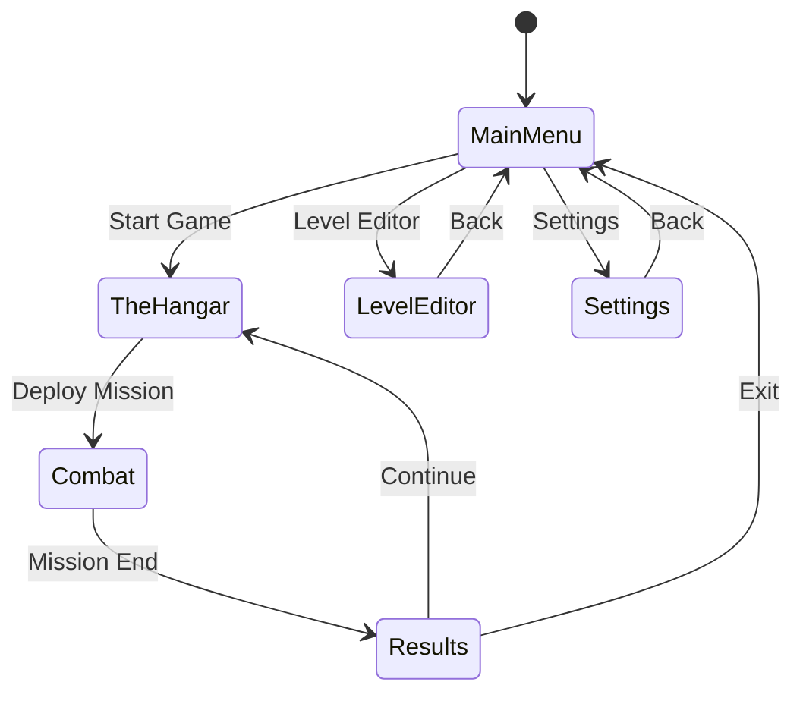

# TRON-STRIDER

A TRON-inspired mech combat game built with React Three Fiber featuring wireframe aesthetics, probability-based bullet-hell combat, and an innovative split-control system where the player pilots the legs while an AI turret handles targeting.

## Description

TRON-STRIDER is a browser-based 3D third-person mech combat game capturing the iconic visual style of TRON (1982). Players pilot a bipedal combat robot through geometric arenas, controlling movement and locomotion while the mech's upper turret autonomously engages enemies when the safety is disengaged. The game features a complete progression loop with ammo conservation mechanics, a powerful level editor, and support for community-created content.

The visual aesthetic is pure wireframe geometry with SVGA vertex shading—no PNG textures. All rendering follows a neon-lit wireframe style with vibrant cyan, magenta, orange, and white color palettes against dark backgrounds.

**Core Gameplay Hook:** You control the legs (movement, strafing, turning). The AI controls the gun (aiming, firing). Toggle the safety to unleash your turret—but conserve ammo wisely.

## Game Architecture

```
┌─────────────────────────────────────────────────────────────┐
│                        App.tsx                               │
│  (Root component, state management, screen routing)          │
├─────────────────────────────────────────────────────────────┤
│                                                              │
│  ┌──────────────┐  ┌──────────────┐  ┌──────────────┐       │
│  │  MainMenu    │  │  TheHangar   │  │  Combat      │       │
│  │  Screen.tsx  │  │  Screen.tsx  │  │  Screen.tsx  │       │
│  └──────────────┘  └──────────────┘  └──────────────┘       │
│                                                              │
│  ┌──────────────┐  ┌──────────────┐  ┌──────────────┐       │
│  │   Results    │  │ LevelEditor  │  │  Settings    │       │
│  │  Screen.tsx  │  │  Screen.tsx  │  │  Screen.tsx  │       │
│  └──────────────┘  └──────────────┘  └──────────────┘       │
│                                                              │
├─────────────────────────────────────────────────────────────┤
│                    Shared Components                         │
│  ┌────────────┐ ┌────────────┐ ┌────────────┐               │
│  │ 3D/        │ │ UI/        │ │ Game/      │               │
│  │ Mech.tsx   │ │ HUD.tsx    │ │ GameState  │               │
│  │ Arena.tsx  │ │ Button.tsx │ │ .ts        │               │
│  │ Skybox.tsx │ │ Panel.tsx  │ │ Combat.ts  │               │
│  │ Grid.tsx   │ │ Slider.tsx │ │ Input.ts   │               │
│  │ Enemy.tsx  │ │ AmmoBar.tsx│ │ Audio.ts   │               │
│  └────────────┘ └────────────┘ └────────────┘               │
└─────────────────────────────────────────────────────────────┘
```

## Functionality

### Screen Flow



### Screen Specifications

#### 1. Main Menu Screen (`screens/MainMenuScreen.tsx`)

**Visual Layout:**
- Centered vertically and horizontally
- Large "TRON-STRIDER" title with glowing cyan wireframe effect
- Four menu buttons stacked vertically with 20px spacing
- Animated wireframe mech rotating slowly in background (legs walking animation)

**Menu Options:**
| Button | Action |
|--------|--------|
| START MISSION | Navigate to TheHangar screen |
| LEVEL EDITOR | Navigate to LevelEditor screen |
| SETTINGS | Navigate to Settings screen |
| EXIT | Close application / show exit confirmation |

**Interactions:**
- Buttons glow brighter on hover (opacity 0.7 → 1.0)
- Click triggers screen transition with fade effect (300ms)
- Keyboard navigation: Arrow keys to select, Enter to confirm

---

#### 2. The Hangar Screen (`screens/TheHangarScreen.tsx`)

**Purpose:** Pre-game setup, loadout selection, and mission briefing.

**Layout Sections:**

```
┌─────────────────────────────────────────────────────────┐
│  [BACK]                    THE HANGAR                   │
├───────────────────┬─────────────────────────────────────┤
│                   │                                     │
│   MECH PREVIEW    │         LOADOUT PANEL               │
│   (3D rotating    │   ┌─────────────────────────────┐   │
│    mech model     │   │ Weapon: [Dropdown]          │   │
│    with walk      │   │ Turret Speed: [Slider]      │   │
│    animation)     │   │ Detection Range: [Slider]   │   │
│                   │   │ Accuracy Bias: [Slider]     │   │
│                   │   │ Leg Speed: [Slider]         │   │
│                   │   │ Armor: [Slider]             │   │
│                   │   └─────────────────────────────┘   │
├───────────────────┴─────────────────────────────────────┤
│                    LEVEL SELECT                          │
│   [Level 1] [Level 2] [Level 3] [Custom...] [Random]    │
├─────────────────────────────────────────────────────────┤
│  Mission: Survive and eliminate all hostiles            │
│  Starting Ammo: 200 rounds                              │
│                              [DEPLOY MISSION]           │
└─────────────────────────────────────────────────────────┘
```

**Mech Customization Options:**

```typescript
interface MechLoadout {
  weapon: 'standard' | 'rapidfire' | 'heavy' | 'precision';
  turretSpeed: number;      // 1-10, rotation speed of upper torso
  detectionRange: number;   // 1-10, how far AI detects enemies
  accuracyBias: number;     // 1-10, preference for accuracy over speed
  legSpeed: number;         // 1-10, movement speed
  armor: number;            // 1-10, damage resistance
  color: string;            // Hex color for mech wireframe
}
```

**Level Selection:**
- Grid of level thumbnail previews (wireframe top-down view)
- Built-in levels numbered 1-10
- "Custom" button opens file picker for community levels
- "Random" generates procedural arena

---

#### 3. Combat Screen (`screens/CombatScreen.tsx`)

**Primary Gameplay Arena**

**Camera System:**
- Third-person chase camera, 18 units behind mech, 10 units above
- Smooth follow with 0.1 lerp factor
- Camera collision avoidance with arena boundaries
- Camera rotates with player facing direction

---

## Core Gameplay Mechanics

### The Split-Control System

The player mech has two distinct control domains:

**LOWER BODY (Player Controlled):**
- Legs/locomotion
- Strafing left/right
- Turning/rotation
- Forward/backward movement
- Movement speed control

**UPPER BODY (AI Controlled):**
- Turret/torso rotation (360 degrees)
- Target acquisition
- Aiming
- Firing
- Target priority selection

**The Safety Toggle:**
The critical link between player and AI control is the SAFETY system:

```typescript
interface SafetyState {
  engaged: boolean;         // true = safety ON, turret locked
  turretAngle: number;      // current rotation (0-360)
  lockedForward: boolean;   // when safety ON, turret faces forward
}
```

| Safety State | Turret Behavior |
|--------------|-----------------|
| SAFETY ON | Turret locked forward, no firing, no rotation |
| SAFETY OFF | Turret rotates freely, auto-acquires targets, fires at will |

---

### Player Controls

| Input | Action |
|-------|--------|
| W / ↑ | Move forward |
| S / ↓ | Move backward |
| A / ← | Strafe left |
| D / → | Strafe right |
| Q | Rotate mech left (turn) |
| E | Rotate mech right (turn) |
| SPACE | Toggle Safety (ON/OFF) |
| SHIFT | Sprint (increased speed, reduced armor) |
| ESC | Pause menu |

**Movement Feel:**
- Weighty, deliberate mech movement
- Acceleration/deceleration curves (not instant)
- Footstep timing synced to leg animation
- Strafing is slower than forward movement (70% speed)

---

### Auto-Turret AI System

When safety is OFF, the turret AI operates autonomously:

```typescript
interface TurretAI {
  state: 'idle' | 'acquiring' | 'tracking' | 'firing' | 'cooldown';
  currentTarget: Enemy | null;
  rotationSpeed: number;        // degrees per second
  detectionRange: number;       // units
  firingRange: number;          // units (always <= detectionRange)
  fieldOfView: number;          // degrees (360 when safety off)
  targetSwitchDelay: number;    // seconds before switching targets
}
```

**Target Acquisition Priority:**
1. Closest enemy within firing range
2. Lowest health enemy (if multiple at same distance)
3. Enemy currently attacking player
4. Most recent enemy to enter detection range

**Turret Behavior Loop:**
```
1. SCAN: Rotate to search for targets
2. ACQUIRE: Lock onto highest priority target
3. TRACK: Rotate turret to follow target
4. FIRE: When aligned, fire at target
5. EVALUATE: Check if target destroyed, switch if needed
6. REPEAT
```

**Quick-Shot Mechanic:**
When safety is toggled OFF, the turret performs a "gunfighter draw":
- Immediate 50% faster rotation for first 0.5 seconds
- First shot fires 30% faster than normal fire rate
- Creates satisfying "snap to target" feel

---

### Probability-Based Combat System

**Core Philosophy:** Instead of simulating every bullet's physics trajectory, we calculate hit probability mathematically and resolve outcomes instantly. This allows hundreds of bullets and dozens of enemies efficiently.

```typescript
interface HitCalculation {
  baseAccuracy: number;       // weapon base (0-1)
  distanceFactor: number;     // falloff based on range
  movementPenalty: number;    // target movement reduces accuracy
  finalHitChance: number;     // calculated probability
  damage: number;             // if hit, damage dealt
}

function calculateHitChance(
  shooter: Mech | Enemy,
  target: Mech | Enemy,
  weapon: Weapon
): HitCalculation {
  const distance = getDistance(shooter.position, target.position);
  const optimalRange = weapon.optimalRange;
  const maxRange = weapon.maxRange;
  
  // Base accuracy from weapon
  let accuracy = weapon.baseAccuracy;
  
  // Distance falloff (quadratic)
  if (distance > optimalRange) {
    const falloffRatio = (distance - optimalRange) / (maxRange - optimalRange);
    accuracy *= Math.max(0, 1 - Math.pow(falloffRatio, 2));
  }
  
  // Movement penalty
  const targetSpeed = getSpeed(target);
  accuracy *= 1 - (targetSpeed * 0.1);
  
  // Clamp final value
  accuracy = Math.max(0.05, Math.min(0.95, accuracy));
  
  return {
    baseAccuracy: weapon.baseAccuracy,
    distanceFactor: accuracy / weapon.baseAccuracy,
    movementPenalty: targetSpeed * 0.1,
    finalHitChance: accuracy,
    damage: weapon.damage
  };
}
```

**Range Zones:**

| Zone | Distance | Hit Modifier |
|------|----------|--------------|
| Point Blank | 0-10 units | 100% accuracy |
| Optimal | 10-30 units | 90-100% accuracy |
| Medium | 30-50 units | 50-90% accuracy |
| Long | 50-80 units | 20-50% accuracy |
| Extreme | 80-100 units | 5-20% accuracy |
| Beyond Max | >100 units | 0% (no shot taken) |

---

### Weapon Specifications

```typescript
interface Weapon {
  id: string;
  name: string;
  damage: number;
  fireRate: number;           // rounds per second
  magSize: number;            // rounds before reload
  reloadTime: number;         // seconds
  baseAccuracy: number;       // 0-1
  optimalRange: number;       // units
  maxRange: number;           // units
  projectileSpeed: number;    // for visual only
  soundEffect: string;
}
```

| Weapon | Damage | Fire Rate | Mag | Reload | Accuracy | Optimal | Max Range |
|--------|--------|-----------|-----|--------|----------|---------|-----------|
| Standard | 12 | 4/sec | 30 | 2.0s | 0.85 | 25 | 60 |
| Rapidfire | 6 | 10/sec | 50 | 2.5s | 0.70 | 20 | 50 |
| Heavy | 35 | 1.5/sec | 12 | 3.0s | 0.90 | 35 | 80 |
| Precision | 25 | 2/sec | 20 | 2.0s | 0.95 | 50 | 100 |

---

### Ammo System

```typescript
interface AmmoState {
  currentRounds: number;      // rounds in current magazine
  reserveRounds: number;      // total reserve ammo
  maxReserve: number;         // maximum carriable reserve
  isReloading: boolean;
  reloadProgress: number;     // 0-1
}
```

**Ammo Conservation Mechanics:**
- Total ammo is LIMITED per mission
- No automatic regeneration
- Ammo pickups scattered on map
- Running out = turret cannot fire (safety auto-engages)
- HUD shows ammo status prominently

**Ammo Pickup:**
```typescript
interface AmmoPickup {
  position: Vector3;
  amount: number;             // rounds restored
  respawnTime: number;        // seconds until respawn (0 = no respawn)
  collected: boolean;
}
```

---

### Enemy System

**Enemy Types:**

```typescript
type EnemyType = 'drone' | 'turret' | 'walker' | 'heavy';

interface Enemy {
  id: string;
  type: EnemyType;
  position: Vector3;
  rotation: number;
  health: number;
  maxHealth: number;
  speed: number;
  weapon: Weapon;
  aiState: EnemyAIState;
  detectionRange: number;
  attackRange: number;
}

type EnemyAIState = 'patrol' | 'alert' | 'chase' | 'attack' | 'flee';
```

| Enemy Type | Health | Speed | Damage | Range | Behavior |
|------------|--------|-------|--------|-------|----------|
| Drone | 20 | 15 | 5 | 30 | Fast, erratic, flanks |
| Turret | 50 | 0 | 15 | 50 | Stationary, accurate |
| Walker | 40 | 8 | 10 | 40 | Pursues, takes cover |
| Heavy | 100 | 5 | 25 | 60 | Slow, high damage, tanks |

**Enemy AI Behavior:**

```typescript
interface EnemyAI {
  patrolPath: Vector3[];      // waypoints for patrol
  homePosition: Vector3;      // spawn point
  aggroRange: number;         // distance to notice player
  leashRange: number;         // max chase distance from home
  accuracy: number;           // 0-1 hit chance modifier
  reactionTime: number;       // delay before shooting
  prefersCover: boolean;      // seeks obstacles when damaged
}
```

---

### Efficient Bullet Hell System

**Visual vs Logical Bullets:**

The game separates visual representation from damage calculation:

```typescript
// LOGICAL: Instant resolution
interface ShotResolution {
  shooter: string;            // entity ID
  target: string;             // entity ID
  hitChance: number;          // calculated probability
  didHit: boolean;            // Math.random() < hitChance
  damage: number;             // if hit
  timestamp: number;
}

// VISUAL: Particle/tracer effect
interface BulletVisual {
  id: string;
  startPosition: Vector3;
  endPosition: Vector3;       // target position (hit or miss offset)
  speed: number;
  color: string;
  trailLength: number;
  hitEffect: boolean;         // spawn impact particles at end
}
```

**Resolution Flow:**
```
1. Shot fired → Calculate hit probability
2. Resolve hit/miss instantly (random check)
3. Apply damage if hit (immediate)
4. Spawn visual tracer (aesthetic only)
5. Tracer travels to endpoint
6. Spawn hit/miss particles at endpoint
```

**Particle Pooling:**
```typescript
const BULLET_POOL_SIZE = 200;
const PARTICLE_POOL_SIZE = 500;

interface ParticlePool {
  bullets: BulletVisual[];
  sparks: Particle[];
  activeCount: number;
  
  spawn(type: 'bullet' | 'spark', config: ParticleConfig): void;
  update(deltaTime: number): void;
  recycle(particle: Particle): void;
}
```

---

### HUD Elements (`components/ui/GameHUD.tsx`)

```
┌─────────────────────────────────────────────────────────────┐
│ [HEALTH]██████████░░ 80%              [MINIMAP]             │
│ [ARMOR] ████████░░░░ 65%                  ·                 │
│                                          · ▲ ·              │
│                                            ·                │
│  ┌─────────────────┐                                        │
│  │ ⚠ SAFETY: OFF   │    (3D GAME VIEW)                      │
│  │ TURRET: ACTIVE  │                                        │
│  └─────────────────┘                                        │
│                                                             │
│                                                             │
│                                                             │
│ [AMMO: 127/200]  [MAG: 23/30]  [TARGETS: 5]   [ESC: Pause] │
└─────────────────────────────────────────────────────────────┘
```

**HUD Components:**

| Element | Position | Information |
|---------|----------|-------------|
| Health Bar | Top-left | Current/max health, color-coded |
| Armor Bar | Below health | Damage reduction indicator |
| Safety Status | Left-center | Large indicator: SAFETY ON/OFF |
| Turret Status | Below safety | IDLE/TRACKING/FIRING |
| Ammo Counter | Bottom-left | Reserve ammo / max ammo |
| Magazine | Bottom-center | Current mag / mag size |
| Target Count | Bottom-right | Remaining enemies |
| Minimap | Top-right | Top-down view, enemy dots |

**Safety Status Visual:**
```typescript
const SafetyIndicator = ({ engaged }: { engaged: boolean }) => {
  const color = engaged ? '#00FF00' : '#FF3300';  // Green=ON, Red=OFF
  const text = engaged ? 'SAFETY: ON' : '⚠ SAFETY: OFF';
  const pulse = engaged ? false : true;           // Pulse when active
  
  return (
    <div className={`safety-indicator ${pulse ? 'pulse' : ''}`}
         style={{ borderColor: color, color }}>
      {text}
    </div>
  );
};
```

---

### Audio System

**Audio Samples (No TTS):**

All voice lines are pre-recorded audio samples, robotic/synthesized style:

| Sound ID | Trigger | Content/Description |
|----------|---------|---------------------|
| `voice_safety_on` | Safety toggled ON | "Safety engaged" |
| `voice_safety_off` | Safety toggled OFF | "Safety disengaged - weapons hot" |
| `voice_low_ammo` | Ammo < 20% | "Warning: ammunition low" |
| `voice_critical_ammo` | Ammo < 10% | "Critical: ammunition depleted" |
| `voice_ammo_pickup` | Collect ammo | "Ammunition replenished" |
| `voice_reloading` | Reload started | "Reloading" |
| `voice_reload_complete` | Reload finished | "Magazine loaded" |
| `voice_target_acquired` | First target locked | "Target acquired" |
| `voice_target_down` | Enemy destroyed | "Target eliminated" |
| `voice_taking_damage` | Health drops 25%+ | "Taking fire" |
| `voice_critical_damage` | Health < 25% | "Critical damage - recommend retreat" |
| `voice_mission_start` | Level begins | "Systems online - commencing operation" |
| `voice_mission_complete` | All enemies dead | "Area secured - mission complete" |

**Sound Effects:**

| Sound | Trigger | Description |
|-------|---------|-------------|
| `sfx_footstep_l` | Left foot lands | Heavy metallic thud |
| `sfx_footstep_r` | Right foot lands | Heavy metallic thud (slight variation) |
| `sfx_turret_rotate` | Turret turning | Servo whir, continuous |
| `sfx_fire_standard` | Standard weapon | Sharp electronic burst |
| `sfx_fire_rapid` | Rapidfire weapon | Quick repeated pops |
| `sfx_fire_heavy` | Heavy weapon | Deep bass boom |
| `sfx_fire_precision` | Precision weapon | Clean, focused snap |
| `sfx_hit_metal` | Bullet hits mech | Metallic ping/ricochet |
| `sfx_hit_enemy` | Bullet hits enemy | Electronic crackle |
| `sfx_explosion` | Enemy destroyed | Low rumble + shatter |
| `sfx_pickup` | Collect item | Ascending electronic chime |
| `sfx_reload` | Reload action | Mechanical clunk + slide |
| `sfx_safety_click` | Safety toggled | Satisfying mechanical click |

**Audio Manager:**
```typescript
interface AudioManager {
  sounds: Map<string, AudioBuffer>;
  voiceQueue: string[];           // Queued voice lines (no overlap)
  currentVoice: string | null;
  
  playSound(id: string, volume?: number, pan?: number): void;
  queueVoice(id: string): void;   // Add to queue, plays in order
  stopAll(): void;
}
```

---

## Mech Model Specification

### Wireframe Mech Structure

```
            ┌─────┐
            │HEAD │  ← Sensor array (rotates with turret)
       ┌────┴─────┴────┐
       │    TURRET     │  ← Upper torso, rotates 360°
       │   ┌─────┐     │
       │   │WEAPON│────┼──→ Barrel extends from turret
       │   └─────┘     │
       └───────┬───────┘
               │
       ┌───────┴───────┐
       │     CORE      │  ← Center torso, fixed orientation
       │               │
       └───┬───────┬───┘
           │       │
       ┌───┴───┐ ┌─┴───┐
       │ L-HIP │ │R-HIP│  ← Hip joints
       └───┬───┘ └───┬─┘
           │         │
       ┌───┴───┐ ┌───┴───┐
       │ L-LEG │ │ R-LEG │  ← Upper legs
       └───┬───┘ └───┬───┘
           │         │
       ┌───┴───┐ ┌───┴───┐
       │L-KNEE │ │R-KNEE │  ← Knee joints
       └───┬───┘ └───┬───┘
           │         │
       ┌───┴───┐ ┌───┴───┐
       │L-SHIN │ │R-SHIN │  ← Lower legs
       └───┬───┘ └───┬───┘
           │         │
       ┌───┴───┐ ┌───┴───┐
       │L-FOOT │ │R-FOOT │  ← Feet
       └───────┘ └───────┘
```

**Component Hierarchy:**
```typescript
interface MechModel {
  // Core body (fixed relative to movement)
  core: {
    position: Vector3;
    rotation: number;         // Y-axis, controlled by player turning
  };
  
  // Upper turret (independent rotation)
  turret: {
    rotationOffset: number;   // Relative to core, 0-360
    weaponBarrel: Vector3;    // Muzzle position for effects
    sensorHead: Vector3;      // "Eye" position
  };
  
  // Legs (animated based on movement)
  legs: {
    left: LegState;
    right: LegState;
    walkCycle: number;        // 0-1 animation progress
    isWalking: boolean;
  };
}

interface LegState {
  hipAngle: number;
  kneeAngle: number;
  footAngle: number;
  grounded: boolean;
}
```

**Walk Animation:**
```typescript
function updateWalkCycle(mech: MechModel, speed: number, dt: number) {
  if (speed > 0.1) {
    mech.legs.isWalking = true;
    mech.legs.walkCycle = (mech.legs.walkCycle + dt * speed * 2) % 1;
    
    // Inverse kinematics simplified:
    const cycle = mech.legs.walkCycle;
    const leftPhase = cycle;
    const rightPhase = (cycle + 0.5) % 1;
    
    // Hip swing: -30° to +30°
    mech.legs.left.hipAngle = Math.sin(leftPhase * Math.PI * 2) * 30;
    mech.legs.right.hipAngle = Math.sin(rightPhase * Math.PI * 2) * 30;
    
    // Knee bend: 0° to 45° during lift
    mech.legs.left.kneeAngle = Math.max(0, Math.sin(leftPhase * Math.PI * 2)) * 45;
    mech.legs.right.kneeAngle = Math.max(0, Math.sin(rightPhase * Math.PI * 2)) * 45;
    
    // Foot plants when hip is forward
    mech.legs.left.grounded = leftPhase > 0.25 && leftPhase < 0.75;
    mech.legs.right.grounded = rightPhase > 0.25 && rightPhase < 0.75;
  } else {
    mech.legs.isWalking = false;
    // Idle stance: slight knee bend
    mech.legs.left.hipAngle = 0;
    mech.legs.right.hipAngle = 0;
    mech.legs.left.kneeAngle = 10;
    mech.legs.right.kneeAngle = 10;
  }
}
```

---

## Level Editor (`screens/LevelEditorScreen.tsx`)

### Editor Layout

```
┌─────────────────────────────────────────────────────────────┐
│ [BACK]  [NEW] [LOAD] [SAVE] [TEST]    LEVEL EDITOR         │
├───────────────────────────────────────────────┬─────────────┤
│                                               │  PALETTE    │
│                                               │ ┌─────────┐ │
│                                               │ │ [Floor] │ │
│                                               │ │ [Wall]  │ │
│           3D EDITOR VIEWPORT                  │ │ [Cover] │ │
│           (Isometric or free camera)          │ │ [Spawn] │ │
│                                               │ │ [Enemy] │ │
│                                               │ │ [Ammo]  │ │
│                                               │ │ [Health]│ │
│                                               │ └─────────┘ │
│                                               │             │
│                                               │  PROPERTIES │
│                                               │ ┌─────────┐ │
│                                               │ │ Type:   │ │
│                                               │ │ Pos:    │ │
│                                               │ │ Rot:    │ │
│                                               │ └─────────┘ │
├───────────────────────────────────────────────┴─────────────┤
│ Grid: 1x1  │ Layer: Ground  │ Selected: Wall  │ Snap: ON   │
└─────────────────────────────────────────────────────────────┘
```

### Palette Objects

```typescript
type EditorObjectType = 
  | 'floor'           // Walkable ground tile
  | 'wall'            // Impassable barrier
  | 'cover_low'       // Half-height cover
  | 'cover_high'      // Full-height cover
  | 'player_spawn'    // Player start position (1 per level)
  | 'enemy_drone'     // Drone spawn point
  | 'enemy_turret'    // Stationary turret
  | 'enemy_walker'    // Walker enemy
  | 'enemy_heavy'     // Heavy enemy
  | 'pickup_ammo'     // Ammo pickup location
  | 'pickup_health'   // Health pickup location
  | 'waypoint';       // Patrol waypoint for enemies

interface EditorObject {
  id: string;
  type: EditorObjectType;
  position: { x: number; y: number; z: number };
  rotation: number;
  properties: Record<string, any>;
}
```

### Level Data Format

```typescript
interface LevelData {
  name: string;
  author: string;
  version: string;
  gridSize: { width: number; height: number };
  playerSpawn: { x: number; y: number; rotation: number };
  objects: EditorObject[];
  enemies: EnemySpawn[];
  pickups: PickupSpawn[];
  metadata: {
    difficulty: 'easy' | 'medium' | 'hard';
    parTime: number;          // seconds
    minEnemies: number;
    maxAmmo: number;
  };
}

// Example level JSON:
{
  "name": "Training Ground",
  "author": "System",
  "version": "1.0",
  "gridSize": { "width": 50, "height": 50 },
  "playerSpawn": { "x": 5, "y": 5, "rotation": 0 },
  "objects": [
    { "id": "wall_1", "type": "wall", "position": { "x": 10, "y": 0, "z": 10 }, "rotation": 0 },
    { "id": "cover_1", "type": "cover_low", "position": { "x": 15, "y": 0, "z": 15 }, "rotation": 45 }
  ],
  "enemies": [
    { "type": "drone", "position": { "x": 30, "y": 0, "z": 30 }, "patrolPath": [...] },
    { "type": "turret", "position": { "x": 40, "y": 0, "z": 20 }, "rotation": 180 }
  ],
  "pickups": [
    { "type": "ammo", "position": { "x": 20, "y": 0, "z": 20 }, "amount": 50 }
  ],
  "metadata": {
    "difficulty": "easy",
    "parTime": 120,
    "minEnemies": 5,
    "maxAmmo": 300
  }
}
```

### Editor Controls

| Input | Action |
|-------|--------|
| Left Click | Place selected object |
| Right Click | Delete object under cursor |
| Middle Click + Drag | Pan camera |
| Scroll | Zoom in/out |
| R | Rotate selected object 45° |
| G | Toggle grid snap |
| Ctrl+S | Save level |
| Ctrl+Z | Undo |
| Ctrl+Y | Redo |
| Delete | Delete selected object |
| Space | Test play current level |

---

## Results Screen (`screens/ResultsScreen.tsx`)

**Post-Mission Statistics:**

```
┌─────────────────────────────────────────────────────────────┐
│                    MISSION COMPLETE                          │
│                       ★ ★ ★                                  │
├─────────────────────────────────────────────────────────────┤
│                                                              │
│   Time:              2:34                                    │
│   Enemies Destroyed: 12/12                                   │
│   Accuracy:          67%                                     │
│   Shots Fired:       189                                     │
│   Shots Hit:         127                                     │
│   Damage Taken:      145                                     │
│   Ammo Remaining:    23                                      │
│   Safety Toggles:    8                                       │
│                                                              │
│   GRADE: A                                                   │
│                                                              │
├─────────────────────────────────────────────────────────────┤
│           [CONTINUE]              [MAIN MENU]               │
└─────────────────────────────────────────────────────────────┘
```

**Grading System:**

```typescript
function calculateGrade(stats: MissionStats): string {
  let score = 0;
  
  // Time bonus (faster = better)
  if (stats.time < stats.parTime * 0.5) score += 30;
  else if (stats.time < stats.parTime) score += 20;
  else if (stats.time < stats.parTime * 1.5) score += 10;
  
  // Accuracy bonus
  score += Math.floor(stats.accuracy * 30);
  
  // Efficiency (ammo conservation)
  const ammoEfficiency = stats.ammoRemaining / stats.startingAmmo;
  score += Math.floor(ammoEfficiency * 20);
  
  // Survival (health remaining)
  const healthRatio = stats.healthRemaining / stats.maxHealth;
  score += Math.floor(healthRatio * 20);
  
  // Grade thresholds
  if (score >= 90) return 'S';
  if (score >= 80) return 'A';
  if (score >= 70) return 'B';
  if (score >= 60) return 'C';
  if (score >= 50) return 'D';
  return 'F';
}
```

---

## Settings Screen (`screens/SettingsScreen.tsx`)

**Settings Categories:**

```typescript
interface GameSettings {
  // Audio
  masterVolume: number;       // 0-100
  sfxVolume: number;          // 0-100
  voiceVolume: number;        // 0-100
  musicVolume: number;        // 0-100
  
  // Graphics
  wireframeThickness: number; // 1-5
  glowIntensity: number;      // 0-100
  particleCount: number;      // low/medium/high
  cameraShake: boolean;
  
  // Gameplay
  turretSensitivity: number;  // 1-10
  autoReload: boolean;
  safetyStartState: 'on' | 'off';
  subtitles: boolean;
  
  // Controls
  invertY: boolean;
  keyBindings: KeyBindings;
  
  // Accessibility
  colorBlindMode: 'none' | 'protanopia' | 'deuteranopia' | 'tritanopia';
  highContrast: boolean;
  reducedMotion: boolean;
}
```

---

## Style Guide

### Color Palette

```typescript
const TRON_COLORS = {
  // Primary
  cyan: '#00FFFF',
  cyanDark: '#008B8B',
  cyanLight: '#88FFFF',
  
  // Secondary
  magenta: '#FF00FF',
  orange: '#FF6600',
  white: '#FFFFFF',
  
  // UI States
  safetyOn: '#00FF00',      // Green - safe
  safetyOff: '#FF3300',     // Red - weapons hot
  warning: '#FFAA00',       // Amber - caution
  critical: '#FF0000',      // Red - danger
  
  // Background
  background: '#000011',
  gridLines: '#003344',
  
  // Enemy colors
  enemyDrone: '#FF00FF',
  enemyTurret: '#FF6600',
  enemyWalker: '#FFFF00',
  enemyHeavy: '#FF0000',
};
```

### Typography

```css
/* Primary font for UI */
font-family: 'Orbitron', 'Courier New', monospace;

/* Sizes */
--font-title: 48px;
--font-heading: 24px;
--font-body: 16px;
--font-small: 12px;
--font-hud: 14px;

/* Weights */
--font-normal: 400;
--font-bold: 700;
```

### UI Components

```css
/* Panel styling */
.panel {
  background: rgba(0, 17, 34, 0.85);
  border: 1px solid rgba(0, 255, 255, 0.3);
  box-shadow: 
    0 0 10px rgba(0, 255, 255, 0.2),
    inset 0 0 20px rgba(0, 255, 255, 0.1);
  backdrop-filter: blur(4px);
}

/* Safety indicator */
.safety-indicator {
  padding: 8px 16px;
  border: 2px solid currentColor;
  font-family: 'Orbitron', monospace;
  font-size: 18px;
  font-weight: bold;
  text-transform: uppercase;
}

.safety-indicator.pulse {
  animation: pulse 1s infinite;
}

@keyframes pulse {
  0%, 100% { opacity: 1; }
  50% { opacity: 0.5; }
}

/* Ammo bar */
.ammo-bar {
  display: flex;
  gap: 2px;
}

.ammo-segment {
  width: 4px;
  height: 16px;
  background: #00FFFF;
  transition: opacity 0.1s;
}

.ammo-segment.empty {
  opacity: 0.2;
}
```

### 3D Wireframe Materials

```typescript
// Standard wireframe material
const wireframeMaterial = new THREE.MeshBasicMaterial({
  color: TRON_COLORS.cyan,
  wireframe: true,
  transparent: true,
  opacity: 0.9,
});

// Player mech glow material
const mechGlowMaterial = new THREE.ShaderMaterial({
  uniforms: {
    color: { value: new THREE.Color(TRON_COLORS.cyan) },
    glowIntensity: { value: 1.5 },
    time: { value: 0 },
  },
  vertexShader: /* glsl */`
    varying vec3 vNormal;
    varying vec3 vPosition;
    void main() {
      vNormal = normal;
      vPosition = position;
      gl_Position = projectionMatrix * modelViewMatrix * vec4(position, 1.0);
    }
  `,
  fragmentShader: /* glsl */`
    uniform vec3 color;
    uniform float glowIntensity;
    uniform float time;
    varying vec3 vNormal;
    varying vec3 vPosition;
    void main() {
      float intensity = pow(0.7 - dot(vNormal, vec3(0, 0, 1.0)), 2.0);
      float pulse = 0.9 + 0.1 * sin(time * 2.0);
      gl_FragColor = vec4(color * glowIntensity * pulse, intensity);
    }
  `,
  transparent: true,
  wireframe: true,
});

// Enemy wireframe (varies by type)
function getEnemyMaterial(type: EnemyType): THREE.Material {
  const colorMap = {
    drone: TRON_COLORS.enemyDrone,
    turret: TRON_COLORS.enemyTurret,
    walker: TRON_COLORS.enemyWalker,
    heavy: TRON_COLORS.enemyHeavy,
  };
  
  return new THREE.MeshBasicMaterial({
    color: colorMap[type],
    wireframe: true,
    transparent: true,
    opacity: 0.85,
  });
}
```

---

## Performance Goals

| Metric | Target |
|--------|--------|
| Frame Rate | 60 FPS (minimum 30 on low-end) |
| Load Time | < 3 seconds initial load |
| Memory | < 512MB GPU memory |
| Max Enemies | 30 simultaneous |
| Max Bullet Visuals | 200 simultaneous |
| Max Particles | 500 simultaneous |
| Level Size | Up to 100×100 grid |

### Optimization Strategies

1. **Probability Combat:** Hit resolution is instant math, not physics
2. **Object Pooling:** Pre-allocate bullets, particles, effects
3. **Visual Separation:** Damage calculated separately from visuals
4. **LOD:** Reduce wireframe detail at distance
5. **Frustum Culling:** Built into Three.js
6. **Batch Rendering:** Group static geometry
7. **Throttled Updates:** AI at 10Hz, physics at 60Hz, visuals at 60Hz

---

## Testing Scenarios

### Core Gameplay Tests

1. **Movement:** Mech moves with proper weight, strafing works, turning rotates body
2. **Safety Toggle:** Toggle engages/disengages turret, audio plays, HUD updates
3. **Turret AI:** Turret acquires targets, tracks smoothly, fires accurately
4. **Combat:** Hits register based on probability, damage applies, enemies react
5. **Ammo:** Ammo depletes, reload works, pickups restore ammo
6. **Victory:** Mission completes when all enemies destroyed
7. **Defeat:** Game over when player health reaches 0

### Audio Tests

1. **Voice Lines:** All status voices play at correct triggers, no overlap
2. **Sound Effects:** Footsteps sync with animation, weapons sound correct
3. **Safety Click:** Satisfying feedback on toggle

### Editor Tests

1. **Place Objects:** All palette items place correctly
2. **Save/Load:** Levels export to JSON, import correctly
3. **Test Play:** Launch button starts game with current level
4. **Validation:** Missing player spawn shows error

### Performance Tests

1. **Many Enemies:** 30 enemies on screen maintains 60 FPS
2. **Bullet Hell:** 200 tracers rendering smoothly
3. **Large Level:** 100×100 grid loads and plays

---

## Accessibility Requirements

1. **Keyboard-Only Play:** Full gameplay possible with keyboard only
2. **Color Blind Modes:** Alternative palettes for all color blindness types
3. **High Contrast:** Ensure wireframes visible against backgrounds
4. **Screen Reader:** Menu items have proper aria labels
5. **Pause Anytime:** ESC always pauses, no timed menus
6. **Reduced Motion:** Option to minimize particle effects and screen shake
7. **Subtitles:** Voice lines displayed as text when enabled

---

## Extended Features (Future)

1. **Dual Wielding:** Second weapon slot, both arms fire independently
2. **Weapon Upgrades:** Improve damage, accuracy, fire rate
3. **Mech Variants:** Light (fast), Medium (balanced), Heavy (tanky)
4. **Boss Encounters:** Large enemies with multiple phases
5. **Multiplayer:** Co-op missions or versus arena
6. **Campaign Mode:** Story progression with unlocks
7. **Leaderboards:** Global high scores per level

---

## Dependencies

```json
{
  "dependencies": {
    "react": "^18.2.0",
    "react-dom": "^18.2.0",
    "@react-three/fiber": "^8.15.0",
    "@react-three/drei": "^9.88.0",
    "three": "^0.158.0",
    "zustand": "^4.4.0",
    "uuid": "^9.0.0",
    "howler": "^2.2.0"
  },
  "devDependencies": {
    "typescript": "^5.2.0",
    "vite": "^5.0.0",
    "@types/react": "^18.2.0",
    "@types/three": "^0.158.0"
  }
}
```

---

## Implementation Notes

1. **State Management:** Use Zustand for global game state, React state for UI
2. **Frame Loop:** Use `useFrame` from R3F for game loop logic
3. **Combat Resolution:** All hit/miss calculated instantly, visuals are decorative
4. **Audio Manager:** Queue voice lines to prevent overlap, pool sound effects
5. **Separation of Concerns:** Keep 3D rendering separate from game logic
6. **No PNG Textures:** All visuals are procedural wireframe geometry
7. **Module Boundaries:** Each file should be < 300 lines; split as needed
8. **Type Safety:** Full TypeScript coverage, no `any` types

---

## State Machine: Game Flow

```typescript
type GameState = 
  | 'loading'
  | 'menu'
  | 'hangar'
  | 'combat'
  | 'paused'
  | 'results'
  | 'editor';

interface CombatState {
  phase: 'deploying' | 'active' | 'victory' | 'defeat';
  player: PlayerMech;
  enemies: Enemy[];
  projectiles: BulletVisual[];
  pickups: Pickup[];
  elapsedTime: number;
  stats: MissionStats;
}

interface MissionStats {
  shotsFired: number;
  shotsHit: number;
  enemiesDestroyed: number;
  totalEnemies: number;
  damageTaken: number;
  ammoUsed: number;
  ammoRemaining: number;
  startingAmmo: number;
  safetyToggles: number;
  time: number;
  parTime: number;
  healthRemaining: number;
  maxHealth: number;
}
```

---

*This TINS README provides complete specifications for generating a functional TRON-STRIDER mech combat game. All features, data structures, and behaviors are explicitly defined to enable accurate implementation.*
